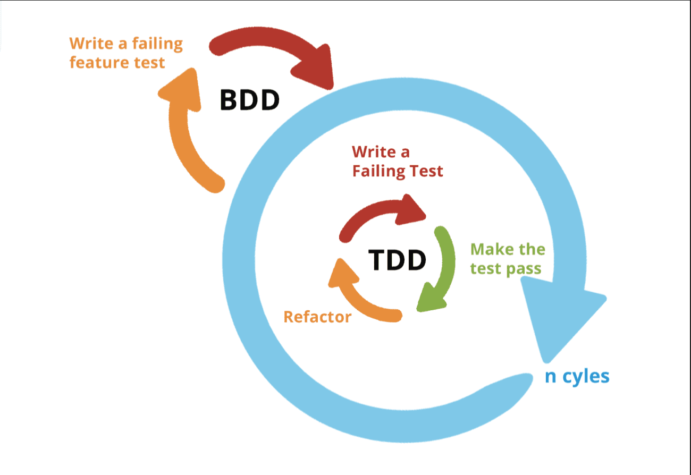

## 코드 커버리지 (Code Coverage)

> In computer science, test coverage is a measure used to describe the degree to which the source code of a program is executed when a particular test suite runs. A program with high test coverage, measured as a percentage, has had more of its source code executed during testing, which suggests it has a lower chance of containing undetected software bugs compared to a program with low test coverage - wikipedia

**코드 커버리지란 현재 작성한 테스트 코드가 실제 프로덕션 코드를 얼마나 커버하는지에 대해 표현한 퍼센트 지표**이다. 즉, 코드 커버리지란 테스트에 의해 실행된 프로덕션 코드의 양을 퍼센트로 표현한 것이라 할 수 있다. 코드 커버러지를 통해 현재 작성된 테스트 갯수가 충분한지, 테스트를 미쳐 놓치고 있는 프로덕션 코드가 존재하는지에 대해 검토할 수 있다.

### 화이트 박스 테스트 vs 블랙박스 테스트

테스트 기법에는 크게 2가지로 화이트 박스, 블랙박스 테스트 기법이 존재한다. 코드 커버리지는 이 중 어떤 방식에서 유래된 것일까? 

**코드 커버리지는 테스트에 의해 실행되는 소스 코드의 양을 퍼센트로 표현한 것인데, 이는 화이트 박스 테스트라는 기법에 기반하고 있다.** `화이트 박스 테스트`란 프로덕션 코드의 모든 내부 경로(코드를) 테스트하여 모듈 내부의 작동을 확인하는 기법을 뜻한다. 반면 `블랙 박스 테스트` 란 사용자 입장에서 구현된 기능이 완전하게 동작하는지를 확인하는 테스트 기법이다. 프로덕션 코드 및 세부 동작을 알 필요가 없으며, 단순히 입력 값에 따라 올바른 기댓값이 출력되는지에 대해 확인하는 테스트다.

## 코드 커버리지 측정 기준

코드 커버리지를 측정하는 기준에는 여러 방식이 있다. 크게 **함수 커버리지, 라인(구문) 커버리지, 결정 커버리지, 조건 커버리지가 존재한다.** 각 커버리지 측정 기준에 대해 학습해보도록 하자.

### 함수 커버리지 (Function Coverage)

어떤 함수가 최소 1번 이상 호출되었는지 여부를 기준으로 커버리지를 측정한다. 함수 내부에 작성된 모든 코드가 실행될 필요가 없으며, 해당 함수 그 자체가 호출되었다면 커버리지에 포함시킨다.

> 💡 함수 커버리지 = (실행된 함수의 수 / 전체 함수의 수 ) * 100 %

~~~java
public void func1() {
    // ...    
}

public void func2() {
    // ...    
}
~~~

만약 위 코드에서 함수 `func1()` 이 테스트 코드로 인해 호출되었고, `func2()` 는 호출되지 않았다면 커버리지 계산 결과가 어떻게 될까? 2게의 함수 중에 1개만 호출된 상태이므로 테스트 커버리지는 50% 가 될 것이다.

### 라인 커버리지(Line Coverage) 

라인 커버리지는 `구문 커버리지 (Statement Coverage)` 라고도 불린다. **프로덕션 코드내의 전체 구문 중에서 몇 줄의 구문이 실행되었는지를 기준으로 측정**한다.

> 💡 구문 커버리지 = (실행된 구문의 수 / 전체 구문의 수) * 100 %

~~~java
public void calculate(char operator, int num1, int num2) {
    log.info("함수를 동작합니다."); // (1)    
    if(operator == '+') { // (2)   
        log.info(num1 + num2); // (3)
    } 
    else if(operator == '-') { // (4)
        log.info(num1 - num2); // (5)
    }
    log.info("함수를 종료합니다."); // (6)
}
~~~

만약 위 코드에서 연산자를 "+" 으로 실행했다면 커버리지는 어떻게 될까? 테스트 실행 결과, `(1)` ~ `(6)` 구문 중에 `(4)` 와 `(5)` 는 실행되지 않을 것이다. 즉, 6개의 구문중에 4개의 구문이 실행되었으므로 커버리지는 약 66.6% 으로 측정 될 것이다.

### 결정 커버리지 (Decision Coverage)

결정 커버리지는 `브랜치 커버리지(Branch Coverage)` 라고도 불린다. (개인적으로 커버리지 중에 다소 햇갈려했던 개념이다.) 프로덕션 코드에 조건문이 있다면, **조건문의 전체 조건식 최종 결과(출력값)가 True 인 케이스와 False 인 케이스 2가지가 최소 1번 이상 실행되면 커버리지에 포함**된다.

~~~java
public void func(int a, int b) {
    if(a > 0 && b > 0) {
        log.info("조건문 내부 코드를 실행합니다.");
    }
}
~~~

위 코드에서 함수 파리미터로 `func(100, 100)` 와 `func(-100, -100)` 을 넣어 실행한 테스트 케이스 2개가 있다면, 전체 조건식 최종 결과(출력값)가 각각 true, false 가 도출된다. 즉, 전체 조건식 결과가 true, false 가 한번씩 출력되었으므로 커버리지에 포함시킨다.

### 조건 커버리지 (Condition Coverage)

앞서 학습했던 결정 커버리지는 전체 조건식을 기준으로 판단했다면, 조건 커버리지는 개별(각각의 세부) 조건식을 기준으로 판단하여 커버리지를 측정한다. **모든 개별 조건식의 실행 결과에 True 인 케이스와 False 인 케이스가 포함된다면 커버리지에 포함된다.** 

~~~java
public void func(int a, int b) {
    if(a > 0 && b > 0) {
        log.info("조건문 내부 코드를 실행합니다.");
    }
}
~~~

위 코드에서 함수 파라미터로 `func(100, -100)` 와 `func(-100, 100)`을 넣어 테스트 케이스를 각각 실행되었다면 어떻게 될까? 우선 `func(100, -100)` 을 부여한 테스트의 경우 개별 조건식 결과가 각각 True, False 가 된다. 따라서 `func(100, -100)` 를 넣어 실행한 테스트 케이스의 경우 커버리지에 포함된다. 한편 `func(-100, 100)` 의 개별 조건식 결과는 False, True 가 되므로 이 테스트 케이스 또한 커버리지에 포함된다.

## 진정한 의미의 코드 커버리지

코드 커비리지는 왜 중요할까? 단순히 프로덕션 코드가 얼만큼 커버되었는가를 측정하는 행위가 불과할까?

**코드 커버리지의 중요성은 테스트 코드의 중요성과 일맥상통한다.** 테스트의 장점이자 진정한 의미의 TDD, BDD 방법론을 적용했을 떄의 이점은 [TDD(테스트 주도 개발) 와 BDD(행위 주도 개발)
](https://haon.blog/test/tdd-bdd/) 에서 다룬적이 있다.

우선, **높은 커버리지는 이전보다 더 과감하게 코드를 리팩토링할 수 있게 해준다.** 리팩토링시 낮은 커버리지가 존재하는 코드는 이전보다 변화에 두려운 레거시 코드가 될 것이다. 비슷한 이유로 높은 커버리지는 비교적 신뢰도 있는 프로덕션 코드임을 알려주는 객관적인 지표이기에, 견고한 애플리케이션임을 믿고 더 자신있게 서비스를 배포할 수 있게 해준다.

또한 **휴먼 에러를 최소화할 수 있다.** 테스트에서 놓칠 수 있는 부분들을 코드 버러지지를 통해 직접 확인핣 수 있고, 그에 따라 부족한 테스트를 보강할 수 있다. 비슷한 이유로, **낮은 커버리지를 보완하기 위해 테스트를 작성하는 과정속에서 프로덕션에 대한 이해도를 높일 수 있다.** 커버리지가 미흡한 부분을 직접 찾아내고, 해당 프로덕션에 대한 시나리오를 테스트로 작성함으로써 모호한 이해도를 갖고 개발한 코드를 보완하며, 숨겨진 엣지 케이스 또한 찾아낼 수 있다.

이 떄문에 많은 서비스 기업에서는 테스트의 중요성을 인지하고 높은 커버리지를 최대한 유지 및 지속적으로 상승시키며 개발하고 있다고 한다. 

### 높은 커버리지를 맹목적으로 신뢰하지 말 것

그렇다고 해서, 높은 커버리지는 절대적으로 견고한 애플리케이션임을 보장하진 않는다. 예를들어 아래와 같이 계산을 위한 코드를 살펴보자.

~~~java
public void calculate(char operator, int num1, int num2) {
    log.info("함수를 동작합니다."); // (1)    
    if(operator == '+') { // (2)   
        log.info(num1 + num2); // (3)
    } 
    else if(operator == '-') { // (4)
        log.info(num1 - num2); // (5)
    }
    log.info("함수를 종료합니다."); // (6)
}
~~~

덧셈 연산에 대한 테스트를 커버하기 위해 아래와 같은 테스트를 작성했다고 해보자.

~~~java
@DisplayName("연산자가 + 인 경우 덧셈 연산이 수행된다.")
@Test
void test1() {
    assertDoesNotThrow(() -> calculator.calculate('+', 1, 2));
}
~~~

위 테스트는 문제없이 성공하게 된다. 하지만, 위에 작성한 테스트는 정말 바람직할까? 만약 연산자를 마이너스 '-' 연산자로 바꾼다면? 이 또한 테스트가 통과한다.

따라서 높은 커버리지가 절대적으로 견고한 애플리케이션임을 보장하지 않는다. **진정하게 견고한 애플리케이션이 되기 위해선 테스트 코드 자체에서 불필요한 테스트가 없도록 해야한다.** 높은 커버리지를 유지하기 위해서 불필요한 코드에 대해 테스크 코드를 작성하는 행위는 그저 자기만족에 불과하다. 따라서 커버리지가 높다고 한들, 해당 프로덕션이 절대적으로 완벽함을 믿지 말고, 정말 필요한 테스트를 작성하여 높은 커버리지를 달성하는 것이야 말로 진정한 테스트 커버리지가 아닐까 싶다.

## 마치며

다음 포스트에선 우리 하모니 팀의 코드 커버리지 측정 및 JACOCO, 소나큐브 도입기에 대해 다루어보고자 한다.