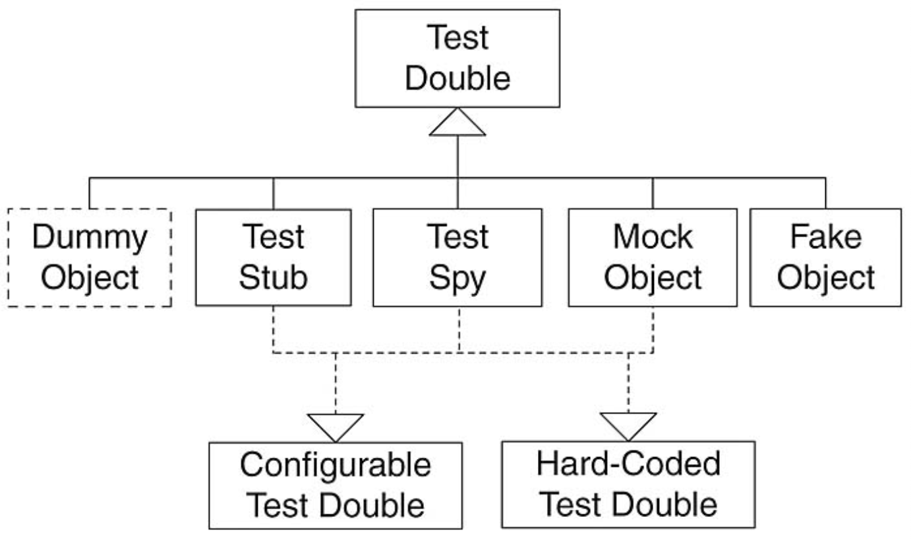

> 💡 학습 동기는 지난 포스트 [혼란스러운 단위, 통합, 인수, 시스템 테스트. 명확한 테스트 격리 수준 정리 😵‍💫](https://haon.blog/test/type/) 에서 이어지는 내용이다.

Junit 과 같은 자동화 테스트 도구를 활용하여 테스트를 작성할 때, 여러 객체들 사이에 의존성을 갖는 경우 테스트를 하기 까다로운 경우가 있다. 가령 프로덕션 코드의 핵심인 Service 레이어 객체에 대해 테스트가 Repository, Dao 에 직접 의존하고 있다면 테스트에 문제가 없을까?

Service 레이어는 Repository 에 대해 의존성을 갖고있다. 또 Repository 계층은 관례적으로 데이터베이스와 의존하는 형태를 갖는다. 결국 Service 레이어 객체는 꼬리에 꼬리를 물어 의존관계가 길어지는 형태를 갖는다.

맙소사. 우리가 테스트할 대상은 오로지 Service 객체만을 신경쓰는 것이었는데, 복잡한 의존관계로 인해 테스트 대상에 온전히 집중할 수 없게 되었다. 여기서 의존관계와 종속성을 신경쓰지 않고, 다른 객체와의 의존관계를 격리시켜 오로지 테스트 대상에만 집중할 수 있게 하는 기법이 바로 `테스트 더블(Test Double)` 이다.

### 테스트 더블 (Test Double)

`테스트 더블(Test Double)` 이란 현재 테스트 대상과 의존관계, 종속성을 맺는 객체들을 최대한 신경쓰지 않고 격리된 방식으로 테스트할 수 있도록 도와주는 객체다. 즉, 테스트 더블을 테스트하고자 하는 대상만을 독립적으로 테스트할 수 있도록 별도로 구현한, 실제 객체를 대신하는 더 단순한 객체이다.

정리하면, 현재 테스트 대상과 의존관계를 맺는 객체 대신에, 이와 동일하게 동작하는 별도의 가짜 객체가 테스트 더블이다. 현재 테스트 대상은 이 가짜 객체(Test Double)를 의존하게 된다. 

이때 용어를 잠시 정리하자면, 테스트 대상을 `SUT(System Under Test)` 라고하며, SUT 가 의존하는 실제 객체를 `DOC(Depended On Component)` 라고 한다. 가짜 객체인 테스트 더블은 이 DOC 를 모방한 객체로, DOC 과 동일한 입.출력을 제공하도록 동작한다.

## 테스트 더블의 종류

테스트 더블은 구현하는 세부 방식에 따라 총 5가지의 종류로 분류한다. 이에 대한 종류로는 **Dummy, Fake, Stub, Mock, Spy** 가 있는데, 한번 살펴보자.

### Dummy 

더미 객체는 **아무런 동작도 하지 않고, 겉으로 번 껍대기만 생성된 간단한 객체이다.** 테스트 대상 클래스는 이 더미 객체에 의존하지만, 절대 사용하지 않는다. 

예를들어 아래와 같은 UserService 클래스에서 회원가입을 수행하는 signup 메소드를 테스트한다고 해보자. 로직을 보면 알 수 있듯이, UserRepository 가 아닌 BookRepository 와는 전혀 관련없는 상황이다.

~~~java
public class UserService {
    private final UserRepository userRepository;
    private final BookRepository bookRepository;

    // ...

    public void signup(SignUpDto request) {
        userRepository.save(request);
    }
}
~~~

UserService 의 signup 메소드는 BookRepository 와 의존관계를 갖지 않기 때문에, 적어도 signup 테스트에 대해선 간단히 빈껍대기만을 가진, 아무런 동작도 수행하지 않는 BookRepository 더미 객체를 생성해줄 수 있다.

~~~java
public DummyBookRepo implements BookRepository {
    @Override
    public Book findBookById(long bookId) {

    }
}
~~~

### Fake

페이크 객체는 DOC 을 흉내내는 아주 간단히 구현된 객체로, 더미 객체와 달리 실제로 동작하고 사용된다. 하지만, 매우 단순한 방식으로 간단하게 구현하기 때문에 실제 프로덕션 코드에선 사용하기에 적합하지 않다.

페이크 객체로 DOC 을 흉내내는 가장 대표적인 예가 바로 데이터베이스다. 실제로는 복잡한 RDBMS 와 실제로 데이터베이스 통신을 하는 대신에, 실제 DB 를 흉내내는 인메모리 DB 로 대신하는 것이다. 아래와 Dao 코드를 보자. 

JdbcUserDao 는 JDBC 에 기반하여 실제 데이터베이스에 쿼리를 날려 통신을 한다. 나는 실제 DB 에 직접 쿼리를 날려 유저 데이터를 저장하는 동작이 수행되는 대신에, 임의로 DB 와 유사하게 동작하는 DB 로 간단히 테스트하고 싶다. 이를 위해 페이크 객체를 만들어보자.

~~~java
public class JdbcUserDao implements UserDao {
    private static UserDao userDao;
    private JdbcTemplate jdbcTemplate = JdbcTemplate.getInstance();

    public JdbcUserDao() { }

    @Override
    public void insert(User user) {
        String sql = "INSERT INTO USERS VALUES (?, ?, ?, ?)";
        jdbcTemplate.update(sql, user.getUserId(), user.getPassword(), user.getName(), user.getEmail());
    }

    // ...
}
~~~

실제 데이터베이스를 대신하는 간단한 인메모리 DB 방식으로 구현했다. `HashMap` 을 사용했는데, 현재 테스트에 한정하여 문제없이 동작할 것이다.

~~~java
public class FakeUserDao implements UserDao {
    private final <Long, User> inMemoryDB = new HashMap<>();

    @Override
    public void insert(Long userId, User user) {
        inMemoryDB.put(userId, user);
    }
}
~~~

그런데 과연 위 페이크 객체는 실제 프로덕션 코드에 적합할까? `HashMap`  이 MySQL 과 같은 체계적인 RDBMS 를 따라하진 못하며, 문제없이 동작하는 코드는 위 테스트 코드에 한정될 것이다. 이 떄문에 페이크 객체는 프로덕션 코드에 접하지 않다는 것이다.

### Stub

스텁은 테스트 과정에서 수행된 호출에 대해 **하드 코딩된 정적인 응답만을 제공한다.** 즉, 반한될 응답값이 미리 정적으로 결정되어 있으며, 항상 동일한 응답값만을 리턴한다.

로또 숫자 생성기가 있을때, 이를 스텁으로 구현하자면 아래와 같이 구현될 수 있다. 이 스텁을 활용하는 객체에 한정하여 항상 동일한 로또 넘버 리스트를 리턴한다. 

~~~java
public class LottoGeneratorStub implements LottoGenerator {
    private static final List<Long> lottoNumbers = {1, 3, 10, 37, 38, 41};

    public List<Long> generateLottoNumbers() {
        return lottoNumbers;
    }
}
~~~

### Spy

스파이는 Stub 의 역할을 가지면서, 호출된 내용에 대해 약간의 동적인 정보를 기록해둔다. 실제 테스트 더블로 구현된 객체에 자기 자신이 호출 되었을 때 확인이 필요한 부분을 기록하도록 구현한다.

아래 UserService 는 회원기입 메소드를 호출할 때 마다 유저 정보를 저장하고, 총 몇번 회원가입을 시도했는지 체크한다. 이처럼 자기 자신이 호출된 상황을 저장하고 확인할 수 있는 객체가 스파이다.

~~~java
public class UserService {
    private int signUpCnt = 0;
    private Collecction<User> users = new ArrayList<>();

    public void signUp(User user) {
        signUpCnt++;
        users.add(user);
    }

    public long getSignUpCnt() [
        return signUpCnt;
    ]
}
~~~

### Mock

모의 객체는 **호출에 대한 기대를 명세할 수 있고, 그 명세 내용에 따라 동작하도록 프로그래밍된 객체다.** Stub 에 비해, 특정 응답에 대한 구체적인 기댓값을 설정할 수 있다. 보통 Mock 객체는 개발자가 직접 코드를 작성하여 기댓값을 작성할 수도 있지만, Mocking 프레임워크를 사용하여  편리하게 동작 및 기댓값을 단언할 수 있다. 자바 진영에서 사용되는 대표 프레임워크는 `Mockito` 이다.

또한 위 테스트 더블 객체 종류 모두에게 호환되는 객체 종류이다. 즉, Dummy, Stub, Spy 처럼 동작할 수 있는 훌륭한 객체이다. 

아래 코드를 보면 Mockito 라이브러리에서 제공하는 `when` 절을 활용하어 명세를 하였다. Mocking 된 userRepository 는 when 절을 활용하여 명세한 내용에 따라 동작하게 된다. 

~~~java
@ExtendWith(MockitoExtension.class)
public class UserServiceTest {
    @Mock
    private UserRepository userRepository;
    
    @Test
    void test() {
        when(userRepository.findById(anyLong())).thenReturn(new User(1, "Test User"));
        
        User actual = userService.findById(1);
        assertThat(actual.getId()).isEqualTo(1);
        assertThat(actual.getName()).isEqualTo("Test User");
    }
}
~~~

지금까지 테스트를 진행하면서 Mockito 라이브러리를 자주 사용해왔기 떄문에, 더 자세한 내용은 여기서 학습하지 않도록 한다.

## 참고

- Effective Software Testing (Mauricio Aniche)
- https://tecoble.techcourse.co.kr/post/2020-09-19-what-is-test-double/
- https://hudi.blog/test-double/
