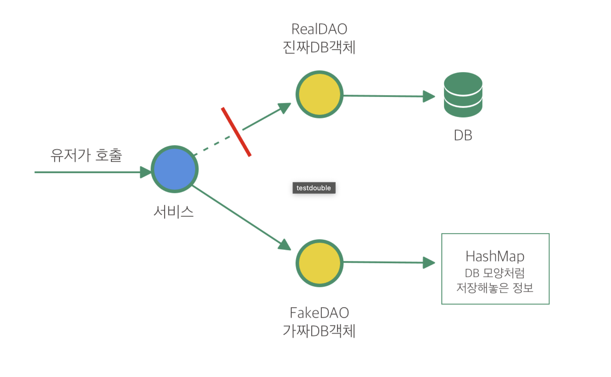

## 학습배경

이번 카카오테크 교육과정에서 맥(mac) 코치님의 수업을 들으면서, 애자일스러운 개발 프로세스에 대해 알게 되었다. 수업 내용중 E2E 테스트, 테스트 커버리지, ... 등 실제 현업에서의 테스트 진행방식에 관한 내용도 자세히 들을 수 있었다.

이전부터 혼자 무작정 테스트를 작성하면서 무작정 단위 테스트, 통합 테스트에 대한 개념을 익혔는데, 항상 명확한 기준없이 작성했었던 것 같다. 사실 테스트 더블(Test Double), 모의 객체에 관한 학습을 진행해볼까 하다 근본 기초부터 제대로 학습하기위해 테스트 수준에 대해 먼저 학습하기로 생갃했다. 이번 기회에 테스트에 관한 지식을 매꾸고자 글을 작성한다.

---

## 단위, 통합, 인수 테스트, .. 햇갈리는 기본 개념 정리 😫

 단위, 통합, 인수, 시스템 테스트등은 기본적인 용어, 개념임에도 사실 지금껏 햇갈려했던 단어이다. "이걸 단위 테스트라고 하는거겠지?" 라는 추측성에 가까운 정의를 해왔는데, 이번 기회에 확실히 개념을 정교화한 후 향후 포스트에서 테스트 더블, 모의 객체에 관하여 학습하도록 한다.

 ## 테스트 피라미드

 

 테스트 피라미드는 테스트 수준별로 단위 테스트, 통합 테스트, 시스템 테스트, 수동 테스트로 구분을 지어놓았다. 서로 다른 테스트 수준과 그 이점을 명확히 이해하고 나면, 우리는 단위 테스트와 이 외의 테스트 수준 중 어떤것에 더 노력을 들여야할지, 그리고 서비스에서 어떤 부분을 테스트 기법으로 테스트할지 결정할 수 있다. 이를위해 각 계층별 테스트 특징을 학습해본다.

### 단위 테스트

단위(Unit) 를 격리래서 테스트하는 것을 단위 테스트라고 한다. 단위 테스트를 구성할 때 가장 어려우면서도 재밌는 점은, 한 단위를 구성하는 요소를 정의하는 명확한 기준이다. 즉, 어떤 크기를 가진 컴포넌트를 단위(Unit) 로 바라봐야 하는가인데, **한 단위는 단 1개의 메소드일 수도 있고, 또는 여러개의 클래스로 구성될수도 있다.**

> "단위 테스트는 시스템에서 작업 단위를 호출하는 자동화된 코드 조각이다. 그러고 작업 단위는 한 메소드, 한 클래스 또는 함께 동작하는 여러 클래스에 이를 수 있고, **검증 가능한 단 하나의 논리적 목표를 달성한다.**" -  로이 오쉐로브(2009)

로이 오쉐로브의 인용문 중 살펴볼 부분은 "검증 가능한 단 하나의 논리적 목표를 달성한다" 이다. 하나의 논리적 단위를 구성하는 것이 단위(Unit) 으로 취급되며, 이 떄문에 한 논리적 단위를 구성하는 요소들은 단 1개의 메소드로 구성될 수 있지만, 여러개의 클래스로도 구성될 수 있는 것이다. 

#### 모의 객체와 단위 테스트

관례적으로 단위 테스트는 (데이터베이스나 웹 서비스 등과 같은) 외부 시스템에 의존하지 않는 작은 클래스 집합, 또는 내가(개발자 나 자신) 이 제어하지 않는 무언가를 테스트하는 것으로 작성된다. 이 떄문에 단위 테스트 작성시 모의 객체를 자주 활용하게 된다. 

가령 위와같이 클래스A 에 대해 테스트를 진행한다고 했을때, 이 클래스 A는 단위로 바라볼 수 있다. 이 단위를 테스트할 때, 우리의 목표는 클래스 A 에 대한 테스트에 집중할 수 있도록 최대한 나머지 (A 와 의존관계가 있는 요소들) 로 부터 A 를 격리하는 것이다. 만약 A 가 다른 나머지 클래스들에 의존하게 된다면 그것들을 모두 고려하여 테스트를 진행해야 하므로 A 라는 단위가 아닌 나머지를 모두 고려한 테스트가 되버리며, 단위의 기준이 모호해진다.

모의 객체, 테스트 더블에 관한 내용은 향후 포스트에서 다루겠다.

### 통합 테스트

단위 테스트가 오로지 한 단위에 최대한 집중하여 테스트를 진행하는데에 목적을 둔다. 즉, 시스템의 가장 작은 부분에 집중한다. 반면 통합 테스트는 하나의 서비스를 구성하는 여러 구성요소 중 특정 요소들에 대해 외부 요소(DB, 외부 라이브러리) 들과 함께 묶어 테스트 하는 방식이다. 통합 테스트의 목적은 시스템의 여러 구성요소들을 함께 묶어 테스트하는 것이며, **시스템을 구성하는 여러 구성요소들간의 상호작용에 초점을 맞춘다.**  

이때, 구성요소란 우리 작성한 코드의 컴포넌트 여럿을 비롯하여 외부 요소 또한 함께 포함한다. 외부 요소란 개발자가 변경할 수 없는 부분(데이터베이스, JWT 제공처, 외부 라이브러리, 인프라 등) 을 뜻한다. 즉, 통합 테스트는 **우리가 작성한 컴포넌트 코드들과 외부 요소를 모두 하나로 묶었을 때 원활히 상호작용하는 것을 테스트해야 할 때 사용하는 테스트 수준이다.**  이는 DB에 접근하거나 전체 코드와 다양한 환경이 제대로 작동하는지 확인하는데 필요한 모든 작업을 수행할 수 있다. 그러나, 통합 테스트가 응용 프로그램이 완전하게 작동하는 걸 무조건 증명하지는 않는다.

또한 유의할 점은, 통합테스트는 시스템내에 여러 컴포넌트, 외부 요소들의 상호작용 관계를 기반으로 테스트하는 것이므로 아래에서 기술할 `인수 테스트(Acceptance Test)` 에서도 활용될 수 있다. 쉽게말해, 통합 테스트를 구성하는 컴포넌트 범위는 작을 수도 있고, 클 수도 있다. 프레젠테이션 계층부터 레포지토리 계층까지 전 범위에 구성된 컴포넌트 여럿을 함께 묶어 테스트하는 것도 통합 테스트가 될 수도 있고, 이것이 곧 상황에 따라 인수 테스트가 되기도 한다. 프레젠테이션 계층에선 JWT 토큰을 인증하고 받아오는 것이 수행될 수 있고, 서비스 및 레포지토리 계층에선 DB 와의 원활한 상호작용 로직 검증이 포함될 수 있다. 반대로 자그마한 컴포넌트 여럿을 묶어 외부 요소와 테스트할 수도 있기에, 더 작은 범위의 계층별 테스트에서도 활용될 수 있다. 그저 통합 테스트는 논리적인 단위를 가진 컴포넌트와 외부 요소 여럿을 함께 묶는다는 의미가 내포되기 때문에, 크기와 범위가 명확하지 않고 다소 모호한 면이 있다.

스프링부트에서는 클래스 상단에 `@SpringBootTest` 어노테이션을 붙여 통합 테스트를 수행할 수 있다. `@SpringBootTest` 는 스프링의 전체 빈을 컨텍스트에 모두 띄워서 테스트 환경을 구동한다. 즉, 어플리케이션이 동작하는 실제 환경과 동일한 환경에서 테스트를 진행하게 된다.

통합 테스트를 이해하기 위해, DAO 를 생각하면쉽다. DAO 는 외부 구성요소인 DB 와의 상호작용만을 담당하는 클래스(데이터 접근 객체) 이다. DAO 는 우리가 작성한 코드로, 외부 요소인 데이터베이스와 상호작용한다.  우리는 아래와 같은 DAO 코드를 작성했다고 했을 떄, DAO 를 통한 SQL 쿼리가 제대로 작동하는지 확인하고 싶어 테스트 하고 싶은 상황이라고 생각해보자.

~~~java
public class UserDao {
    private static UserDao userDao;
    private JdbcTemplate jdbcTemplate = JdbcTemplate.getInstance();

    public UserDao() { }

    public void insert(User user) {
        String sql = "INSERT INTO USERS VALUES (?, ?, ?, ?)";
        jdbcTemplate.update(sql, user.getUserId(), user.getPassword(), user.getName(), user.getEmail());
    }

    // ...
~~~

과연 위와 같은 Dao 의 insert 쿼리문 하나가 원활히 동작하는지 테스트하기 위해 서비스 전체를 모두 통틀어서 테스트 할 필요가 있을까? 당연히 아니다. 우리는 Dao 와 데이터베이스 이 둘의 통합에만 집중하여 테스트하길 바랄 것이다.

이처럼 통합 테스트는 시스템(서비스) 내의 특정 요소들을 여럿 추출하여, 이들에 대해 테스트하는 방식이다. 이러한 방식은 앞서 말한 "시스템 전체를 테스트하는 대신 구성요소들의 상호작용에 초점을 맞춘다." 라는 말과 부합한다.

### 시스템 테스트

시스템(서비스) 을 더 실질적인 관점에서 바라보자면, 시스템이 가진 모든 구성요소(데이터베이스, FE, BE 전체 구성요소) 를 포함한 테스트를 수행해야 할 것이다. 이것이 바로 시스템 테스트다. 이 테스트 수준은 시스템이 내부에서 어떻게 동작하는지 관심이 없다. 자바로 개발되었는지, MySQL 로 데이터베이스를 구축했는지 여부도 관심이 없다. **오로지 어떤 입력(Input)으로 넣었을 떄 어떤 출력(Output)이 나오는지에 대해서만 관심이 있다.**

#### 이점

시스템 테스트의 명백한 이점은 **현실적**이라는 것이다. 즉, 실제 서비스 사용자가 진행하는 작업과 유사한 행위에 대해 검증하기 떄문에, 우리는 서비스 전체 로직에 대해 더 믿음을 가질 수 있다.

#### 취약점

하지만 **느리다.** 전체 시스템을 구동하는 작업은 쉽지 않은 일이다. 또한 **다소 불안정하다.** 같은 테스트 코드를 실행했을 때, 어떨떄는 통과하고, 어떨떄는 실패하기도 한다. 외부 오픈 API 를 사용하는 활용하는 경우를 생각하면 이해하기 쉬운데, 우리 서비스에서 HTTP POST 요청을 보낸 후 응답이 오는데까지 항상 동일한 시간이 걸린다는 보장이 없다. 어떨떄는 3초가 걸리고, 또 어떨떄는 5초가 걸릴 수 있다. 이 떄문에 시스템 테스트는 예기치 못한 동작을 일으킬 수 있는 불확실성이 너무 많기 떄문에, 테스트를 전적으로 믿기 힘들다.

## 각 테스트 수준을 언제 사용하고, 무엇을 테스트해야할까?

각 테스트 수준을 언제 사용할지에 대한 대답은, "상황에 따라 다르다" 이다. 아래 각 수준별 특징에 따라 알맞은 테스트 수준을 선정하여 작성하는 것이 올바를 것이다.

> 💡 테스트 수준별 활용 상황
> - 시스템 테스트 : 애플리케이션의 주요하고, 위험한 실행 흐름에 대해 테스트시 작성
> - 통합 테스트 : 외부 서비스(DB 등)와의 복잡한 상호작용를 테스트시 작성
> - 단위 테스트 : 모든 비즈니스 규칙은 여기서 테스트되어야 한다.

테스트 피라미드에서, 위로 올라갈수록 테스트는 더 현실적이고 복잡해진다. 또한 위로 올라갈수록 작성 비율이 낮아진다. 즉, 관례적으로 단위 테스트가 작성 비율이 가장 높음을 알 수 있다.

### 단위 테스트를 지향할 것

사람마다 가치관과 기준은 다르겠지만, 단위 테스트를 선호하는 경우가 꽤나 많다. 단위 테스트는 작성하기 쉽고, 빠르다. 작은 단위에 대해 효율적이고 엄격하게 테스트하는 일은, 이보다 더 큰 기능에 대한 굳은 믿음을 가질 수 있게 해준다. 결국 현재 작성한 여러 단위들이 서로 함꼐 동작하여 더 큰 기능을 구성하기 때문이다. 큰 기능은 자신의 작은 단위들에 대해 올바르게 동작할 것이라는 믿음을 가지고 있다.

### 각 수준에서 정확히 무엇을 테스트하는데?

#### 단위 테스트

소프트웨어 시스템의 알고리즘, 단일 비즈니스 로직과 관련된 단위에 대해선 단위 테스트를 사용한다. 이때, 대부분의 비즈니스 로직은 메시지를 주고받는 엔티티 클래스에 담겨있다. 이 떄문에 엔티티를 단위 테스트하는 것이 매우 중요하다.

또한 비즈니스 로직은 대개 외부 서비스에 의존하지 않기 떄문에, 단위 테스트로 쉽게 테스트하고 완전히 제어할 수 있다. 단위 테스트를 이요하면 입력 데이터를 완전히 통제할 수 있을 뿐 아니라, 기대한 대로 동작했는지에 대한 믿음을 확보할 수 있다. 

#### 통합 테스트

앞서 계속 설명했듯이, 테스트 대상 구성요소가 DB, 외부 서비스의 공공 API 와 같은 외부 구성요소와 상호작용 할떄마다 통합 테스트를 사용하는 것이 좋다. 

단, 통합 테스트는 단위 테스트보다 비용이 많이 들고 설정하기 어려우므로, 시스템의 일부를 테스트할 수 있는 유일한 방법일 떄만 사용하도록 하자.

### 인수 테스트 vs 시스템 테스트

필자가 이번 테스트 수준을 학습하면서 가장 햇갈렸던 부분이 인수 테스트와 시스템 테스트의 차이다. 생각의 정교화를 위해, 인수 테스트에 대해 아래와 같이 정리해보겠다.

### 인수 테스트 (Acceptance Test)

**인수 테스트는 개발이 완료된 소프트웨어에 대해 사용자 요구사항을 충족하는지 테스트하는 것이다.** 이 떄문에 사용자 입장을 고려하여, 사용자 시나리오(스토리) 를 작성하게 된다. 프로젝트에 참여하는 사람들 (기획자, 클라이언트 대표, 개발자 등) 이 토의를 진행하여, 시나리오를 만들고, 개발자는 이에 의거하여 테스트 코드를 작성한다. 정리하자면, 인수 테스트란 사용자 시나리오에 의거하여 테스트를 작성하는 기법이다. 인수테스트 단계에서 소프트웨어에 문제가 없으면 사용자는 소프트웨어를 인수하게 되고, 프로젝트는 종료된다. 

시나리오에서 요구하는 것은 어떤 사용자가 (= 누가), 어떤 목적으로, 무엇을 하는가이다. 개발을 하다보면 이런 기능은 API 를 통해 드러난다. 

결국 인수 테스트는 소프트웨어 인수를 목적으로 하는 테스트다. 소프트웨어를 인수하기 전에 명세한 요구사항(인수 조건) 대로 잘 동작하는지 검증이 필요하다. 또한 소프트웨어를 인수할 떄, **소프트웨어 내부 구조나 구현 방법을 고려하기 보단, 실제 사용자 관점에서 테스트하는 경우가 많다.** 따라서, 인수 테스트는 소프트웨어 내부 코드에 관심이 없는 블랙박스 테스팅 기법이다. 실제 사용자 관점에서 테스트할 주로 `E2E(End to End)` 형식을 이용해서 확인한다.

#### E2E (End To End) Test

e2e test는 End To End test의 약자이다. 말 그대로 Endpoint, 즉 사용자가 실제 프로그램을 사용하는 상황을 테스트하는 것이다. 그래서 소프트웨어의 내부 구조 보다는 비즈니스 쪽에 초점을 두어 실제 시나리오대로 잘 동작하는지 테스트 하는 것이다. 그래서 Acceptance test(인수테스트)와 같은 의미로 사용되며, 이 또한 소프트웨어 인수를 위해 사용자 시나리오대로 테스트를 해보는 의미로 직결된다.

이러한 특징을 지닌 인수 테스트는 보통 자바 진영에선 RestAssured, MockMVC 와 같은 테스트 툴을 활용하여 테스트를 작성한다.

### 차이점은 무엇인가

시스템 테스트는 그저 해당 시스템(서비스) 가 완벽하게, 문제없이 동작하는지에 대해 초점이 맞추어져있다. 특정 인풋(Input) 에 대해 정확하게 원하는 아웃풋(Output) 이 도출되는지에 관심이 쏠려있다. 즉, 소프트웨어 장애 리스크에 대해 절대 문제가 발생하지 않도록 작성하는데에 목적을 둔다. 

인수 테스트 또한 문제가 발생하지 않도록 테스트를 진행하는 면에선 비슷하지만, 조금 목적이 다르다. 인수 테스트는 실제 사용자 환경에서, 사용자 입장에서 테스트를 수행하는 것에 초점을 둔다. 다시말해, 사용자가 만족할만한 서비스인지에 대해서 만족도를 높이기 위해 테스트한다. 장애없는, 버그없는 시스템이 구축되는것이 시스템 테스트라면, 인수 테스트는 사용자의 입장에서 불편함이 없고, 만족할 수 있도록 여러 사용자 시나리오에 기반하여 테스트를 작성한다. 

## 더 학습해볼 키워드

- 테스트 더블 (Test Double)
- 모의 객체 

## 참고

- Effective Software Testing (Mauricio Aniche)
- https://engineering.linecorp.com/ko/blog/server-side-test-automation-journey-2
- https://star7sss.tistory.com/846#3._%EC%8B%9C%EC%8A%A4%ED%85%9C_%ED%85%8C%EC%8A%A4%ED%8A%B8_(System_Testing)
- https://tecoble.techcourse.co.kr/post/2021-05-25-unit-test-vs-integration-test-vs-acceptance-test/
- https://dudurian.tistory.com/107