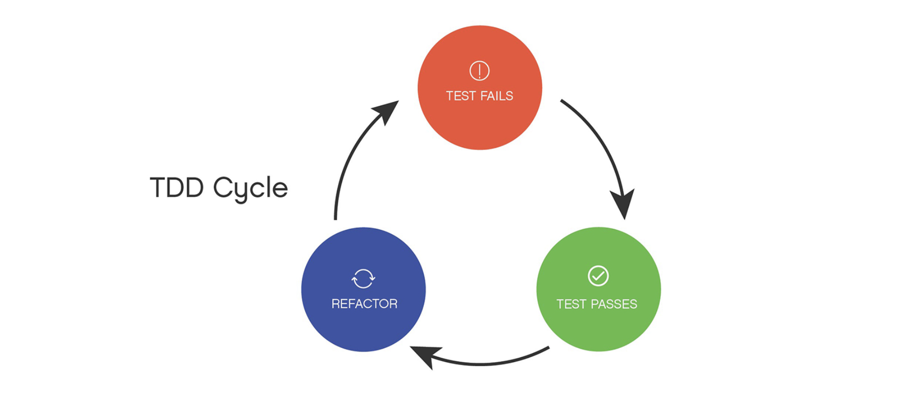
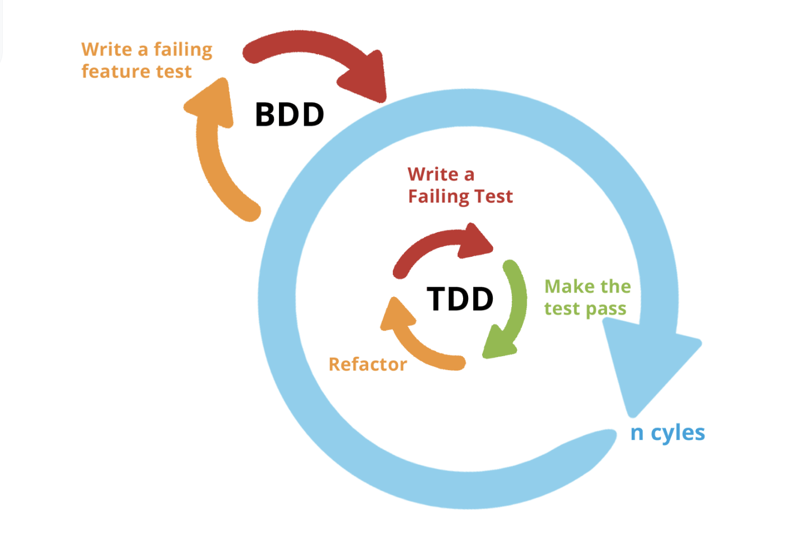

## 학습배경

우리 하모니 팀에서 테스트 코드를 작성하면서 BDD 스타일로 코드를 작성하고 있는데, 아직 남에게 언제든 즉각 BDD 그리고 TDD 에 대한 설명할 수 있을만큼 생각이 완벽하게 정교화되지 않은 것 같다. 또한 카카오테크 교육과정속에서 맥(mac) 코치님의 TDD, BDD 특강을 들은적이 있는데, 그때 이후로 개발하기에 급급하여 정교화된 학습을 미루어두고 있었다. 이번 기회에 TDD 와 BDD 에 대한 생각의 정교화를 위해 글을 작성하고, 학습해보도록 한다.

## TDD (Test Driven Development)

진짜 아무것도 몰랐던 시절에는 `TDD = 테스트 코드 작성` 인 줄 알았다. 하지만 이는 큰 오산이었다. TDD 를 소프트웨어 개발 "방법론" 이다. 

TDD 를 없이 무작정 테스트 코드를 작성하던 시절, 기존 테스트 코드 작성 방식은 프로덕션 코드를 먼저 모두 작성한 뒤에서야 테스트 코드를 작성했다. 하지만 TDD 는 이 순서가 반전된 것이다. **TDD 는 프로덕션 보다 보다 일단 실패하는 테스트 코드를 먼저 작성한다. 이후에 실패한 테스트 코드를 통과시키기 위한 최소한의 프로덕션 코드를 작성하고, 점진적으로 리팩토링하는 방식**이다. 테스트가 통과했다면, 이후 다른 기능을 개발하기 위한 새로운 (실패하는) 테스트 코드를 작성하거나 또는 프로덕션 코드를 리팩토링한다.

### TDD 사이클

TDD 는 `RED`, `GREEN`, `REFACTOR` 이 3가지의 사이클을 계속 반복하는 워크플로우 방식으로 진행된다. 이 3가지는 무엇을 뜻할까?

### RED: 실패하는 테스트 코드를 우선 작성한다.

동작하는 프로뎍션 코드가 전혀 없는 상황에서 우선 테스트 코드를 작성한다. 테스트 코드는 향후 개발될 프로덕션 코드가 어떠한 `기능` 을 정상적으로 수행하는지를 중점으로 작성한다. 후술할 BDD 와 다른점은, TDD 는 `기능 확인`을 중점으로 작성한다면, BDD 는 작성한 시나리오에 대한 `행위` 를 정상적으로 수행하는지를 중점으로 작성한다. BDD 는 이따가 자세히 학습해보자.

 또한 아직 프로덕션 코드가 존재하지 않기 때문에, 테스트 코드를 실패할 수 밖에 없다. 핵심은 우선적으로 실패하는 테스트 코드를 작성하는 것, 즉 RED 를 띄우는 것이다.

~~~java
@Test
void getMemberTest() {
    Member member = new Member("devHaon");

    String result = member.getNickname(1, 3);

    assertThat(result).isEqualTo("devHaon");
}
~~~

나는 Member 클래스의 `getter` 가 닉네임을 정상적으로 출력하는지 기능을 테스트하기 위해 위처럼 테스트를 작성했다. 당연하게도 위 테스트 코드는 아직 Member 클래스, getter 등의 프로덕션 코드가 작성되지 않았기 떄문에 실패할 것이다. 즉, 일단 RED 를 띄운 상태이다.

### GREEN: 테스트를 통과하는 최소한의 프로덕션 코드를 작성한다.

앞서 RED 를 띄웠지만, 아쉽게도 테스트는 실패했다. 다음 단계인 GREEN 에서는 테스트를 통과하도록 최소한의 프로덕션 코드를 작성하는 것이다. 여기서 유의할 점은 "최소한의" 코드를 작성하는 것이다. **리팩토링은 나중으로 미루고, 일단 작성한 테스트 코드를 통과시키는데만 집중하여 코드를 작성하는 것이다.** 간신히 작동하는 코드여도 괜찮다. 우선적으로 현재 작성된 테스트를 통과시키는데만 집중한다.

GREEN 을 보기 위해서는 명백한 실제 구현을 입력하는 방법도 있겠지만, 정의상으론 최대한 빨리 GREEN 상태를 보기 위해서는 상수를 반환하는 코드를 작성하고 점진적으로 변수로 바꾸어가는 방법이 더 바람직하다.

~~~java
public class Member {

    public Member(String nickname) {
    }

    public String getNickname() {
        return "devHaon"; 
    }
}
~~~

위 코드는 GREEN 을 띄우기 위해 최소한으로 작성된 프로덕션 코드다. 실제로 앞서 작성한 테스트 코드를 실행시키면, 문제 없이 통과할 것이다.

하지만 실제로 적절한 닉네임을 리턴해주는 역할을 수행하지 못한다. 앞서 작성한 테스트를 통과하는 빈 껍대기에 불과하다. GREEN 을 띄우기 위해선, 한번에 하나의 일만 집중하도록 일단 빠르게 테스트 코드를 통과시키는 껍대기 코드를 작성하는 것이다. **즉, 일단 동작하는 쓰레기 코드를 작성하는 단계다.**

### REFACTOR: 리팩토링 한다.

앞서 작성한 GREEN 을 통과하기 위해 만든 더티 코드를 리팩토링한다. 즉, 이 단계에선 좋은 코드로, 정상적인 기능을 수행하는 코드로 리팩토링하는 단계다.

~~~java
public class Member {
    private String nickname;

    public Member(String nickname) {
        this.nickname = nickname;
    }

    public String getNickname() {
        return nickname;
    }
}
~~~

## TDD 는 왜 쓰는가?

### 한번에 하나의 일만 집중할 수 있다.

TDD 를 적용하지 않은 상황에서는 현재 모듈과 관련한 코드를 작성하다가, 갑자기 다른 모듈과 클래스에 한 눈이 팔릴 수 있다. 즉, TDD 를 적용하면 현재 프로덕션 코드에 대한 테스트를 통과시키는데에 온전히 집중할 수 있다.

### 빠른 주기로 피드백 받을 수 있다.

TDD 를 적용하여 빠르게 테스트 코드를 작성할 수 있고, 피드백을 받고, 점진적인 리팩토링을 할 수 있다. 처음부터 완벽한 설계와 코드를 작성해야 한다는 부담도 없어진다. 또한 중간중간에 숨겨진 버그를 빠르게 찾아내는 피드백 과정이 동반된다.

### 프로뎍션 코드에 대한 이해도와 신뢰가 높아진다.

프로덕션 제품의 기능, 정책, 비즈니스 로직등을 통과시키기 위한 테스트 코드를 중점으로 작성한다. 즉, TDD 에 기반하여 작성된 테스트 코드는 프로덕션 코드에 대한 요구사항을 만족시키기 위해 작성된다. 또한 이 요구사항을 만족시키기 위해 처음부터 완벽한 코드를 작성하지 않고, 점진적으로 작성해나간다. 

이 방법을 통해 프로덕션 코드에 대한 테스트 코드의 믿음, 신뢰도가 향상된다. 또한 비슷한 이유로 이해도도 향상될 것이다. 테스트 코드 자체가 일종의 문서가 되는 셈이다.

### 의도치 않은 유용한 부산물을 만들 수 있다.

프로뎍션을 개발하다보면 요구사항이 변화되고, 다른 방향으로 코드를 유연하게 확장해야하는 상황이 많다. 새로운 코드를 작성한 뒤, 그 코드로 갈아끼웠을 때 이 코드가 다른 모둘에 영향을 끼치지 않을지 불안감에 가득할 수 밖에 없다. 이때 이전에 작성한 테스트를 실행하여, 테스트가 성공 또는 실패하는지 확인하여 틀리지 않았음을 굳게 믿을 수 있다. 반대로 당연히 통과할 것 같던 프로덕션 코드도 예상치 못한 코드로 인해 문제가 발생할 수 있는데, 이 또한 기존에 작성한 테스트를 통해 알아낼 수 있다. 즉, TDD 를 통해 만들어진 테스트 코드는 의도치 않은 유용한 부산물이 된다. 또한 비슷한 맥락으로 안전하게, 믿음직한 확장성, 유지보수를 용이하게 만든다.

## BDD (Behavior Driven Development)

BDD 는 말 그대로 행위 주도 개발이다. 앞선 TDD 가 `기능 정상 동작` 을 중점으로 확인한 방법론이라면, BDD 는 `특정한 일련의 행위` 가 정상 동작하는지를 중점으로 테스트하는 방법론이다.  이 떄문에 **BDD 는 테스트를 작성하기 위한 일련의 유저 시나리오를 요구한다.** 하나의 유저 시나리오내에는 어떠한 행위가 이행되는지의 일련의 스토리가 테스트 코드로 표현될 것이다. 시나리오대로 작성된 테스트 코드가 문제없이 동작하는지 작성해야한다.

TDD를 하면서 개발을 하다보면 테스트에 대해서도 계속 유지보수해야한다. 하지만 이 규모가 커진다면 관리하기에 번거롭기도 하고, 마감기한이 정해진 프로젝트라면 일정에 대해 압박을 받을 수도 있다. 그렇기 때문에 매번 개발을 진행하면서 기능에 대해 예외사항에 대해 매번 생각하고 모든 엣지 케이스에 대한 테스트를 작성하는 것은 생각보다 비용이 많이 들어가는 일이라고 볼 수 있다. 

하지만 만약 여기에서 이미 작성된 요구사항이나 기획서가 있고, 그에 맞추어 테스트 케이스를 중점으로 작성하게 된다면, 위와 같은 시간에 대한 비용이 줄게된다. 이것이 바로 BDD이다.

BDD 는 TDD 에서 파생된 테스트 방법론이기 떄문에, 이 둘은 상호 배타적인 관계가 아니라 상호 보완적인 관계이다. 프로젝트에서 BDD의 테스트케이스로 시나리오 검증을 하고, 해당 시나리오에서 사용하는 각 모듈들은 TDD의 테스트케이스로 검증을 하는 방법이 좋다. 

### given-when-then 절

잘 몰랐을 때는 given, when, then 절이 TDD 에만 해당하는 기법인 . 줄 알았는데, 이는 다시금 생각해보면 BDD 방법론에 더 가깝다. given, when, then 절은 행위를 검증하는데에 적합한 테스트 작성 구조이다.

> - `given` : 테스트를 위해 주어진 상태
> - `when` : 테스트 대상에게 가해진 어떠한 상태
> - `then` : 앞선 과정의 결과

아래는 BDD 기반의 테스트 코드다. 

~~~java
@Test
void 유저가_로그인을_시도하면_토큰을_반환한다() {
    // given
    Member member = new Member("devHaon");

    // when
    String token = loginService.login(member);

    // then
    assertThat(token).isNotEmpty();
}
~~~

어떠한가? 앞서 살펴본 TDD 테스트 코드와 느낌이 다소 다르지 않은가? 보듯이 **BDD 스타일로 작성된 코드는 사용자의 행위를 작성하고, 그 결과에 대해 검증을 진행하는 방식이다.** 또한 이 행위 검증을 위해 given-when-then 구조를 취하고 있는 모습이다.

## TDD vs BDD

다시 정리하자면, TDD 는 테스트할 모듈의 "기능" 이 정상적으로 동작하는지 확인 검증을 위해 작성되는 방법론이다. 반면 BDD 는 사용자 시나리오 주체를 기준으로 행위를 확인하는 목적으로 작성되는 방법론이다.

### TDD 와 BDD 를 어떻게 활용해야하는가?

그렇다면 두 방법론 중에 1가지만을 선택해서 사용해야하는가? 라고 의문이 들 수 있지만, 둘의 적절한 타협과 조화를 통해 더 나은 테스트 코드를 만들 수 있다. **BDD의 테스트케이스로 시나리오 검증을 하고, 해당 시나리오에서 사용하는 각 모듈들은 TDD의 테스트케이스로 검증을 하는 방법이 많은 커버리지를 확보할 수 있다.**

## 참고

- https://mingule.tistory.com/43
- https://hudi.blog/test-driven-development/
- https://blog.wakmusic.xyz/tdd-vs-bdd-c738b507930f