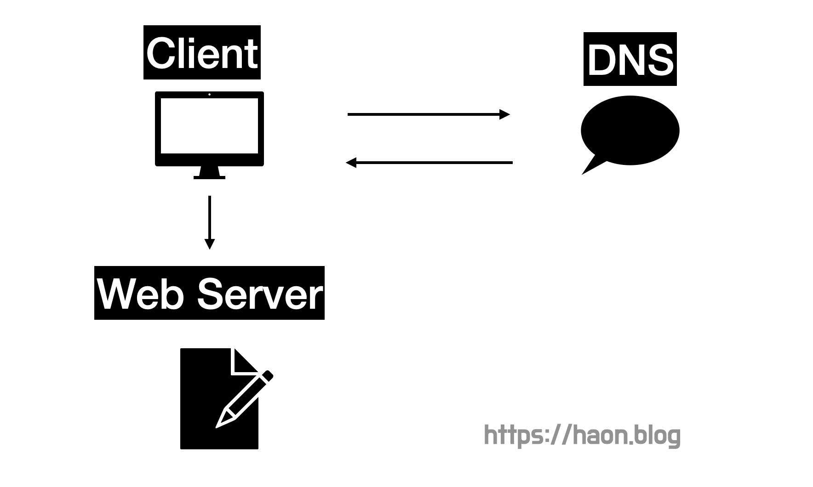
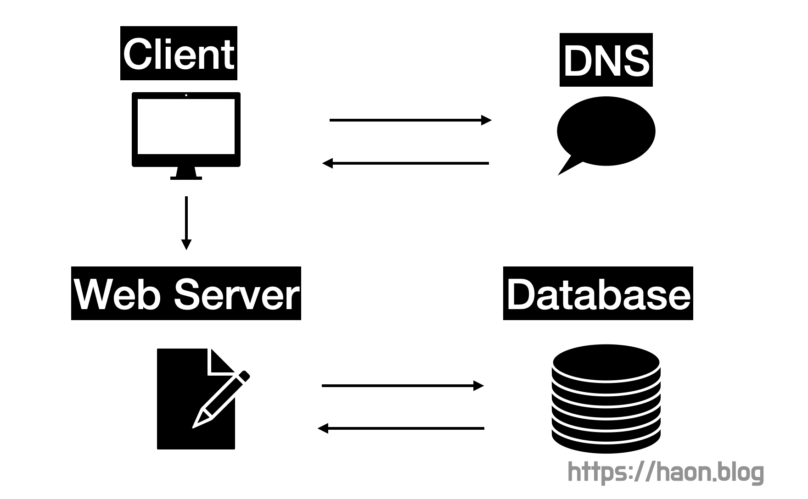
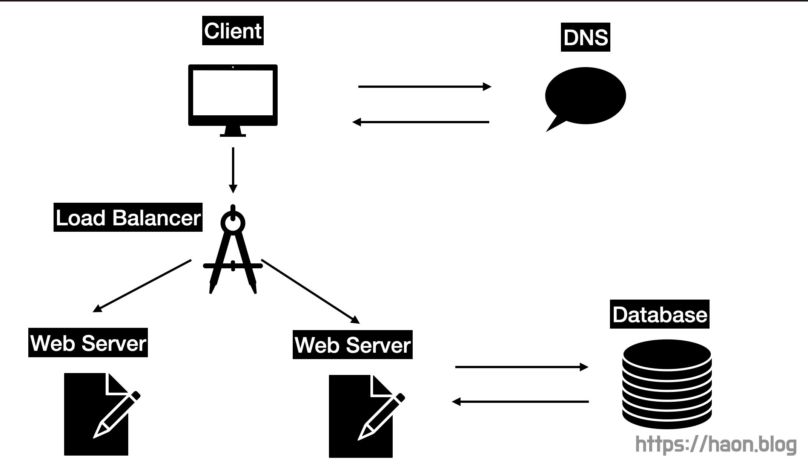
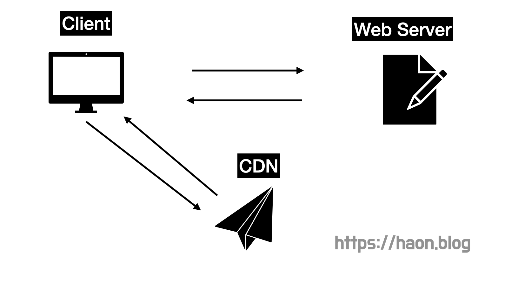
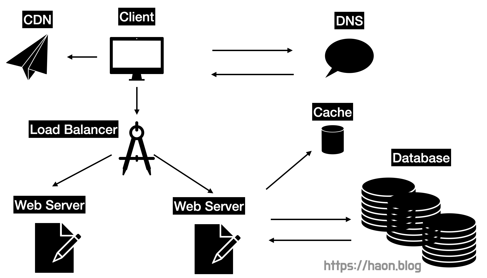
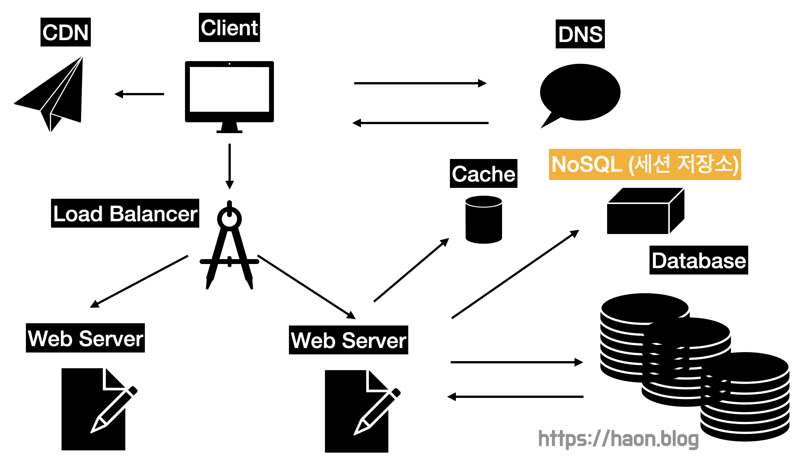
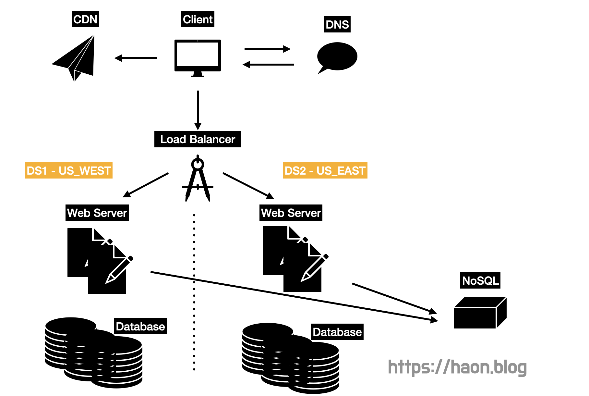
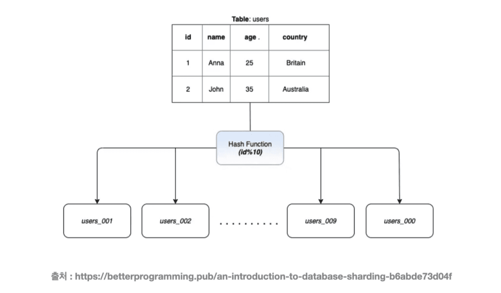

수백만 사용자르 지원하는 시스템을 설계하는 것은 도전적인 과제이다. 이번 포스팅에서는 한 명의 사용자를 지원하는 시스템에서 시작하여, 최종적으로는 몇 백만 사용자를 지원하는 시스템을 설계하는 방법에 대해 학습해보도록 한다. 

## 단일 서버

모든 컴포넌트가 단 1대의 서버에서 실행되는 간단한 시스템부터 설계해보자. 일반적으로 아래와 같은 절차로 수행될 것이다.

- `(1)` 사용자는 도메인 이름으로 DNS 에 질의하여 IP 주소를 얻어낸다.
- `(2)` 이 IP 주소로 사용자는 HTTP 요청을 전송한다.
- `(3)` 웹 서버는사용자에게 HTML 웹 페이지를 제공한다.

## 데이터베이스

사용자가 늘면 서버 하나로는 충분하지 않다. 따라서 여러 서버를 배치해야 한다. 한 서버는 웹/모바일 트래픽 처리 서버이고, 다른 하나는 데이터베이스 서버이다. 이렇게 각 서버를 용도별로 분리하면 각자 독립적으로 확장해 나갈 수 있게 된다.

### 어떤 데이터베이스를 사용할 것인가?

전통적인 RDBMS 에는 MySQL, Oracle DB, PostgreSQL 등이 있다. RDBMS 는 자료를 테이블과 열, 컬럼으로 표현하며, SQL 을 사용하면 여러 테이블에 있는 데이터를 그 관계에 따라 JOIN 하여 합칠 수 있다.

반면 NoSQL 도 에는 CouchDB, DynamoDB 등이 있다. NoSQL 은 다시 4가지 분류로 나눌 수 있는데, key-value 저장소, 그래프 저장소, 컬럼 저장소, 그리고 문서 저장소로 분류할 수 있다.

#### NoSQL 을 사용해야 하는 일부 케이스

대부분의 상황에서는 시장에서 40년간 잘 살아남은 RDBMS 를 사용하는 것이 최선이다. 그렇다면, 언제 NoSQL 을 사용하는 것이 바람직할까?

- 아주 낮은 Latency 가 요구되는 상황
- 다루는 데이터가 비정형(unstructured) 이라서 관계형 데이터가 아닌 상황
- 데이터(JSON, XML 등) 를 직렬화하거나 역직렬화 할 수 있기만 하면 되는 상황
- 아주 많은 양의 데이터를 저장해야 하는 상황

## 수직적 규모 확장 vs 수평적 규모 확장 

**수직적 규모 확장(scale up)** 은 서버에 고사양 자원을 추가(더 좋은 CPU, 더 많은 RAM 등) 을 추가하는 행위를 뜻한다. 반면 **수평적 규모 확장(Scale Out)** 은 더 많은 서버를 추가하여 성능을 개선하는 행위를 뜻한다. 

서버로 유입되는 트래픽의 양이 적을때는 수직적 확장이 좋은 선택이다. 하지만, 수직적 확장에는 아래와 같은 심각한 단점이 존재하여 대규모 애플리케이션에는 수평적 확장이 더 적절하다.

- 한 대의 서버에 CPU 나 메모리를 무한대로 증설할 방법은 존재하지 않기에, 언젠가는 분명 서버 사양을 올리는데 한계점에 도달한다. 
- FailOver 이나 다중화 방안을 제시하지 않는다. 서버에 장애가 발생하면 웹사이트는 완전히 중단된다.

### 로드밸런서

앞서 살펴본 설계에서는 사용자가 웹 서버에 직접 바로 연결된다. 이 설계 구조는 웹 서버가 다운될 경우 사용자자는 웹 사이트에 접속할 수 없게도니다. 또한, 트래픽이 너무 많아져서 서버가 한계에 도달하면 Latency 가 증가하거나 접속이 불가능해진다. 이 문제를 해결하기 위해 로드밸런서를 도입해야한다. 

로드밸랜서는 부하 분산 집합(load balancing set) 에 속한 웹 서버들에게 트래픽 부하를 고르게 분산하는 역할을 한다. **사용자는 웹 서버에 직접 접근하는 대신에 로드밸런서의 공개 IP 주소로 접근하게 된다.** 따라서, 웹 서버는 클라이언트의 접속을 직접 처리하지 않는다. 일반적으로 보안을 위해 서버간 통신에는 사설(비공개) IP 주소를 사용한다. **따라서, 로드밸런서와 웹 서버는 이 사설 주소를 사용하여 통신한다.**

부하 분산 집합에 또 하나의 웹 서버를 추가하고 나면 FailOver 가 안되는 문제를 해결할 수 있으며, 웹 계층의 가용성(Availability) 은 향상된다. 서버1이 다운되면(offline) 모든 트래픽은 서버2로 전송된다. 따라서 웹 사이트 전체가 다운되는 일이 없어진다. 또한 웹 사이트로 유입되는 트래픽에 가파르게 등장하면, 부하를 분산하기 위해 새로운 서버를 더 추가할 수도 있다. 

이제 웹 계층은 괜찮아졌다. 그렇다면 데이터베이스 서버는 가용성 측면에서 안전한가? 아직 데이터베이스 서버는 한 대이고, FailOver 나 다중화를 지원하지 않는다. 데이터베이스 다중화는 이런 문제를 해결한다.

### 데이터베이스 다중화

많은 데이터베이스는 다중화를 지원한다. 보통은 서버 사이에 **주(master) - 부(slave) 관계를** 설정하고 데이터 원본은 주 서버에, 사본은 부 서버에 저장하는 방식으로 구성한다. 또한 쓰기 연산은 master 서버에서만 지원한다. slave 서버는 master 서버로부터 그 사본을 전달받고, 읽기 연산만을 지원한다. 

대부분의 애플리케이션은 읽기 연산의 비중이 쓰기 연산보다 훨씬 높다. 따라서 통상 slave 데이터베이스의 수가 master 서버의 수 보다 많다. 

그렇다면, 데이터베이스 다중화를 통해 어떤 이점을 얻을 수 있을까?

- `(1)` 부하 분산을 통한 성능 개선 : master-slave 다중화 모델에서 쓰기 연산은 master 서버로만 전달디는 반면, 읽기 연산은 slave 서버들로 분산된다. 따라서 병렬로 처리되는 쿼리 수가 늘어나므로 성능이 향상된다.
- `(2)` 지리적 분산 : 자연 재해 등의 이유로 데이터베이스 서버 가운데 일부가 파괴되어도 데이터는 보존된다. 지리적으로 떨어져있는 곳으로 서버를 다중화할 수 있기 때문이다.
- `(3)` 가용성 : 데이터를 여러 지역에 복제해 둠으로써, 하나의 데이터베이스 서버에 장애가 발생하더라도 다른 서버에 있는 데이터를 가져와 계속 서비스 할 수 있게된다.

또한 데이터베이스를 다중화한다면 아래와 같은 상황에 대처할 수 있게 된다.

- 한 대뿐인 slave 서버가 다운되었다면, 읽기 연산은 일시적으로 master 서버에게 전달된다. 또한 즉시 새로운 slave 서버를 올려서 장애 서버를 대체(FailOver) 할 수 있을 것이다. slave 서버가 여러대인 경우라면 읽기 연산이 정상 동작하는 slave 서버들에게 분산되고, 이후 새로운 master 서버가 장애 서버를 대체할 수 있을 것이다.

- master 서버가 다운되었고, slave 서버가 1대뿐인 경우 : slave 서버가 새로운 master 서버로 승격하고, 일시적으로 읽기/쓰기 연산을 모두 처리한다.

프로덕션 환경에서 벌어지는 일은 이것보다는 사실 더 복잡하다고 한다. slave 서버에 보관된 데이터가 최신 상태가 아닐 수 있기 때문이다. 없는 데이터는 복구 스크립트를 돌려서 추가해야 한다. **다중 마스터(Multi Master) 나 원형 다중화(Circular Replica-tion)** 방식을 도입하면 이 복잡한 상황에 대처할 수 있는데, 이는 너무 어려운 내용이라 책에서 다루지 않는다.

## 캐시

캐시란 값 비싼 연산 결과 또는 자주 참조되는 데이터를 메모리 안에 두고, 뒤이은 요청이 보다 빨리 처리될 수 있도록 하는 저장소다. 애플리케이션 성능은 **데이터베이스를 얼마나 자주 호출하느냐에 따라 크게 좌우**되는데, 캐시는 그런 문제를 완화할 수 있다.

### 캐시 계층(cache tier)

캐시 계층은 데이터가 잠시 보관되는 곳으로 데이터베이스보다 훨씬 빠르다. 데이터베이스는 데이터를 디스크에 저장하고, 캐시는 RAM 에 저장하기 때문이다. 별도의 캐시 계층을 두면 `(1)` 성능이 개선되고 `(2)` 데이터베이스 부하가 줄어들고 `(3)` 캐시 계층을 독립적으로 확장할 수 있다. 

#### 읽기 주도형 캐시 전략

웹 서버는 캐시 서버에 데이터가 있다면(Cache Hit) 캐시 서버에서 데이터를 읽는다. 반대로 없다면(Cache Miss) 데이터베이스에서 데이터를 읽고, 캐시에 저장한 뒤 사용자에게 응답을 반환한다. 이런 캐시 전략을 **읽기 주도형 캐시 전략(read-through caching strategy)**이라고 한다. 이 외에도 데이터 종류, 크기, 엑세스 패턴에 맞는 다양한 캐시 전략이 있다고 한다.

### 캐시 사용시 유의할 점

캐시를 사용할 때는 아래 사항들을 고려해야 한다.

- 캐시는 어떤 상황에 바람직한가? : 데이터 갱신은 자주 일어나지 않지만 참조가 빈번할 때 

- 어떤 데이터를 캐시에 두어야 하는가? : 캐시는 데이터를 휘발성 메모리에 두므로, 영속적으로 보관할 데이터는 캐시에 두지 않는 것이 바람직하다. 중요한 데이터는 데이터베이스와 같이 **지속적 저장소(persistent data store)** 에 두어야 한다.

- 캐시에 보관된 데이터는 어떻게 만료(expire) 되는가? : 적절한 만료 정책이 필요하다. 만료된 데이터는 캐시에서 사라져야 한다. 만료 정책이 없으면 데이터는 영원히 캐시를 점유하게 된다. 만료 기한은 너무 짧으면 곤란한데, 데이터베이스를 너무 자주 읽게 될 것이기 때문이다. 너무 길어도 곤란한데, 실제 원본 데이터와 캐싱된 데이터간에 차이가 날 수 있기 떄문이다.

- 일관성(consistency)은 어떻게 유지되는가? : 일관성이란 데이터 저장소의 원본과 캐시 내의 사본이 같은지 여부이다. **저장소의 원본을 갱신하는 연산과 캐시를 갱신하는 연산이 단일 트랜잭션으로 처리되지 않는 경우, 이 일관성이 깨질 수 있다.** 원본 데이터 갱신을 성공하고, 캐시 갱신에는 실패했을 때 이 두 연산이 단일 트랜잭션으로 묶이지 않았다면 원본과 캐시의 일관성이 깨진다. 여러 지역에 걸쳐 시스템을 확장하는 경우 캐시와 저장소 사이의 일관성을 유지하는 것은 어려운 문제이다.

- 장애에는 어떻게 대처할 것인가? : 케시 서버를 한 대만 배치하면 **SPOF(Single Point Of Failure)** 가 될 수 있다. SPOF 를 피하려면, 여러 지역에 걸쳐 캐시 서버를 분산해야한다.

- 캐시 메모리를 얼마나 크게 잡을 것인가? : 캐시 메모리가 너무 작다면, 엑세스 패턴에 따라 **캐시 메모리에서 너무 자주 밀려나버려(eviction)** 성능이 떨어지게 된다. 이를 막을 한 가지 방법은, 캐시 메모리를 **과할당(over-provision)** 하는 것이다. 갑자기 캐시에 보관할 데이터가 많아졌을 때 생길 문제를 방지할 수 있다.

- 데이터 방출(eviction) 정책은 무엇인가? : 캐시가 꽉 차버리면 추가로 캐시에 데이터를 넣어야 할 경우 기존 데이터를 캐시에서 내보내야 한다. 이것을 캐시 데이터 방출 정책이라고 하는데, 가장 널리 쓰이는건 마지막으로 사용된 시점이 가장 오래된 데이터를 먼저 내보내는 **LRU(Least Recently Used)** 이다. 다른 정책으로는 사용된 빈도가 가장 낮은 데이터를 내보내는 **LFU(Least Frequently Used)** 이고, 가장 먼저 캐시에 들어온 데이터를 가장 먼저 내보내는 정책인 **FIFO(First In First Out)** 도 있다.

## 콘텐트 전송 네트워크 (CDN)

CDN 은 정적 콘텐츠(HTML, JS 파일, 이미지, 비디오 등) 를 전송하는데 쓰이는, 지리적으로 분산된 서버의 네트워크이다. 사용자가 네트워크를 방문하면, 그 사용자에게 가장 가까운 CDN 서버가 정적 콘텐츠를 전달한다.

참고로 동적 콘텐츠 캐싱은 요청 경로, Query String, 쿠기, 요청 헤더등의 정보에 기반하여 HTML 페이지를 캐싱하는 것이다. 이는 책에서 다루지 않는다.

CDN 은 어떻게 동작할까?  어떤 사용자가 웹사이트를 방문하면, **그 사용자에게 가장 가까운 CDN 서버가 정적 콘텐츠를 전달**하게 된다.당연한 말이지만, CDN 서버가 서버로부터 멀면 벌수록 웹 사이트는 천천히 로딩될 것이다. 세부 동작 과정은 보통 다음과 같이 동작하게 된다.

- `(1)` 사용자가 이미지 URL 을 이용해 이미지에 접근한다. 이 URL 의 도메인은 CDN 서비스 사업자가 제공한다.

- `(2)` CDN 서버에 해당 이미지가 없는 경우, CDN 서버는 원본 서버에 요청에 이미지 파일을 가져온다. 이때 원본 서버는 웹 서버일수도 있고, AWS S3 와 같은 저장소일 수도 있다.

- `(3)` 원본 서버가 CDN 서버에 파일을 리턴한다. HTTP 응답 헤더에는 해당 파일이 얼마나 오래 캐시될 수 있는지 나타내는 **TTL(Time-To-Live)** 값이 들어있다.

- `(4)` CDN 서버는 파일을 캐시하고 사용자에게 리턴한다. 이 이미지 파일은 TTL 에 명시된 시칸만큼 캐시된다.

- `(5)` 다른 사용자가 동일한 이미지를 CDN 서버에 요청한다.

- `(6)` 해당 이미지가 만료되지 않았다면 CDN 서버가 캐시해 둔 파일을 리턴한다.

### CDN 사용시 고려해야 할 사항

- 비용 : CND 은 보통 제 3사업자에 의해 운영되며, 데이터 전송량에 따라 요금을 지불한다. 따라서 자주 사용되지 않는 컨텐츠를 캐싱하는 것은 비용 낭비이다.

- 적절한 만료 시한 설정 : 시의성이 중요한 (time-sensitive) 컨텐츠는 만료 시점을 잘 설정하는게 중요하다. 만료 시한이 너무 길면 컨텐츠의 신선도가 떨어지고, 너무 짧으면 원본 서버에 빈번한 접속 요청이 들어올 것이다. 캐시 서버의 만료 정책과 비슷하다.

- CDN 장애에 대한 대처 방안 : CDN 이 응답하지 않는 경우 이 문제를 감지하여 원본 서버로부터 컨텐츠를 가져올 수 있도록 클라이언트를 구성할 필요가 있다.

- 컨텐츠 무효화(invalidation) 방법 : 아직 만료되지 않은 컨텐츠라고 하더라도, 아래 방법을 통해 CDN 에서 제거할 수 있다.
    - `(1)` CDN 서비스 사업자가 제공하는 API 를 사용한 무효화
    - `(2)` 컨텐츠의 다른 버전을 서비스하도록 오브젝트 비저닝을 이용한다. 컨텐츠의 새로운 버전을 지정하기 위해서는 URL 마지막에 버전 번호를 인자로 준다. 

지금까지의 시스템 설계를 그려보면 아래와 같을 것이다.

## 무상태(stateless) 웹 계층

이제 웹을 수평 확장(Scale Out) 하는 방법을 고민해 볼 차례이다. 이를 위해서는 사용자 세션 데이터와 같은 상태 정보를 웹 계층에서 제거해야한다.

#### 상태 정보에 의존적인 아키텍처

상태정보를 보관하는 서버는 클라이언트 정보, 즉 상태를 유지하여 요청들 사이에 공유(쿠기와 세션등을 사용하여) 되도록 해야한다. 무상태 서버에는 이런 장치가 없다.

문제는 같은 클라이언트로부터의 요청은 항상 같은 서버로 전송되어야 한다는 점이다. 대부분의 로드밸런서가 이를 해결하기 위해 **고정 세션(Sticky Seession)** 기능을 제공하고 있는데, 이는 로드밸런서에 큰 부담을 준다. 게다가 로드밸런서 뒷단에 서버를 추가하거나 제거하기도 까다로워진다. 

> 사실 왜 로드밸런서 뒷단에 서버를 추가하거나 제거하기도 까다로워지는지 잘 이해되지 않아서, 이는 추가 학습이 필요하다.

### 무상태 아키텍처

무상태 아키텍처는 세션과 같은 상태 정보를 별도의 **공유 저장소(Shared Storage)** 로 부터 데이터를 저장하고 가져온다. 즉, 상태 정보는 웹 서버로부터 물리적으로 분리되어 있다. 이런 구조는 단순하고, 안정적이고, 규모 확장이 쉽다. 이 공유 저장소는 Redis 와 Mecached 같은 캐시 서버를 사용할 수도 있고, NoSQL 서버를 사용할 수도 있다. 다만, 책에서는 규모 확장이 간편한 NoSQL 을 선택했다고 한다.

세션과 같은 상태를 Redis 와 같은 별도의 상태 저장소에 보관하면 **오토스케일링(AutoScaling)** 도 가능해진다. 오토스케일링은 트래픽 양에 따라 유연하게 웹 서버를 자동 추가하거나 삭제하는 기능이다. 상태 정보가 각 웹 서버에서 관리하는 방식이 아니므로, 트래픽 양에 따라 웹 서버를 넣었다 뺄 수 있는 유연한 구조로 개선된다. 

> 왜 오토스케일링을 가능하게 만드는지에 대한 추가 학습이 필요하다.

## 데이터 센터

만약 우리 서비스가 전 세계적으로 사용하게 되었다면 어떨까? **가용성을 높이고 전 세계 어디서든 빠르게 사용하기 위해 데이터 센터를 지원**해야한다.

지리적으로 분리된 2개의 데이터 센터가 있다고 해보자. 장애가 없는 상황에서 사용자는 가장 가까운 데이터 센터로 라우팅된다. 이 절차를 **지리적 라우팅(geoDNS-routing 또는 geo-routing)** 이라고 한다. 지리적 라우팅에서 geoDNS 는 사용자의 위치에 따라 도메인 이름을 어떤 IP 주소로 변환할지 결정해주는 DNS 서비스이다. 만약 데이터 센터 중 하나에 장애가 발생하면, 모든 트래픽은 장애가 발생안한 다른 데이터 센터로 라우팅된다.

다중 데이터 센터를 구축하려면 몇 가지 기술적 난제를 해결해야한다.

- 트래픽 우회 : 올바른 데이터 센터로 트래픽을 보내는 효과적인 방법을 찾는다. **geoDNS 는 사용자에게서 가장 가까운 데이터 센터로 트래픽을 보낼 수 있도록** 해준다.

- 데이터 동기화 : 데이터 센터마다 별도로 데이터베이스를 사용하고 있는 상황이라면, 장애가 자동으로 복구되어(failover) 트래픽이 다른 데이터베이스로 우회된다 해도, 해당 데이터 센터에는 찾는 데이터가 없을 수 있다. 이런 상황을 방지하는 보편적 전략은, 동일한 데이터를 여러 데이터센터에 걸쳐 똑같이 다중화 하는 것이다.

## 메시지 큐

**시스템을 더 큰 규모로 확장하기 위해서는 시스템의 컴포넌트를 분리하여, 각기 독립적으로 확장될 수 있도록 설계**해야한다. 메시지 큐(message queue) 는 많은 실제 분산 시스템이 이 문제를 해결하도록 지원한다.

메시지 큐는 비동기 통신을 지원하는 컴포넌트잉다. 메시지 큐는 무손실을 보장하는 특징이 있는데, 이는 메시지 큐에 한번 저장된 메시지는 소비자가 꺼낼때까지 안전히 보관된다는 점이다. 메시지 큐는 메시지의 버퍼 역할을 하며, 비동기적으로 전송한다.

**ProduceR (또는 Publisher)** 라고 불리는 서비스가 메시지를 만들어 메시지 큐에 메시지를 발생(publish) 한다. 메시지 큐에는 **Consumer 또는 Subscriber** 라고 불리는 서비스 또는 서버가 연결되어 있는데, 메시지를 받고 동작을 수행한다. 

메시지 큐를 사용하면 서비스 또는 서버 간 결합이 느슨해져서, 규모 확장성이 보장되어야 하는 안정적인 애플리케이션을 구성하기 좋다. 또, 결함에 대한 내성을 높여준다. **생산자는 소비자가 다운되어 있을 때도 메시지를 발행할 수 있고, 반대로 소비자는 생산자 서비스가 다운되어 있더라도 메시지를 수신**할 수 있다. 즉, 생산자 소비자는 서로의 서버가 살아있던 죽어있던 간에 상관없이 메시지를 발행하기만 하면 되기 떄문에, 비동기적으로 동작할 수 있다는 것이고 서버간 결합이 느슨해지며 규모를 확장하기 쉽다는 것이다.

사용 예로 시간이 오래 걸리는 이미지 보정 작업을 들 수 있다. 생산자인 웹 서버는 이미지 보정 작업을 메시지 큐에 넣는다. 사진 보정 작업 프로세스는 메시지 큐에서 메시지를 꺼내 해당 비동기적으로 이미지 보정 작업을 수행한다. 이런 구조에서는 생산자와 소비자 서비스의 규모는 각기 독립적으로 확장될 수 있다.

## 로그, 메트릭 그리고 자동화 

소규모 서비스에서는 로그, 메트릭(metric), 자동화(automation)은 좋지만 필수는 아니다. 하지만 사업 규모가 커지면 이런 도구에도 투자해야한다.

## 데이터베이스의 규모 확장

저장할 데이터가 많아지면 데이터베이스에 대한 부하도 커진다. 그때는 데이터베이스를 증설할 방법을 찾아야한다. 데이터베이스 규모를 확장하는 방법에는 수직적 확장과 수평적 확장 2가지로 나뉜다.

### 수직적 확장

데이터베이스 서버의 CPU, RAM, 디스크와 같은 자원을 증설하는 방법이다. 하지만, 이 방법에는 몇가지 심각한 단점이 존재한다.

- 서버 하드웨어를 무한 증설할 수 없으므로 한계점에 언제가 반드시 도달한다.
- 하나의 데이터베이스를 수직 확장하면 SOF 로 인한위험성이 크다.
- 고성능 서버로 갈수록 가격이 올라가므로 비용이 많이 발생한다.

### 수평적 확장 - 데이터베이스 샤딩

> 💡 데이터베이스 샤딩에 대한 자세한 이론은 [데이터베이스 분산 스토리지를 위한 파티셔닝과 샤딩](https://haon.blog/database/partitioning-sharding/) 을 참고하자.

데이터베이스의 수평적 확장을 **샤딩(Sharding)** 이라고 한다. 더 많은 서버를 증설함으로써 성능을 개선할 수 있다. 샤딩은 대규모 데이터베이스를 **샤드(shared)** 라는 작은 단위로 분할한다. 모든 샤드는 같은 스키마를 사용하지만, 샤드에 보관되는 데이터 사이에는 중복이 없다. 

샤딩 방식에는 여러가지가 있다. 그 중 **해시 샤딩(hash sharding)** 의 경우 샤드의 개수에 따라서 해시 함수를 사용하여 데이터가 보관되는 샤드를 결정한다. 예를들어 샤드가 4개라면, `user_id % 4` 를 해시 함수로 사용하여 데이터가 보관됭 샤드를 결정할 수 있다.

샤딩 전략에서 가장 중요하게 고려한 것은 **샤딩 키(sharding key, 즉 Partitioning Key)** 를 어떻게 정하는가에 있다. 샤딩 키는 데이터가 어떤 샤드에 저장되는지 결정하는 하나 이상의 컬럼으로 구성된다. 위 예제의 경우 user_id 가 샤딩 키이다. 샤딩 키를 정할때는 데이터가 고르게 분산될 수 있도록 하는것이 중요하다.

샤딩을 도입하면 시스템이 복잡해지고 풀어야할 새로운 문제도 생긴다.

- **데이터의 재 샤딩(re-sharding)** : 데이터가 너무 많아져서 하나의 샤드로는 감당이 어렵거나, 또는 균등하게 데이터 분포가 되지 않아 특정 샤드에 데이터가 몰려 할당된 공간 소모가 다른 샤드에 비해 빠르게 될 때 재 샤딩을 고려해야한다.  이를 **샤드 소진(shard exhaustion)** 이라고 하는데, 이런 현상을 해결하기 위해 샤드 키를 계산하는 함수를 변경하고 재배치 해야한다. (이는 안정 해시라는 기법을 사용하면 해결할 수 있다고 한다.)

- **유명인사(celebrity) 문제** : 핫스팟 키 문제라고도 부른다. 특정 샤드에 질의가 집중되어 서버에 과부하가 걸리는 문제이다. 페이스북 같은 서비스에서 유명 인사 유저가 모두 한 샤드에 집중적으로 저장되어 있다면 해당 샤드에만 과부하가 걸릴 것이다. 이를 해결하기 위해 유명인사 각각에 샤드 하나씩을 할당해야 할 수도 있고, 더 잘게 샤드를 쪼개야할 수도 있다.

- **조인과 비정규화(join and de-normalization)** : 하나의 데이터베이스를 여러 서버로 쪼개면, 여러 샤드에 걸친 데이터를 조인하기 힘들다. 이를 해결하는 방법 중 하나는 데이터베이스를 비정규화 하여 조인 없이 하나의 테이블에서 질의가 수행될 수 있도록 하는 것이다.

## 정리

지금까지 학습한 내용을 정리하면 다음과 같다.

- 웹 계층은 무상태 계층으로
- 모든 계층에 다중화 도입
- 가능한 한 많은 데이터를 캐시할 것 
- 여러 데이터 센터를 지원할 것 
- 정적 컨텐츠는 CDN을 통해 서비스할 것 
- 데이터 계층은 샤딩을 통해 그 규모를 확장할 것
- 각 계층은 독립적 서비스로 분할할 것 
- 시스템을 지속적으로 모니터링하고, 자동화 도구를 이용할 것

## 더 학습해야 할 키워드 

- Sticky Session
- 왜 상태를 별도의 저장소에 저장하면 부하 분산 집합내의 **AutoScaling** 이 가능해지는가?