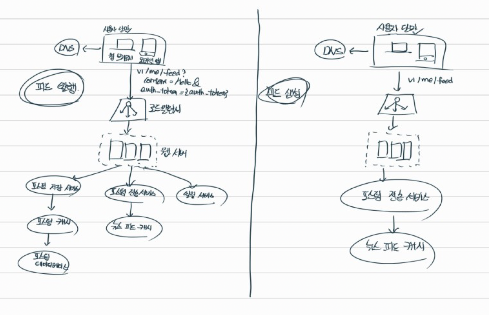

## 시스템 설계 면접은 무엇을 평가할까?

시스템 설계 면접을 당황스러울 때가 많다. 널리 알려진 상품 X (유튜브, 트위치, 인스타그램 등) 을 설계해보라는 식으로 막연한 문제가 나올때도 맣다.

다행인 것은, 아무도 면접자에게 실제 시스테처럼 복잡한 요구를 하지는 않는다. 실세계에서 이용되는 시스템으 구조는 극도로 복잡하다. 그러하면, 왜 대체 시스템 설계 면접이 있는 것일까?
시스테 설계 면접은 2명의 동료가 모호한 문제를 풀기 위해 협력하여 그 해결책을 찾아내는 시뮬레이션이다. 이 문제에는 정해진 결말도 없고, 정답도 없다. 이 문제에는 정해진 결말도 없고, 정답도 없다. 최종적으로 도출될 설계안은 본인이 설계 과정에 들인 노력에 비하면 그다지 중요하지 않다.

이 면접은 면접자의 설게 기술을 시연하는 자리익, 설게 과정에서 내린 결정들에 대한 방어 능력을 보이는 자리이며, 면접관의 피드백을 건설적인 방식으로 처리할 자질이 있음을 보이는 자리인 것이다.

면접관의 입장에서는, 일차적 목표는 면접자의 능력을 평가하는 것이다. 가장 피하고 싶은 일은 면접이 매끄럽게 진행되지 않아서 충분한 시그널(signal) 을 수집하지 못한 바람에 평가 결과를 확정 지을 수 없는 상황일 것이다. 그렇다면 면접관이 시스템 설계 면접에서 찾고자 하는 것은 무엇인가?

많은 사람들이 시스템 설계 면접은 지원자의 설계 능력이 기술적 측면을 평가하는 자리일 것이라 생각할 것이다. 사실은 그 이상이다. **시스템 설계 면접이 잘 진행되면, 지원자가 협력에 적합한 사람인지, 압박이 심한 상황도 잘 해쳐 나갈 자질이 있는지, 모호한 문제를 건설적으로 해결할 능력이 있는지 등을 살펴볼 수 있다. 좋은 질문을 던질 능력이 있는지도 살펴볼 수 있다.**

훌륭한 면접관은 **부정적 신호(red flag) 도 놓치지 않는다.** 설계의 순수성에 집착한 나머지, 팀원과 타협하여 결정하는 것을 등한시하고 과도하게 오버 엔지니어링을 하게되는 개발자들이 현업에도 많다. 그런 엔지니어들은 과도한 엔지니어링의 결과로 시스템 전반의 비용이 올라간다는 사실을 알아채지 못하는 일이 많은데, 그 결과로 상당수 회사들은 값비싼 대가를 치르고 있다. 우리는 면접관에게 이런 엔지니어들과 같은 경향이 있다는 것을 보이면 안된다.
이것 이외의 부정적 신호로는 완고함, 편협함 같은 것들도 있다.

## 효과적 면접을 위한 4단계 접근법

시스템 설계 면접은 전부 제각각이다. 훌륭한 설계 면접은 정해진 결말도 없고 정답도 없다. 하지만 그 절차나 범위에는 공통적인 부분이 있다.

### 1단계. 문제 이해 및 설계 범위 확정

> 바로 답부터 들이밀지 마라. 속도를 늦추고, 깊이 생각하고 질문하여 요구사항과 가정들을 정확히 파악하라.

시스템 면접을 볼 떄는 생각없이 바로 답을 내서는 좋은 점수를 받기 어렵다. 요구사항을 완전히 이해하지 않고 답을 내놓은 행위는 아주 엄청난 감점 요소이다. 면접은 퀴즈 쇼가 아니며, 정답 따위는 없다는 걸 상기하자.

그러니 **바로 답부터 들이밀지 마라. 속도를 늦춰라. 깊이 생각하고 질문하여 요구사항과 가정들을 분명히 하라.** 이 단계의 중요성은 강조하고 또 강조해도 모자람이 없다. 엔지니어인 우리에게는 어려운 문제를 풀고 최종 설계를 바로 내놓고 싶은 욕구가 있다. 하지만 그러면 잘못된 시스템을 설계할 가능성이 높아진다. 엔지니어가 가져야 할 가장 중요한 기술 중 하나는 올바른 질문을 하는 것, 적절한 가정을 하는 것, 그리고 시스템 구축에 필요한 정보를 모으는 것이다.

질문을 던지면 면접관은 우리가 질문에 대한 답을 바로 내놓거나, 아니면 우리 스스로 어떤 가정을 하기를 요구할 것이다. 후자의 경우(스스로 가정하기) 에는 그 가정을 화이트보드다 종이에 적어두어야 한다. 나중에 필요해질 때가 있어서다. 그렇다면 어떤 질문을 해야하나? **요구사항을 정확히 이해하는데 필요한 질문을 하라.** 예를들어 아래와 같은 질문을 해볼 수 있다.

> 💡 요구사항을 정확히 이해하기 위해 필요한 질문 예시
>
> - 구체적으로 어떤 기능들을 만들어야 하나?
> - 제품 사용자 수는 얼마나 되나?
> - 회사의 규모는 얼마나 빨리 커지리랄 예상하나? 3달, 6달, 1년뒤의 규모는 얼마나 되리라 예상하는가?
> - 회사가 주로 사용하는 기술 스택은 무엇인가? 설계를 순화하기 위해 활용할 수 있는 기존 서비스로는 어떤 것들이 있는가?

### 예제 (1단계)

뉴스 피드 시스템을 설계하라는 요구를 받았다고 해보자. 요구사항을 분명히 하기위한 질문을 던져야 할 것이다. 우리와 면접과 사이에 오갈 대화는 다음과 비슷할 것이다.

- 지원자 : 모바일 앱과 웹 앱 가운데 어느 쪽을 지원해야 하나요? 아니면 둘 다일까요?
- 면접관 : 둘 다 지원해야 합니다.
- 지원자 : 가장 중요한 기능은 무엇인가요?
- 면접관 : 새로운 포스트를 올리고, 다른 친구의 뉴스 피드를 볼 수 있도록 하는 기능입니다.
- 지원자 : 이 뉴스 피드는 시간 역순으로 정렬해야 하나요? 아니면 다른 특별한 정렬 기준이 있습니까? 제가 특별한 정렬 기준이 있느냐고 묻는 이유는, 피드에 올라갈 포스트마다 다른 가중치가 부여되어야 하는지 알고 싶어서 입니다. 가령 가까운 포스트가 사용자 그룹에 올라가는 포스트보다 더 중요하다거나요.
- 면접관 : 문제를 단순하게 만들기 위해, 일단 시간 역순으로 정렬된다고 가정합시다.
- 지원자 : 한 사용자는 최대 몇 명의 사용자와 친구를 맺을 수 있나요?
- 면접관 : 5000명입니다.
- 지원자 : 사이트로 오는 트래픽 규모는 어느 정도입니까?
- 면접관 : DAU 기준 1천만명입니다.
- 지원자 : 피드에 이미지나 비디오도 올라올 수 있나요? 아니면 포스트는 그저 텍스트입니까?
- 면접관 : 이미지나 비디오 같은 미디어 파일로 포스트 할 수 있어야 합니다.

지금까지 우리가 면접관에게 던질 수 있는 질문 사례를 살펴보았다. 요구사항을 이해하고 모호함을 없애는 게 이 단계에서 가장 중요하다는 것을 명심하자.

## 2단계. 개략적인 설계안 제시 및 동의 구하기

이번 단계에서 초점을 맞춰야 할 것은 개략적인 설계안을 제시하고 면접관의 동의를 얻는 것이다. 이 과정은 면접관과 협력하며 진행하면 좋다.

- `(1)` **설게안에 대한 최초 청사진(아키텍처 설계를 문서화한 기술 도면) 을 제시하고 의견을 구하라.** 면접관을 마치 팀원인 것처럼 대하라. 훌륭한 면접관들은 지원자들과 대화하고 설계 과정에 개입하기를 즐긴다.

- `(2)` **화이트보드나 종이에 핵심 컴포넌트를 포함하는 다이어그램을 그려라.** 클라이언트(모바일/웹), API, 웹 서버, 데이터 저장소, 캐시, CDN, 메시지 큐 같은 것들이 포함될 수 있다.

- `(3)` 이 최초 설계안이 시스템 규모와 관게된 제약사항들을 만족하는지를 개력적으로 계산해보아라. 계산 과정은 소리내어 설명하라. 아울러, 이런 개략적 추정이 필요한지는 면접관에게 미리 물어보도록 하자.

가능하다면 시스템의 구체적 사용 사례도 몇 가지 살펴보자. 개력적 설계안을 잡아 나가는데 도움이 될 것이다. 미처 고려하지 못한 엣지 케이스를 발견하는데도 도움이 될 것이다.

이 단계에서 "API 엔드포인트나 데이터베이스 스키마도 보야아 하는가?" 이는 질문에 따라 다르다. 가령 "구글 검색 엔진을 설계하라" 와 같은 큰 규모의 설계 문제라면 이 단계에서 다루기에는 지나치게 세부적인 내용일 것이다. 멀티 플레이어 포커 게임의 백엔드를 설게하라는 질문이라면 괜찮을 것이다. 면접관의 의견을 물어보아라.

### 예제 (2단계)

"뉴스 피드 시스템을 설게하라" 라는 질문을 그대로 활용하여, 개략적 설계는 어떻게 만들어 내는지 살펴보겠다. 시스템이 실제로 어떻게 동작하는지 지금 당장 이해할 필요는 없다. (상세한 내용은 본 서적의 11장에서 다룬다고 한다.)

개략적으로 살펴보자면 이 설계는 2가지의 처리 플로우(flow) 로 나누어 생각해볼 수 있다. 피드 발행과 피드 생성이 2가지이다.

- 피드 발행 : 사용자가 포스트를 올리면 관련된 데이터가 캐시/데이터베이스에 기록되고, 해당 사용자의 친구 뉴스 피드에 뜨게된다.

- 피드 생성(조회) : 어떤 사용자의 뉴스 피드는 해당 사용자 친구들의 포스트를 시간 역순으로(최신 포스트부터 오래된 포스트 순으로) 정렬하여 만든다.

## 3단계. 상세 설계

이 단계로 왔다면 우리는 면접관과 아래 목표들은 달성한 상태일 것이다.

- 시스템에서 전반적으로 달성해야 할 목표와 기능 범위 확인
- 전체 설계의 개략적 청사진 마련
- 해당 청사진에 대한 면접관의 의견 정취
- 상세 설계에서 집중해야 할 영역들 확인

이제 면접관과 해야할 일은 실제 대상 컴포넌트 사이의 우선순위를 정하는 것이다. 어떤 면접에서는 면접관이 우리에게 집중 했으면 하는 영역을 알려 주기도 한다. 반면 어떨 때는, 특히 선임급 개발자 면접이라면, 시스템의 성능 특성에 대한 질문을 던질 것이고, 그 경우 질문 내용은 시스템의 병목 구간이나 자원 요구량 추정치에 초점이 맞춰져 있을 것이다. **대부분의 경우 면접관은 우리가 특정 시스템 컴포넌트들의 세부사항을 깊이 있게 설명하는 것을 보길 원한다.**

가령 출제된 문제가 단축 URL 생성기 설계라고 해보자. 그렇다면 면접관은 우리가 그 해시 함수의 설계를 구체적으로 어떻게 설계할 것인지 듣고 싶어 할 것이다. 반면 체팅 시스템에 관한 문제였다면, 어떻게 하면 레이턴시를 줄이고 사용자의 온/오프라인 상태를 표시할 것인지를 듣고자 할 것이다.

면접 시에는 시간 관리에도 특별히 주의하자. **사소한 세부사항을 설명하느라 정작 우리의 능력을 보일 기회를 놓쳐버리게 될 수도 있다.** 우리는 면접관에게 긍정적 신호를 전달하는 데 집중해야 한다. 불필요한 세부사항에 시간을 쓰지말자. 예를들어, 페이스북에서 뉴스 피드의 순위를 매기는 데 사용되는 EdgeRank 알고리즘에 대해 얘기하는 것은 바람직하지 않은데, 시간을 너무 많이 쓰게 되는데다 **우리가 규모 확장 가능한 시스템을 설계할 능력이 있다는 것을 입증하는데는 도움이 되지 않는다.**

### 예제 (3단계)

뉴스 피드 시스템의 개략적 설계를 마친 상황이라고 해보자. 그리고 면접관도 그 설계에 만족하고 있다고 해보자. 이제 2가지 중요한 용례를 보다 깊이 탐구해야 한다. (상세 설계도는 생략하겠다.)

- `(1)` 피드 발행
- `(2)` 뉴스 피드 가져오기

### 4단계. 마무리

이 마지막 단계에서 면접관은 설계 결과물에 관련된 몇 가지 후속 질문을 던질 수도 있고, 우리 스스로 추가 논의를 진행하도록 할 수도 있다. 아래의 몇 가지 지침을 활용하도록 하자.

- 면접관이 시스템 병목구간, 혹은 좀 더 개산 가능한 지점을 찾아내라 주문할 수 있다. 거기에 대고 우리의 설계가 완벽하다거나 개선할 부분이 없다는 답은 하지 않도록 하자. 개선할 점은 언제나 있기 마련이다. 이런 질문은 우리의 비판적 사고 능력을 보이고, 마지막으로 좋은 인상을 남길 기회이다.

- 우리가 만든 설계를 한번 다시 요약해주는 것도 도움이 될 수 있다. 우리의 해결책을 제시한 경우에는 특히 중요하다. 긴 면접이 끝난뒤에 면접관의 기억을 환기시켜주는 것은 효과가 있기 때문이다.

- 운영 이슈도 논의할 가치가 충분하다. 메트릭은 어떻게 수집하고 모니터링 할 것인가? 로그는? 시스템은 어떻게 배포해나갈 것인가?

- 미래에 닥칠 규모 확장 요구에 어떻게 대처할 것인지도 흥미로운 주제이다. 예를들어, 현재 설계로 백만 사용자는 능히 감당할 수 있다고 해보자. 천만 사용자를 감당하려면 어떻게 대처해야 할까?

## 정리

면접에서 해야할 것과 하며 안되는 것을 정리하면 아래와 같다.

### 해야할 것

- `(1)` 질문을 통해 확인하라. 스스로 내린 가정이 옳다 믿고 진행하지 마라.

- `(2)` 문제의 요구사항을 이해하라.

- `(3)` 정답이나 최선의 답안 같은 것은 없다는 것을 명심하라. 스타트업을 위한 설계안과 수백만 사용자를 지원해야 하는 중견 깅버을 위한 설계안이 같을리 없다. 요구사항을 정확하게 이해했는지 다시 확인하라.

- `(4)` 가능하다면 여러 해법을 함께 제시하라.

- `(5)` 개략적 설계에 면접관이 동의하면, 각 컴포넌트의 세부사항일 설명하기 시작하라. 가장 중요한 컴포넌트부터 진행하라.

- `(6)` 면접관의 아이디어를 이끌어내라. 좋은 면접관은 우리와 같은 팀원처럼 협력할 것이다.

- `(7)` 포기하지 말라.

#### 하지 말아야 할 것

- `(1)` 전형적인 면접 문제들에도 대비하지 않은 상태에서 면접장에 기자 말라.

- `(2)` 요구사항이나 가정들을 분명히 하지 않은 상태에서 설계를 제시하지 말자.

- `(3)` 처음부터 특정 컴포넌트의 세부사항을 너무 깊이 설명하지 말자. 개략적 설계를 마친 뒤에 세부사항으로 나아가자.

- `(4)` 진행 중에 막혔다면, 힌트를 정하기를 주저하지 말자.

- `(5)` 소통을 주저하지 말라. 침묵 속에 설계를 진행하지 말자.

- `(6)` 설계안을 내놓은 순간 면접이 끝났다고 생각하지 말자. 면접관이 끝났다고 말하기 전까지는 끝난 것이 아니다. 의견을 일찍, 그리고 자주 구하라.

### 시간 배분

45분의 시간이 주어진다고 가정하고, 각 단계에 어느정도 시간을 쓰는 것이 좋을까? 대략적인 추정치에 불과하니, 참고만 하자.

- 1단계 (문제 이해 및 설계 범위 확정) : 3~10분
- 2단계 (개략적 설계안 제시 및 동의 구하기) : 10~15분
- 3단계 (상세 설계) : 10~25분
- 4단계 (마무리) : 3~5분
