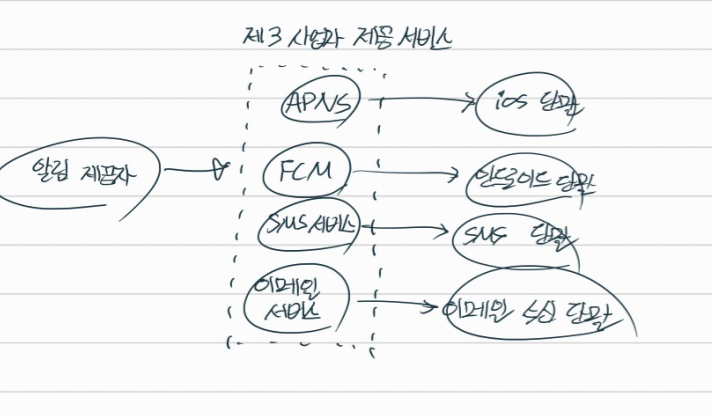
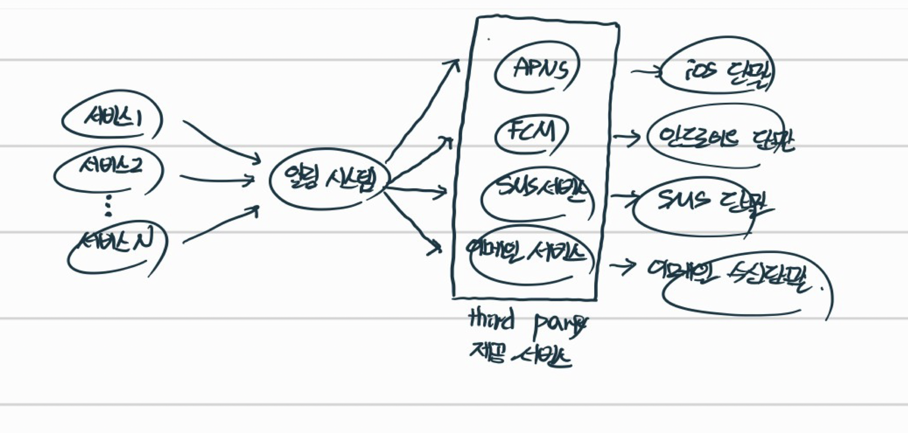
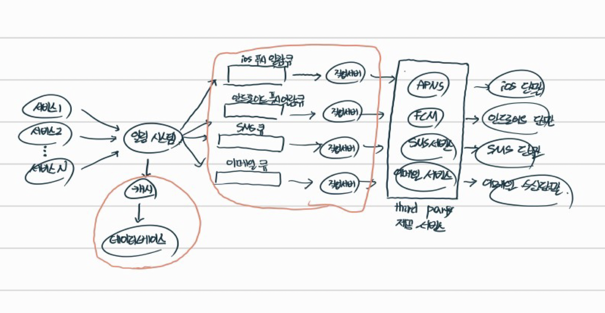
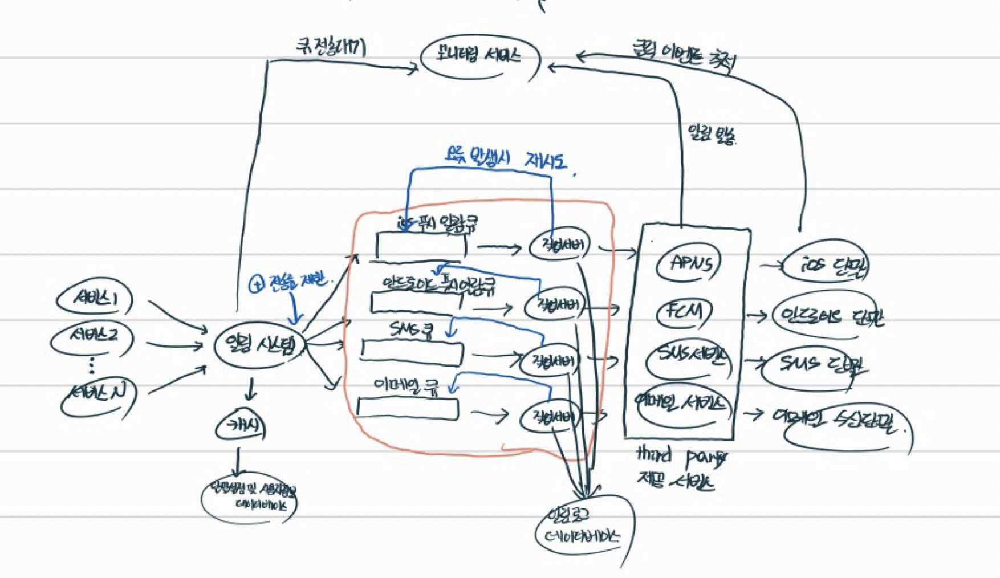

## 1단계. 문제 이해 및 설계 범위 확정

하루에 백만건 이상의 알림을 처리하는 확장성 높은 시스템을 구축하는게 쉬운 과제가 아니다. 알림 시스템이 어떻게 구현되는지에 대한 깊은 이해가 필요한 작업이다. 이에 관한 무제가 면접에 출제될 때는 보통 정해진 정답이 없고, 문제 자체가 모호하게 주어지는 것이 일반적이므로, 적절한 질문을 통해 요구사항이 무엇인지 지원자 스스로 알아내야 한다.

- 지원자 : 이 시스템은 어떤 종류의 알림을 지원해야 하는가?
- 면접관 : 푸시 알림, SMS 메시지, 그리고 이메일이다.
- 지원자 : 실시간 시스템이어야 하는가?
- 면접관 : 연성 실시간(soft real-time) 시스템이라고 가정한다. 알림은 가능한 빨리 전달되어야 하지만, 시스템에 높은 부하가 걸렸을 때 약간의 지연은 무방하다.
- 지원자 : 어떤 종류의 단말을 지원해야 하는가?
- 면접관 : ios 단말, 안드로이드 단말, 그리고 랩탑/데스크탑을 지원해야 한다.
- 지원자 : 사용자에게 보낼 알림은 누가 만들 수 있는가?
- 면접관 : 클라이언트 애플리케이션 프로그램이 만들 수도 있고, 서버 측에서 스캐줄링 할 수도 있다.
- 지원자 : 사용자가 알림을 받지 않도록 설정할 수도 있어야 하는가?
- 면접관 : 그렇다. 해당 설정을 마친 사용자는 더 이상 알림을 받지 않는다.
- 지원자 : 하루에 몇 건의 알림을 보낼 수 있어야 하는가?
- 면접관 : 천만 건의 모바일 푸시 알림, 백만 건의 SMS 메시지, 5백만 건의 이메일을 보낼 수 있어야 한다.

## 2단계. 개략적 설계안 제시 및 동의 구하기

ios, 및 안드로이드 푸시 알림, SMS 메시지, 그리고 이메일을 지원하는 알림 시스텥ㅁ의 개략적 설계안을 만들어보자. 이를 위해 아래 내용들을 다룬다.

- 알림 유형별 지원 방안
- 연락처 정보 수집 절차
- 알림 전송 및 수신 절차

### 알림 유형별 지원 방안

#### ios 푸시 알림

ios 에서 푸시 알림을 보내기 위해서는 3가지 컴포넌트가 필요하다.

- `(1)` 알림 제공자 : 알림 요청을 만들어 애플 푸시 알림 서비스(APNS) 로 보내는 주체이다. 알림 요청을 만들려면 다음과 같은 데이터가 필요하다.

  - 단말 토큰 : 알림 요청을 보내는 데 필요한 고유 식별자이다.
  - 페이로드 : 알림 내용을 담은 JSON 딕셔너리이다.

- `(2)` APNS : 애플이 제공하는 원격 서비스이다. 푸시 알림을 ios 장치로 보내는 역할을 담당한다.

- `(3)` ios 단말 : 푸시 알림을 수신하는 사용자 단말이다.

#### 안드로이드 푸시 알림

안드로이드 푸시 알림도 비슷한 절차도 전송된다. APNS 대신 FCM(Firebase Cloud Messaging) 을 사용한다는 점만 다르다.

#### SMS 메시지

SMS 메시지를 보낼 때는보통 트월리오, 넥스모 같은 제 3 사업자의 서비스를 많이 이용한다. 이런 서비스는 대부분 상용 서비스라서 이용 요금을 내야한다.

#### 이메일

대부분의 회사는 고유 이메일 서버를 구축할 역량은 갖추고 있다. 그럼에도 많은 회사가 상용 이메일 서버를 이용한다. 그 중 유명한 서비스로 센드그리드, 메일침프가 있다. 전송 성공률도 높고, 데이터 분석 서비스도 제공한다.

### 연락처 수집 정보 절차

알림을 보내려면 모바일 단말 토큰, 전화번호, 이메일 주소 등의 정보가 필요하다. 사용자가 우리 앱을 설치하거나 처음으로 회원가입 하면 API 서버는 해당 사용자의 정보를 수집하여 데이터베이스에 저장한다.

데이터베이스 스키마 설계도 잘 고려해보자. user, device 라는 테이블을 설계하고, user 와 device 테이블을 1:n 관계로 매핑한다. 그리고 user 테이블에는 이메일 주소와 전화번호를 저장하고, device 테이블에는 단말 토큰을 저장한다. 한 사용자가 여러 단말을 가질 수 있고, 알림은 모든 단말에 전송되어야 한다는 점을 고려하였다.

### 알림 전송 및 수신 절차

우선 개략적인 설계안부터 살펴보고, 점차 최적화 해나가보자.

#### 개략적 설계안 (초안)

- 1~N까지의 서비스 : 이 서비스 각각은 MSA 일 수도 있고, CronJob 일 수도 있고, 분산 시스템 컴포넌트 일 수도 있다. 사용자에게 납기일을 알리고자 하는 과금 서비스, 배송 알림을 보내려는 쇼핑몰 웹 사이트 등이 그 예시이다.

- 알림 시스템 : 알림 시스템은 알림 송.수신 처리의 핵심이다. 우선 1개 서버만 사용하는 시스템이라고 가정해보자. 이 시스템은 서비스 1~N에 알림 전송을 위한 API 를 제공해야 하고, 제 3자 서비스에 전달할 알림 페이로드(payload) 를 만들어 낼 수 있어야 한다.

- 제 3자 서비스 (서드파티 서비스) : 이 서비스들은 사용자에게 알림을 실제로 전달하는 역할을 한다. 제 3자 서비스와의 통합을 진행할 때 유의할 것은 확장성이다. 쉽게 새로운 서비스를 통합하거나 기존 서비스를 제거할 수 있어야 한다는 뜻이다. 또 하나 고려해야 할 점은, 어떤 서비스는 다른 시장에서는 사용 못 할 수도 있다는 점이다. 따라서 중국 시장에서는 제이푸시, 푸시와이 같은 서비스를 사용해야만 한다.

- ios, 안드로이드, SMS, 이메일 단말 : 사용자는 자기 단말에서 알림을 수신한다.

#### 문제점

하지만, 위 설계에는 몇 가지 문제점이 존재한다.

- SPOF : 알림 서비스에 서버가 1대밖에 없다. 따라서 알림 서비스에 장애가 발생하면 전체 서비스의 장애로 이어진다.

- 규모 확장성 : 1대의 서비스로 푸시 알림에 관계된 모든 것을 처리하므로, 데이터베이스나 캐시 등 중요 컴포넌트의 규모를 개별적으로 늘릴 방법이 없다.

- 병목 발생 : 알림을 처리하고 보내는 것은 자원이 많이 필요한 작업이다. 예를들어 HTML 페이지를 만들고 서드파티 서비스의 응답을 기다리는 일은 시간이 많이 걸릴 가능성이 있는 작업이다. 따라서 모든 것을 한 서버로 처리하면 사용자 트래픽이 많이 몰리는 시간에는 시스템이 과부하 상태에 빠질 수 있다.

### 개략적 설계안 (개선된 버전)

문제점을 아래와 같이 개선할 수 있다.

> 💡 개선된 점
>
> - 데이터베이스와 캐시를 알림 시스템의 주 서버에서 분리하였다.
> - 알림 서버를 증설하고 자동으로 수평 확장(Scale Out) 이 이루어질 수 있도록 개선하였다.
> - 메시지 큐를 이용해 시스템 컴포넌트 사이의 강한 결합을 끊었다.

#### 각 컴포넌트의 역할

위와 같은 설계안에서 각 컴포넌트는 어떠한 역할을 수행할까?

- 1부터 N까지의 서비스 : 알림 시스템 서버의 API 를 통해 알림을 보낼 서비스들
- 알림 서버
  - 알림 전송 API : 스팸 방지를 위해 보통 사내 서비스 또는 인증된 클라이언트만 이용 가능하다.
  - 알림 검증(validation) : 이메일 주소, 전화번호 등에 대한 기본적 검증을 수행한다.
  - 데이터베이스 또는 캐시 질의 : 알림에 포함시킬 데이터를 가져오는 기능이다.
  - 알림 전송 : 알림 데이터를 메시지 큐에 넣는다. 본 설계안의 경우 하나 이상의 메시지 큐를 사용하므로 알림을 병렬적으로 처리할 수 있다.
- 캐시 : 사용자 정보, 단말 정보, 알림 템플릿 등을 캐싱한다.
- 데이터베이스 : 사용자, 알림, 설정 등 다양한 정보를 저장한다.
- 메시지 큐 : 시스테 컴포넌트 간 의존성을 제거하기 위해 사용한다. 다량의 알림이 전송되어야 하는 경우를 대비한 버퍼 역할도 한다. 본 설계안에서는 알림의 종류별로 별도의 메시지 큐를 사용하였다. 따라서 서드파티 서비스 중 하나가 장애가 발생하더라도 다른 종류의 알림 기능은 정상 동작한다.
- 작업 서버 : 메시지 큐에서 전송할 알림을 꺼내서 서드파티 서비스로 전달하는 역할을 담당하는 서버

#### API 요청 플로우

위 컴포넌트들이 어떻게 협력하여 알림을 전송하게 될까?

- API 를 호출하여 알림 서버로 알림을 보낸다.
- 알림 서버는 사용자 정보, 단말 토큰, 알림 설정 같은 메타데이터를 캐시나 데이터베이스에서 가져온다.
- 알림 서버는 전송할 알림 종류에 알맞는 이벤트를 만들어서 해당 이벤트를 위한 큐에 넣는다. 가령 ios 푸시 알림 이벤트는 ios 푸시 알림 큐에 넣어야 한다.
- 작업 서버는 메시지 큐에서 알림 이벤트를 꺼내고, 서드파티 서비스로 전송한다.
- 서드파티 서비스는 사용자 단말로 알림을 전송한다.

## 3단계. 상세 설계

지금까지 개략적 설계를 진행하면서 알림의 종류, 연락처 정보 수집 절차, 그리고 알림 송수신 절차에 대해 알아보았다. 이제 아래 내용들을 더 자세히 알아보자.

- 안정성
- 추가로 필요한 컴포넌트 및 고려사항 : 알림 템플릿, 알림 설정, 전송률 제한, 재시도 매커니즘, 보안, 큐에 보관된 알림에 대한 모니터링과 이벤트 추적 등
- 개선된 설계안

### 안정성

분산 환경에서 운영될 알림 시스템을 설계할 때는 안정성을 확보하기 위한 사항 몇가지를 반드시 고려해야한다.

- `(1)` 데이터 손실 방지 : 알림이 소실되면 안된다. 알림이 지연되거나 순서가 틀려도 괜찮지만, 알림 자체가 어딘가에서 유실되면 곤란해진다. 이 요구사항을 만족하려면 알림 시스템은 알림 데이터를 데이터베이스에서 보관하고 재시도 메커니즘을 시도해야한다.

  - 이를 위해 알림 로그 데이터베이스를 별도로 개설하는 것이 좋다. ios 단말을 예로들면, ios 푸시 알람 큐로 부터 작업 서버가 메시지를 전달받으면, 해당 메시지가 유실되는 일이 없도록 알림 로그 데이터베이스에 로그를 관리해야 할 것이다.

- `(2)` 알림 중복 전송 방지 : 같은 알림이 여러번 반복되는 것을 완전히 막는 것은 가능하지 않다. 대부분의 경우 알림은 단 1번만 전송되겠지만, 분산 시스템의 특성상 간혹 같은 알림이 중복되어 전송되기도 할 것이다. 그 빈도를 줄이려면 중복을 탐지하는 메커니즘을 도입하고, 오류를 신중히 처리해야 한다. 다음은 간단한 중복 방지 로직의 사례이다.
  - 보내야 할 알림이 도착하면 그 이벤트 ID 를 검사하여, 이전에 본 적이 있는 이벤트인지를 검사한다. 중복된 이벤트라면 버리고, 그렇지 않으면 알림을 발송한다.

### 추가로 필요한 컴포넌트 및 고려사항

- 알림 설정 : 사용자는 이미 너무 많은 알림을 받고 있어서 쉽게 피곤함을 느낀다. 따라서 많은 웹사이트와 앱에서는 사용자가 알림 설정을 상세히 조정할 수 있도록 하고있다. 이 정보는 알림 설정 테이블에 보관되며, 이 테이블에는 아마 다음과 필드들이 필요할 것이다.
  - user_id
  - channel (varchar) : 알림이 전송될 채널. 푸시 알림, 이메일, SMS 등
  - opt_in (boolean) : 해당 채널로 알림을 받을 것인지의 여부

이와 같은 설정을 도입한 뒤에는 특정 종류의 알림을 보내기 전에 반드시 해당 사용자가 해당 알림을 켜 두었는지 확인해야 한다.

- 전송률 제한 : 사용자에게 너무 많은 알림을 보내지 않도록 하는 1가지 방법은, 한 사용자가 받을 수 있는 알림의 빈도를 제한하는 것이다. 이것이 중요한 이유는, 알림을 너무 많이 보내기 시작하면 사용자가 알림 기능을 아예 꺼버릴 수도 있기 떄문이다.

- 재시도 방법 : 서드파티 서비스가 알림 전송에 실패하면, 해당 알림을 재시도 전용 큐에 넣는다. 같은 문제가 계속해서 발생하면 개발자에게 통지(alert) 한다.

- 큐 모니터링 : 알림 시스템을 모니터링 할 때 중요한 메트릭(metric) 하나는 큐에 쌓인 알림의 개수이다. 이 수가 너무 크면 작업 서버들이 이벤트를 빠르게 처리하고 있지 못하다는 뜻이다. 그런 경우에는 작업 서버를 Scale Out 하는 것이 바람직할 것이다.

### 개선된 최종 설계안

초안에 비해 많은 컴포넌트와 기능이 추가되었다. `(1)` 알림 서버에 전송률 제한 기능이 추가 되었으며, 전송 실패에 대응하기 위해 재시도 기능이 추가되었다. `(2)` 전송에 실패한 알림은 다시 큐에 너호 지정된 횟수만큼 재시도한다. `(3)` 전송 템플릿을 사용하여 알림 생성 과정을 단순화하고 알림 내용의 일관성을 유지한다. `(4)` 모니터링과 추적 시스템을 추가하여 시스템 상태를 확인하고 추후 시스템을 개선하기 쉽도록 하였다.

## 더 학습해볼 주제 및 궁금점

- 메시지 전송 실패율을 낮추기 위해 재시도 메커니즘을 도입하는데, 이를 정확히 어떻게 구현할 수 있는가? (지금드는 해법은, Infrastructure 레이어에서 서드파티 호출시 예외가 터지면 @Retryable 로 재시도하는 것이다.)

- 왜 메시지 큐는 각 알림별로 도입해야하는가? 카프카처럼 중앙화된 메시지 큐 1대로 처리할 수는 없는가?

- 전송률 제한은 구체적으로 어떻게 구현할 수 있는 것인가?

- 모니터링 시스템을 통해 메트릭을 수집하는데, 이를 통해 어떻게 재시도 로직을 처리한다는 것인지 연관성에 대한 이해도가 더 필요하다.

- 데이터베이스 서버는 다중화가 필요없는가?
