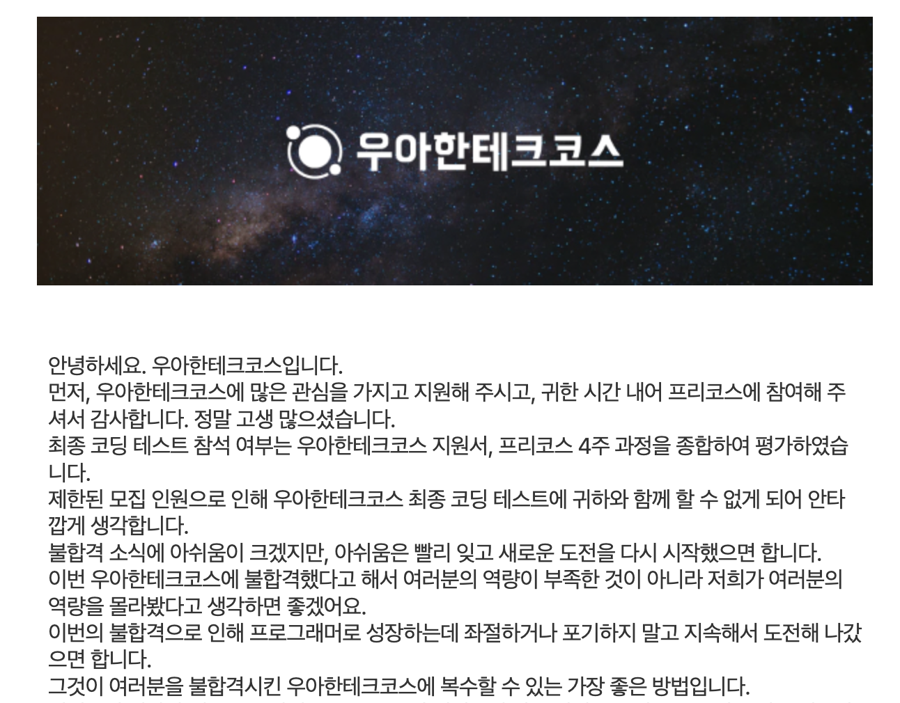
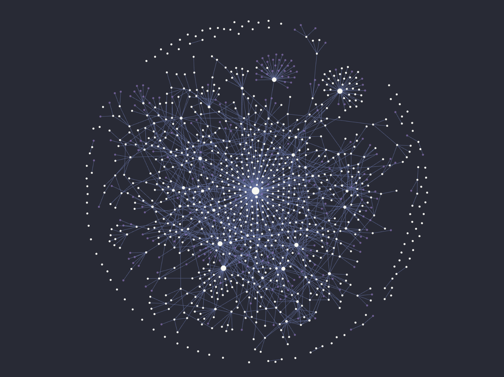
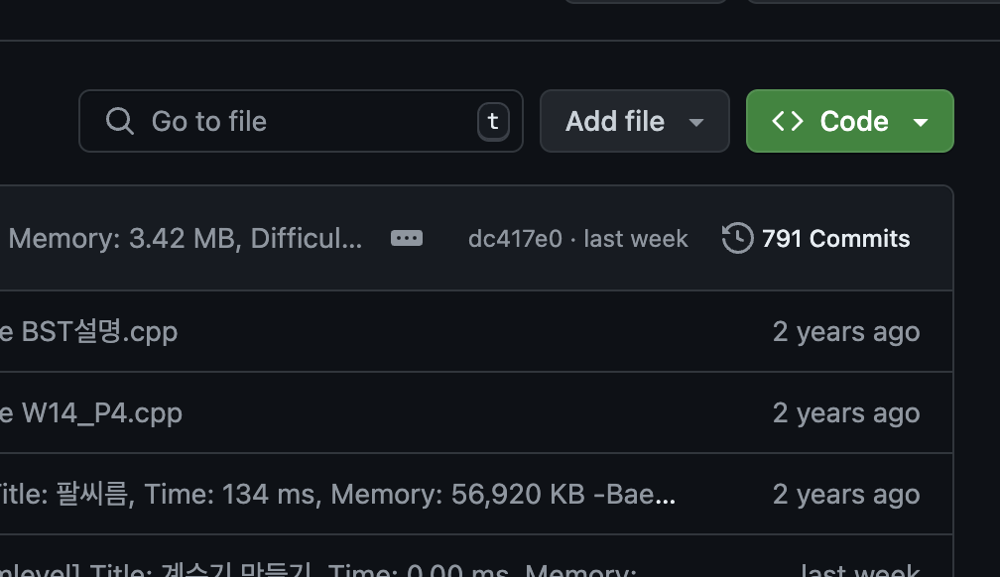
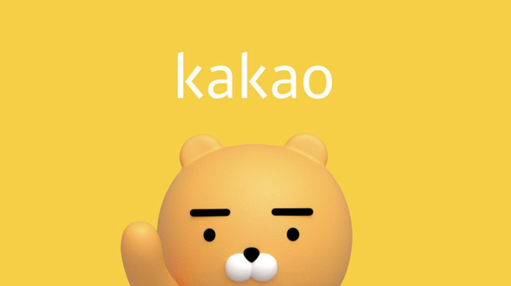
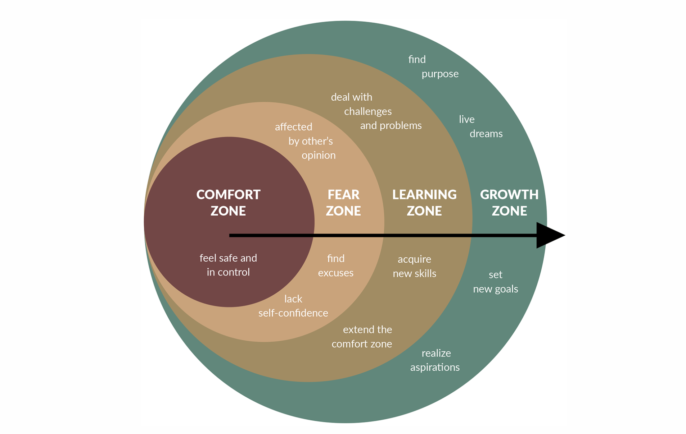

정말 열심히, 후회없이 살아왔던 2024년 상반기였다. 벌써 상반기가 끝나고 하반기의 시작이라니. 이번 7월 1일전까지 잠시 여유가 생겨서 상반기 회고를 적어볼까한다. 이번 상반기는 깊이있고, 의미있는 성장을 많이 이룬 것 같다. 나 혼자서 많은 불안감과 불확실성을 이겨내기 위해 힘든 여정들이 있었다. 그 결과 매우 좋은 성과들이 생겼고 🙂

## 우아한테크코스 탈락, 나에게 찾아온 불안함

작년 하반기 무렵, 우아한테크코스 교육과정에 꼭 참여하고 싶은 절실한 마음으로 지원했다. 결과는 아쉽게도 불합격이었다. 평소 양질의 교육코스 필요성이 절실하게 느껴져 지원했지만 탈락 통보를 받았다. 당시 대학교 3학년이 끝날 무렵이었고 4학년을 앞두고 있었기 때문에 더욱 간절하게 느껴졌다. 탈락을 통보받았을시 4학년을 앞둔 나에게 남는것이 그 어떤것도 없었기 떄문이다.

항상 프로그래밍은 즐거웠지만, 나에겐 우테코가 꼭 필요했던 이유가 있었다. 우선 주변에 몰입하여 끝까지 성장할 동료들이 전혀 존재하지 않았다. 개발자를 꿈꾸는 사람들은 정말 많았지만 다들 그리 열정적이지도 않았으며, 사실 프로그래밍 역량 차이가 심하여 협업을 하기에도 양측 모두가 어려움이 있었다. 또한 불확실성 속에서 내가 작성한 코드, 이끌어줄 코치님들이 존재하지 않았기 떄문에 불확실성에서 학습을 이어가는데 한계를 느꼈다.

### 사실, 나는 불합격한 이유을 정말 잘 알고있다.

내가 교육과정에 불합격 통보를 받은 원인을 정말 잘 알고있다. 이유 자체를 몰랐다면 억울했겠지만. 우선 내가 작성한 글엔 진심이 묻어나지 않았다. 평소처럼 글쓰기를 작성하면 충분히 합격했겠지만, 합격하고 싶은 마음에 나 자신을 포장한 모습을 보여줬다. **역시나 모든 글에는 진심이 담겨있어야만 독자에게 감동과 내가 어떤 사람인지를 명확히 전달할 수 있다.**

무엇보다 내가 탈락한 근본적인 원인은 자만심이다. 내가 당시 작성한 글에는 교육이 아닌, 취업을 위한 맹목적인, 자만심에 가득찬 모습을 보여줬다. 이는 교육코스에서 뽑고 싶어하는 사람에 절대 부합하지 않는다. **교육이 필요하다면 왜 해당 코스가 필요한지, 타인과 다르게 어떠한 노력을 해왔는지 진심을 담아 작성해야한다.** 나는 두 번 다시 이떄처럼 글쓰기를 작성하지 않을 것이다.

> 모든 글에는 진심이 감겨야한다. 또한 자만심, 오만함에 가득찬 글은 독자로 하여금 그 어떠한 감동과 진솔함을 느끼게 할 수 없다. 앞으로도 이 점을 반드시 명시하고 글쓰기를 이어가자 🙂

---

## 불안감, DMN 으로 가득했던 나의 일상생활

나는 이제 무엇을 해야할까. 상실감이 너무 컸다. 4학년이 된 나는 불안함만 커져갔고 손에 아무것도 잡히지 않았다. 부끄럽게도 큰 목표를 이루지못하니 며칠간 아무것도 하기 싫었다. 그렇다고 새로운 해를 맞이하며 아무것도 하지않고 의미없는 생활을 보낼 수는 없으니. 2023년을 끝 마무리하며 회고록을 작성하고, 자기계발 책을 많이 읽었다. 특히 [타이탄의 도구들](https://product.kyobobook.co.kr/detail/S000001767887) 이라는 명서를 발견했는데, 이 책은 나에게 큰 용기와 도전정신을 다시금 불러일으키게 했다. 며칠간 무기력했던 내게 다시 새로운 길을 걸을 수 있는 길라잡이가 되었다.

지금 내게 들이닥친 불안함은 어떻게 없앨 수 있을지, 성공한 사람들은 큰 실패를 겪었을 떄 어떤 마음가짐을 갖고 극복했는지가 궁금했다. 여기서 느낀점은, 어쩌만 모두가 아는 사실이지만, **성공한 사람들 모두가 많은 실패를 겪었고, 타인에게 보이는 찬란한 하이라이트를 만들어내기 위해 수많은 노력과 수고가 있었다는 것이다.** 모두에겐 부족한 점이 가득하다. 심지어 전세계적으로 뛰어난 인물 모두에겐 자신에게 부족한 면이 가득하고, 나는 타인이 하이라이트만을 바라봤던 것이다.

### DMN 활성화를 최소화하기 위해

<iframe width="100%" height="400" src="https://www.youtube.com/embed/hJ7w2FqPfBI" title="나는 왜 쓸데없는 생각을 많이 해서 삶을 피곤하게 하는 걸까? ⵏ 뇌과학" frameborder="0" allow="accelerometer; autoplay; clipboard-write; encrypted-media; gyroscope; picture-in-picture; web-share" allowfullscreen></iframe>

올해에 있어 날 가장 괴롭혔던 타이틀은 `불안함` 이다. 불안함을 제거하기 위해 여러 방법을 시도했다. 앞서 말한 서적들도 여럿 읽었음에도 항상 불안함에 가득찼다. 불안함은 이번학기 학교 수업에도 전혀 집중하지 못하게 하고, 개발을 할때도, 밥을 먹을떄도 온전히 내 일에 집중하지 못하게 만들었다.

근본적인 원인은 `DMN` 이라는것에 있었다. 나는 여지껏 `DMN` 이라는 존재 자체에 대해 전혀 모르고 살았다. DMN 이 자주 활성화되어 불안 모드가 자주 활성화되었고, 나를 괴롭혔던 것이다.

### 나만의 불안 모드 해소방법

올해 3월, DMN 과 불안함의 존재, 근본적인 원인을 명확히 알아내고 덜어내고자 [개발자로 살아가면서 불안과 가면 증후군, 메타인지 학습법을 가꾸는 방법](https://haon.blog/%ED%9A%8C%EA%B3%A0/unrest-behavior/#dmn%EB%8A%94-%EC%84%A0%EC%B2%9C%EC%A0%81%EC%9C%BC%EB%A1%9C-%EC%A1%B4%EC%9E%AC%ED%95%98%EB%8A%94-%EA%B2%83) 라는 글을 작성했다. 이 글을 적으면서 정말 큰 도움이 되었다. 내가 왜 불안해하고 있는지 근본적인 원인을 알 수 있었다. 인간은 원초적으로 불안모드가 장착되어야만 생존이 가능했으며, 나는 DMN 이 자주 활성화되어 내 일에 집중하지 못한 것이다. 이를 해결하기 위해선 나만의 [의식의 흐름 분산 방법](https://haon.blog/%ED%9A%8C%EA%B3%A0/unrest-behavior/#dmn%EB%8A%94-%EC%84%A0%EC%B2%9C%EC%A0%81%EC%9C%BC%EB%A1%9C-%EC%A1%B4%EC%9E%AC%ED%95%98%EB%8A%94-%EA%B2%83) 이 필요했고, 이를 글쓰기로 삼았다. 앞으로도 나는 불안 모드가 활성화될 때 마다 글쓰기를 이어갈 것이다. 불안의 정도에 따라 블로그에 글을 발행하거나, 짧은 회고만으로 충분할 떄는 세컨드 브레인에 글을 작성해야지. 🙂

---

## Gastby Starter Haon 블로그 오픈소스 개발

위와 같은 심리적 불안감과 여정, 이를 해결하기 위한 노력들로 내 불안함은 진정될 수 있었다. 한편으론 올해 가장 큰 업적을 이룬 정량적 성과들이 존재한다. 그 중 하나는 바로 `Gatsby Starter Haon` 블로그 테마 오픈소스를 개발했다는 것이다.

난 프로그래밍 못지않게 글쓰기에 몰입할떄가 가장 즐겁다. **글쓰기는 머리 밖으로 분산된 생각들을 한 곳에 모아 정교화할 수 있고, `메타인지` 활성화에 아주 큰 도움이 된다. 내가 가진 생각을 가만히 두지않고, 밖으로 내보냈을 때(Output) 학습 효과가 매우 좋다는 것은 이미 뇌과학적으로 증명된 사실이다. 또한 인간은 망각의 동물이다. 이를 해결할 수 있는것이 글쓰기다. 예전에 기록했던 내용을 다시 확인하여 휘발된 기억들을 빠르게 복기하며 내가 알아낸 지식들을 장기화시킬 수 있다.**

이 떄문에 블로그를 다년간 운영해오기도 했고. 그런데 이전까지 Velog, 네이버 블로그등 여러 플랫폼을 사용하면서 항상 아쉬웠던점은 내가 블로그를 직접 커스터마이징 할 수 없다는 점이었다. 글을 작성하다가 불편한점이 있어도, 오류를 발견해도, 개선사항이 있어도 내 선호에 따라 글을 작성할 수 없는것이 큰 단점이었다.

### 내가 직접 오픈소스를 만들자.

블로그를 운영하는 사람들 모두가 본인의 선호에 따라, 버그와 이슈를 발견할 때 마다, 개선사항이 존재할 떄 마다 즉각 코드를 수정하여 반영하는 블로그를 생각하게 됐다. 이 생각이 들때쯤 마침 동아리 선배이자 토스뱅크 현직자인 [Hudi](https://github.com/devHudi) 님이 제작한 블로그가 떠올랐다. 나 또한 본인이 직접 개발자 각자의 취향에 알맞게 직접 블로그를 커스터마이징 할 수 있는 오픈소스를 만들겠다는 굳은 목표를 가졌다. 본 Gatsby 블로그 테마 오픈소스는 Hudi 님의 블로그의 큰 영감을 받아 제작되었음을 밝힌다.

지금까지 항상 백엔드 개발만을 이어왔기에 프론트엔드의 지식이 전무했다. 부끄럽게도 HTML 의 기초 문법 조차도 잘 모르는 상태였다. 그 만큼 더 많은 시간과 정성을 부어서 만든 오픈소스 프로젝트다. 꼼꼼히 이론을 학습하고, 내 열정과 노력, 많은 고민을 담아서 React 와 Gatsby 기반으로 개발된 프로젝트다.

> 혹여나 이 회고록을 읽고있는 독자가 있다면 자유롭게 [Gatsby Starter 블로그 테마](https://github.com/msung99/Gatsby-Starter-Haon)를 사용해보길 바란다! 🙂

---

## 세컨드 브레인 운영 시작 ✏️

블로그를 항상 운영하면서도 항상 단점이 존재했다. 생각의 정교화를 위해 블로그에 글을 발행할 떄 마다 소요되는 시간이 매우 길다는 점이다. 글을 발행하는 해당 지식에 한정해선 메타인지가 활성화되며 학습효과에 매우 큰 도움이 되지만, 이와 관련한 관련 학습 키워드들을 노션에 정리만해두고 그때그때 학습하지 못한다는 점이 항상 아쉬웠다. 메인 학습 키워드를 학습하는데 많은 시간이 걸리다보니, 다른 토픽을 학습하는데 많은 부담을 느꼈다.

이를 위해 세컨드 브레인을 운영하기 시작했다. 정확히는 `디지털 가든` 을 운영하기 시작했다. 월간 구독을 결제하고 옵시디언의 예쁜 테마를 활용하여, 생각을 정제하기 위한 나만의 공간을 만들었다. 그런데 사실 몇달 운영하다가 운영 비용이 꽤 큰 부담이라 현재는 비활성화 상태에 있다. 현재는 개인적으로 옵시디언에 세컨드 브레인 형태로 간략히 글을 발행하는 형태로 작성중에있다.

### 더 올바른 학습법을 위해

아직 운영 기간이 그리 길지 않아, 세컨드 브레인 운영방법에 대해 더 연구해봐야겠다. 올해 하반기에는 이를 어떻게 효과적으로 활용하여 내 학습법을 개선할지 고민해야 할 듯하다. 글을 발행하는 방식이 좋지 않은것인지, 블로그에 발행하는 글이 아니라서 그런것인지는 모르겠다. 아직까지는 옵시디언에 발행한 글들이 내 생각의 정교화에 있어 다소 아쉬움이 남는다. 아직까진 온전히 내 지식으로 체화시키는데에 있어 100% 만족시킬 수 없는듯하다.

당장으로 떠오르는 방법은 앞으로 학습을 이어가며 우선순위를 정해야겠다. 높은 우선순위를 가진 학습 키워드에 대해 블로그에 글을 발행하고, 낮은 우선순위 키워드에 대해선 옵시디언에 정제하도록 한다.

---

## 뒤늦은 알고리즘 학습 시작

한편 커리어를 쌓기 위해, 어디던 입사하기 위해 알고리즘 역량을 필수로 갖춰야했다. 하지만 이전까지 나는 순수 프로그래밍만을 이어왔기에, 알고리즘 공부에서 손을 땐지 1년반이 넘어갔다.

어딘가에 최소 지원자격을 갖추기위해선 알고리즘 역량이 반드시 필요함에도, 그간 학습을 미루었기 떄문에 더 빠른 학습이 필요했다. 이번 상반기에 꾸준히 알고리즘을 학습한 흔적들이 존재한다. 알고리즘 문제를 가장 많이 풀었을 때는 하루에 15문제 가까이 풀었던 것 기억이 난다 🤔 덕분에 커밋이 많이 쌓였다.

### 후회되던 매 순간들

신입공채, 인턴, 교육기관등 수많은 업체에선 코딩테스트 역량이 당연시 되었으며, 난 알고리즘을 등한시해왔다. 이전까지 장기간 알고리즘을 버리듯이 했기 때문에, 그 어떠한 지원자격도 충족되지 않았다. 과거의 내가 행동했던 순간들이 많이 후회됐던만큼, 더 필사적으로 노력하여 단기간이 많은 기량을 쌓았다.

### 한가지를 고집피우지 말것

알고리즘을 학습하며 확실히 반성한 점이 있다. **한가지 길에만 올곧 고집을 피우며 도전하는 것은 올바르지 못하다는 점이다.** 이전까지 알고리즘은 프로그래밍에 있어 필요없는 과목이라는 오만한 생각떄문에 학습을 미루었다. 이번 하반기에도 이런 잘못된 고집을 피우며 올바른 방향성으로 나아가는데 방해가 되지 않도록 하자.

그렇다고 내 의견에 뚜렷한 주관이 없어서도 안된다. 내 주장이 확실해야할땐 그에 마땅한 근거와 논리가 뒷받침 되어야한다. 앞으로 내가 선택한 길과 행동이 올바른지 주기적으로 회고를 이어가도록 해야겠다.

---

## 카카오테크 코스 합격까지

불안함과 불확실성, 우울했던 암울기가 가득했던 2024년 상반기였다. 불안감을 잠재우기 위해 많은 심리학, 자기계발 책을 읽었으며, 글쓰기를 통한 DMN 의 근본적인 원인을 알아내고 극복하려했다. 모든것을 다 내려놓고 싶던 마음이 가득했지만, 무엇이던 이루어내야 한다는 굳은 마음가짐을 가지고 묵묵히 걸어나가니, 카카오테크 본 과정에 참여할 수 있게 되었다. 최종 합격 소식을 듣게 되었을 때 정말 얼마나 기쁘던지 🙂

본 과정에 최종 합격하기 전까지 많은 실패와 좌절을 경험했다. 필사적으로 살았음에도 임펙트있게 얻어낸 큰 성과가 없으니 자존감이 많이 내려갔다. 내 감정을 컨트롤하는 능력이 더욱이 중요했고, 내 일에 집중하기 힘들어도 꾸준히 걸어나가는게 힘들었다. 누군가 이 글을 읽고있다면 힘든 여정이 있어도 포기하지 말라는 말을 꼭 전하고 싶다. 나 또한 인생의 하이라이트를 만들어내기 위해 수많은 노력과 수고가 있었기 떄문에 가능한것이다. 타인과 나를 비교하지말고, 어제보다 성장한 나에 대한 성취감을 만끽하며 꾸준한 페이스로 나아가길 바란다.

### 실무 중심의 경험

내가 본 과정에서 얻어가야할 가장 큰 키워드는 실무 중심의 경험을 쌓는것이다. 본 과정은 카카오 현직에서 사용하는 애자일 스크럼, 협업 프로세스등을 직접 그대로 경험할 수 있다. 이러한 실무 문화 외에도 카카오에서 직접 사용하는 실무 기술들을 경험할 수 있다고하니, 내 커리어에 있어 정말 큰 도움이 될 것이다. 본 과정에 참여하여 끝 없이 질문하고, 토론하자. 또한 실무 생태계에 대한 이야기를 직접 듣고 원 없이 경험해야겠다.

### 교육자의 길

나는 언젠가 꼭 교육자의 길을 걷고 말 것이다. **내가 만들어낸 소프트웨어, 지식들을 타인에게 공유했을 때 얻을 수 있는 보람은 내게있어 큰 원동력이 된다.** 이 원동력은 내 학습에 있어 큰 즐거움을 느끼게 해주고, 지금까지 꾸준히 걸어올 수 있게해준 큰 요인이라고 생각한다. 본 과정에서 코치님들을 통해 교육자에 대한 이야기를 자세히 듣고, 조언받고 싶다.

카카오테크 최종 면접을 보면서 들었던 말이 아직도 생생하다. 카카오테크 자소서에 교육자가 되고싶은 이유, 가치관에 대한 내용을 진심을 담아 글을 작성했더니 면접관님들에게 인상깊게 잘 읽었다는 말씀을 들을 수 있었다. 특히 `Gatsby Starter Haon` 에 대한 오픈소스 제작 경험을 기반으로 작성한 내용을 보고 감명 깊었다고 말씀하셨다. 역시 글은 진솔함을 담아 작성해야지 최고의 글쓰기가 될 수 있다. 🙂

### 부가적인 목표

본 과정에 참여하면서도 부가적으로 신경써야 할 것들이 많다.

- ICT 자격증
- 어학 점수
- 코딩테스트
- 본 과정에서의 상세한 기록, 블로깅, 꼼꼼한 문서화
- 미흡한 CS 보완 및 면접대비
- 카카오 현직자님들에게 이력서 조언받기
- ...

부끄럽게도 ICT 자격증은 취득하는 것이 취업에 있어 최소한의 조건임에도 신경쓰지 못했다. IT 개발자 직군은 자격증을 보지 않는다, 실력만 본다라는 말은 앞으로 맹목적으로 받아들이지 않을 것이다. 앞서 **항상 모든 판단에 있어 하나만 올곧 좋은 것이라 고집 피우는 것은 좋지 않다고 했는데, 이 또한 해당한다.** 항상 누군가, 특히 권위있는 사람, 또는 여러 군집단이 주장하는 발언에 대해선 의심하는 습관을 가지자. 확실한 것은, 특정 기업을 제외한 우리나라의 대부분의 기업에선 최소한의 자격증을 요구한다.

코딩테스트는 아직 급한것은 아니다. 이미 알고리즘은 기본기가 잘 다져있으므로, 이번년도 후반기에 급하지 않게 준비하도록 하자. 아직 스스로 미흡하다고 느낀 CS 를 보완해야한다. 이는 아직 급한것은 아니며, 향후 본 과정 참여후 어떤 방식으로 학습할지 알 수 없으므로 학습 리스트 중 하나로 꼭 기억해두자.

무엇보다 가장 중요한 것이 본 과정에서 성장하는 것이다. **내가 어떤 사람인지 증명할 수 있는 정량적 지표가 바로 블로깅이다.** 기록만이 살 길이다. 문서화는 내게있어 앞으로 취업시까지 내세울 강점임을 꼭 기억하자. 분명히 본 코스에 참여했을 때 내가 이미 잘 알고있는 지식들이 존재할것이다. 이미 알고있는 지식이라고 할지라도, 100% 이해한 것이 아니라는 의심이 단 0.1초라도 든다면 문서화를 시키자. 또한 학습 키워드에 있어 간혹 문서화까지 필요없는 것도 있을 것이니, 우선순위를 잘 정하여 블로깅, 문서화를 하자.

---

## 내가 감사해야 할 사람들, 거리두어야할 사람들

올해 상반기에 대인관계에 있어서도 많은 생각이 들었다. 내가 감사해야 할, 고마워해야 할 사람들이 있고, 거리를 두어야할 사람들이 있음을 느꼈다.

<iframe width="100%" height="400" src="https://www.youtube.com/embed/hU4kULhOdNE?si=y-aO6l5hCT5SSqOq" title="YouTube video player" frameborder="0" allow="accelerometer; autoplay; clipboard-write; encrypted-media; gyroscope; picture-in-picture; web-share" allowfullscreen></iframe>

항상 거리감을 두고, 최소한의 관계를 유지해야 할 사람들이 있다. **내게있어 질투심에 찌들어 성장을 막기위한 사람들이 생각보다 많음을 느꼈다.** 내가 하는 행동에 이해할 수 없다는 말, 그리고 질투심에 눈이 멀어 내가 가는길이 틀렸음을 지적하고, 자신에게 위안을 삼는 사람들이 세삼 존재할 때가 있다. [개발자로 살아가면서 불안과 가면 증후군, 메타인지 학습법을 가꾸는 방법](https://haon.blog/%ED%9A%8C%EA%B3%A0/unrest-behavior/) 에서도 이와 관련해 회고했던 적이 있다. 드림코딩님도 말씀했듯이, 앞으로 질투심에 나를 가로막는 사람과는 반드시 거리를 두자.

또한 나를 이용하여 본인의 이득을 취하는 사람과도 거리를 둘 것이다. 내가 알고있는, 보유한 지식, 배움, 기타등등 모두 뽑아내어 본인의 욕심을 채우는 사람 또한 마찬가지로 거리를 두어야한다. 최근 프로젝트에서 겪은점도 있고.

반대로 감사해야할 사람들이 있다. 나를 진심으로 응원해주고, 올바른 길로 나아가도록 만들어주는 사람들이다. 이런 내 주변 사람들에게 항상 감사한 마음을 가지고, 좋은 관계를 계속 이어가도록 하자.

---

## 컴포트 존에서 벗어나기 위해

그간 컴포트 존에서 장기간 머물렀기 때문에 항상 애를 먹었다. 스터디, 프로젝트를 최대한 이어가보려 해도 나에비해 아는것이 많이 없는 동료들과 협업을 진행하거나, 대부분의 그룹에서 내가 가장 잘하는 사람이었다. 이 속에서 느낀점은, 컴포트 존에서 자기만족을 하면서 머무른다면 절대 성장할 수 없는것이다. 이를 잘 알고 있기 때문에, 올해 상반기에 어떻게든 벗어나기위해 필사적으로 살았다.

다행히도 한층 컴포트 존에서 벗어날 수 있었다. 카카오테크 과정에서 정말 열심히 성장할 것이다. 성장하는 과정속에서 겪는 모든 불안은 나를 위한 성장통임을 꼭 기억하자.

### 가장 못하는 사람이 되라

난 어디서든 가장 못하는 사람이 되어야한다. **새로운 것에 대한 두려움과 불안이 있어야만 내가 성장할 수 있음을 항상 기억하자.** 또한 나보다 잘하는 사람들을 보며 비교될 때 마다, 내가 현재 불안해 하는것은 성장통이라고 생각할 것이다. 소프트웨어 교육자 박재성님이 [가장 못하는 사람이 되라](https://brunch.co.kr/@javajigi/46) 에서 말했던 내용과 부합한다.

---

## 마치며

올해 상반기는 많은 사건들과 우울기, 극복기등 많은 경험들과 배움이 있었다. 당장 다음주부터 카카오테크 과정에 참여할 때도 지금까지 얻은 배움들로 열심히 성장해보자. 특히 블로그, 세컨드 브레인을 활용하여 몰입하고, 빠르게 성장해야겠다.

글을 완전히 마무리짓기전, 생각나는 한 사람이 있다. 올해 상반기에 많이 힘들었던 내게 큰 힘이 되어주었던 [대학교 멋쟁이사자처럼 동아리내 가장 친한 동생이자 친구](https://github.com/sean2337) 가 생각난다. 항상 내가 힘들어했던 시기마다 큰 도움을 주었던 내 사람들에게 감사하며 살아야겠다. 😆 올해 하반기에는 더 멋진 나로 성장해있길 기대한다.
