## LINE 개발자, LINER가 되었다

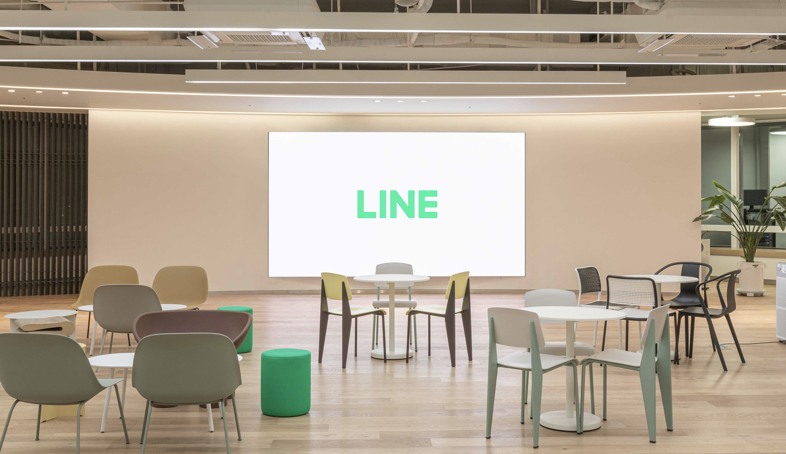

<figcaption> LINE Plus 분당 오피스 - 공용 오피스 및 라운지 </figcaption>

2025년 상반기 대학교 졸업과 동시에, LINE 개발자가 되고야 말았다. 내 직무 역량을 좋게 봐주셨는지, 신입 개발자임에도 불구하고 경력 3년차 서버 개발자 포지션에 최종 합격하여 입사하게 되었다. LINE 개발자가 되기까지 몇년동안 피땀흘리며 노력했던 과정들을 회고해볼까 한다. 2025년 상반기를 더 중점으로 회고해볼까 하지만, 2025년이 아니더라도 그 동안의 성장 과정을 다시금 길게 회고해볼까 한다.

## 멋쟁이사자차럼 동아리, 백엔드의 첫 걸음 시작

<figcaption> 멋쟁이사자처럼 10기 중앙해커톤 은상 수상 </figcaption>)

SOPT, 멋쟁이사자차럼, UMC, GDSC, ... 등등 대학교 내에도 유명한 IT 개발 동아리가 많이 생겼다. 그 중 나는 멋쟁이사자처럼 이라는 동아리에서 활동하면서, 처음으로 웹 프로그래밍을 접하게 되었다. 사실 멋사말고도 UMC 라는 동아리에서도 활동했었지만, 동아리 부원들과 가장 재밌게 활동하여 추억을 많이 쌓은 동아리는 단연코 멋사가 아닐까 싶다.

부원들과 팀을 꾸려서 중앙해커톤을 참여했으며, 그를 마무리로 멋사의 공식적인 활동을 끝내게 되었다. 10명이 넘는 팀원들과 FE, BE, 디자이너로 역할을 구분짓고 열심히 서비스를 런칭해보는 경험을 가졌다. 그런데 지금 시점에서 다시 생각해보면, 당시 만든 서비스는 정말 엉터리였다 😅 엉터리 레거시 코드, 취약한 보안, 정말 낮은 가용성(availability), 성능 튜닝도 전혀 안된 상태, 다운타임도 심한 서비스이며, API 연동도 안된 결과물이기 때문이다.

다만 웹개발을 처음 접하고, 단순 해커톤 참여인데 어떻게 지금 수준처럼 서비스를 런칭할 수 있을까 싶긴하다. 그 당시에는 고도화된 서비스를 완성시키는데 목적이 있는 프로젝트가 아니였기도 하다. 처음으로 웹개발이 무엇인지 감을 익혀서 만족스럽고, 전국 42개 대학이 참여하는 중앙해커톤에서 은상을 수상했다는 점에서 뿌듯한 경험, 추억이 되었다.

멋쟁이사자처럼에선 백엔드 교육세션을 기본적으로 Python + Django 프레임워크로 진행한다. 이 점이 장점이자 단점이 될 수 있었다. 장점이라 함은 Django 특성상 스프링부트 프레임웤에 비해서 진입장벽이 낮기에 REST API 개발을 빠르게 익힐 수 있다는 점이다. 하지만 단점이라 함은 Django 를 깊이 학습해봤자 취업에 그닥 도움이 되지 않는다는 점이다. 안타깝게도 대한민국을 더붙어 전세계에선 스프링 프레임워크 개발자의 채용 수요가 압도적이다 보니, 파이썬 계열을 열심히 파봤자 그닥 좋은 회사로 취업하지 못할 것이 뻔하게 되었다. (스타트업 일부에서만 Django 를 사용하더라.)

그래서 고민이 많았다. 멋쟁이사자처럼 중앙해커톤과 교육세션이 모두 종료된 시점이 되었을 때, Django 를 기반으로 커리어를 계속 쌓아나갈 것인지, 아니면 스프링부트 프레임워크로 새롭게 커리어를 쌓아나갈지 고민이 많았다. 지금까지 Django 를 열심히 공부했는데, 그냥 버리자니 너무 아깝기 때문이다. 하지만 고민끝에 결국 스프링으로 커리어를 새롭게 쌓기로 결정했다.

## UMC 에서 스프링부트 첫걸음 때기

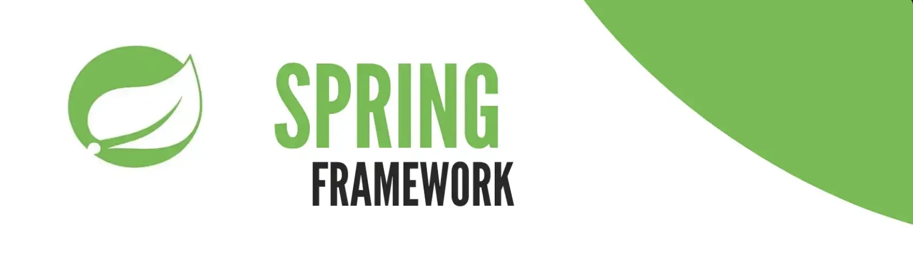

이후 이 때문에 UMC 라는 동아리로 들어가서 스프링부트를 처음 접하게 되었다. 이떄가 2022년 하반기로 기억하는데, 스프링부트가 당시 2점대 버전이었던 것으로 기억한다.

UMC 에선 스프링 생태계의 정말 기초적인 내용을 학습해보며, 스프링 생태계에 대한 전반 오버뷰를 익힐 수 있었다. 교육 과정으로는 데이터베이스 ERD 설계, SQL 쿼리 기초, jdbcTemplate 을 기반으로 진행했다. 아울러, 맨 마지막 교육 세션에는 트랜잭션의 기초 개념에 대해 학습하게 되었다. (트랜잭션 기초 개념이라 함은 ACID, 격리수준과 같은 개념도 아니고, 단순히 스프링 트랜잭션 어노테이션이란 무엇이고, 트랜잭션은 원자성을 보장해 준다 정도의 수준으로 간단히 학습했다.)

이 당시에는 정말 부끄럽게도 스프링 빈, DI, AOP 이런 개념도 들어보지 조차 못했다. 스프링부트 안에서 제공하는 어노테이션을 왜 클래스에 붙여야 하는지도 잘 모르고 그냥 붙였다. 일단 돌아가는 스프링부트 코드를 만들면서 흥미를 붙이는데 의미가 있었지 않나싶다.

이후 2달간 앱 런칭 프로젝트를 시작했다. 7명이 팀을 꾸려 프로젝트를 진행했으며, IOS 2명, 디자이너 1명, BE 4명이었던 것으로 기억한다. (시간이 오래되어서 정확한지는 잘 모르겠지만) 이 당시에는 교육과정에서 배운 jdbcTemplate 이 아니라 JPA 를 기반으로 프로젝트를 진행했다. 교육과정 떄 jdbcTemplate 으로 API 를 만들어보다가 JPA 및 Hibernate 라는 ORM 을 기반으로 REST API 를 개발해보니, SQL 중심적인 개발의 문제점은 정말 많다는 점을 직접 체감하게 되었다.

이 당시만 하더라도 완전 기초 프로그래밍 역량을 갖춘 상태로 개발을 했던 것 같다. 현 블로그를 운영하기 이전 블로그인 Velog 에서 포스팅을 할 때도 포스팅의 퀄리티 및 심도있고 깊은 내용을 다루냐의 수준을 비교해 보면, 지금과 차이가 극명하게 난다. 지금와서 다시금 생각해보면, 짧은 기간인 2년 동안 엄청난 성장을 했기 때문에 LINE 경력직 개발자가 될 수 있었던게 아닐까? (열심히 살았다 나 자신 🙂)

## 서비스 운영 시작, 하지만 실패했다

2023년이 되었을 때 무렵 대학교 3학년이 되었다. 이떄쯤부터 실제 서비스를 운영하고 싶다는 마음이 커졌고, 마침 지인으로부터 서비스 운영 제안을 권유받았던 기억이 난다. 서비스 명은 직접 이곳에 언급할 수 없지만, 사이드 프로젝트치고 규모가 매우 큰 서비스였다. 그 서비스의 특징을 정리해보면 다음과 같다.

> - MAU 8,000명 가량이 접속하는 서비스
> - 일본, 중국, 대만, 태국, 러시아, 미국, ... 등 전세계 각국에서 트래픽이 유입되는 서비스
> - 문서화, 정책 수립 문화를 체계적으로 잡기 위해 노력하는 팀 문화
> - 꽤나 복잡한 도메인 정책 및 비즈니스 로직 개발

### 서비스 운영 팀을 나오게 된 이유

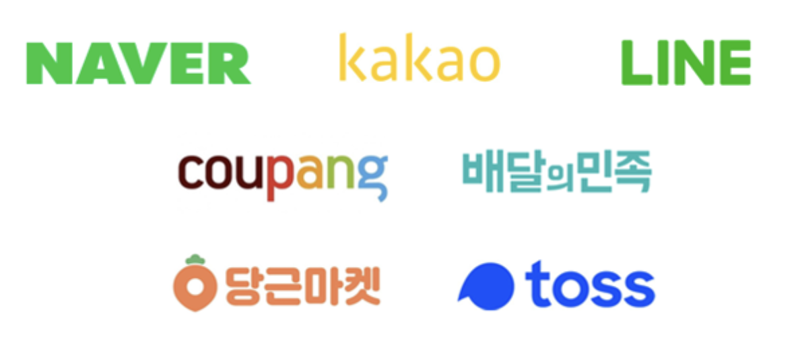

<figcaption> 네카라쿠배당토 - 대한민국 IT 최고의 기업들 </figcaption>

다시금 생각해봐도 꽤나 매력적인 서비스 운영 경험이라고 생각한다. 하지만, 몇달이 지나고 서비스 운영 팀에서 금방 나오게 되었다. 우선 그 서비스는 학부생이 감당하기엔 미션 크리티컬한 도메인만 가득했다. 때문에 서비스를 운영하면서 자유롭게 기술을 적용하고, 고민해보는 경험을 편하게 할 수가 없는 환경이었다. 게다가 주변에 최상위 기업 (흔히 말하는 네카라쿠배) 에 취업하신 선배님들만 봐도 실제 서비스 운영을 하는가의 유무에 따라 취업을 잘 하는것이 아니였다.

IT 대기업(네카라) 에 취업하기 위해선 서비스 운영을 했냐가 절대로 중요하지 않다. 실제로 나 또한 신입임에도 LINE 경력직 개발자가 된 것을 보면, 그닥 서비스 운영 경험이 필수적인 것은 아니라고 증명할 수 있다. (간혹, 주변 사람들을 보면 서비스 운영을 꼭 해야한다는 것에 집착하는 경향이 있는 사람들도 있다.) **네카라 개발자가 되기 위해선 학습의 방향성과, 사용하는 기술들에 대한 내부 동작원리, 본질을 깨닫는 것이 정말 중요하다.** 그렇기 때문에 나 또한 네카라 개발자가 될 수 있었다.

해당 서비스를 운영하면서 그닥 내가 배울 것이 없다고 생각했다. 해당 서비스 팀원들은 문서화 문화를 굉장히 중요시 했지만, 그 정도가 지나치게 과했다. 팀은 생각보다 보수적으로 움직였으며, 내가 원하는 방향성과 잘 맞지 않는다고 생각이 들었다. 간단한 서비스 기능 하나를 런칭하는데만 수개월이 걸렸다.

나에게는 서비스를 자유롭게 운영하면서 실수도 해보고, 도메인을 개발할 때 스스로 고민하는 습관을 편하게 기를 수 있는 경험도 쌓길 원했으며, 트러블슈팅도 마주했을 때 그 장애 전파가 되었을 때도 고객들에게 미치는 파급력이 크지 않은, 마치 놀이터와 같은 프로젝트 운영 경험이 필요했다.

또한 팀이 (내가 느꼈을땐) 보수적으로 움직이다 보니, 학습한 기술들에 대해 실제로 서비스에 적용해보면서 학습하고, 고민하고 싶었지만 전혀 그러지 못했다. 이 당시만 해도 무중단 배포 전략(카나리, 블루그린 같은), Redis 분산락과 같이 실무에서 자주 쓰이는 기술 및 전략들에 대해 기술 블로그 포스팅으로 다룬적이 있다. 하지만 실제 서비스 운영에 전혀 적용하지 못하고 있으니, 포스팅 개수만 늘어가고, 이론 기반 지식으로만 학습하면서 시간이 지나며 머릿속에서 모두 휘발되어 버렸다.

이 외에도 여러가지 이유가 있었지만, 아무튼 이러한 이유로 서비스 운영팀에서 나오게 되었다.

## 카카오테크 부트캠프 1기 수료

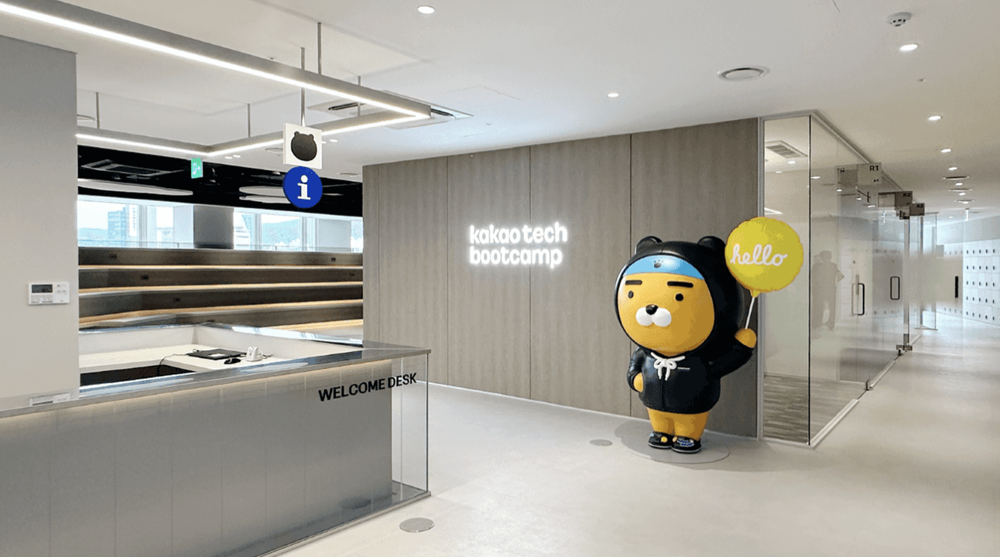

<figcaption> 카카오테크 부트캠프 판교 교육장 </figcaption>

2024년 하반기, 카카오테크 부트캠프에서 진행된 교육과정을 성공적으로 수료했다. 카카오테크 부트캠프에서 활동을 시작하기 전까지는 정말 힘들고, 불안했던 시기들이 많이 있었다. 이와 관련해서는 [2024년 카카오테크 코스 최종 합격까지, 상반기 회고](https://haon.blog/%ED%9A%8C%EA%B3%A0/2024-with-kakaotech/) 포스팅에서 이미 회고를 자세히 해서, 굳이 다루지 않으려고 한다.

### 카카오테크 부트캠프를 선택한 이유

이미 내가 신뢰하고 큰 도움을 받고있는 [동아리 선배](https://hudi.blog/) 를 통해서 꾸준히 도움을 청했고, 평소에 많이 고민하고 도전하는 습관을 통해 학습의 방향성과 기술의 본질, 그리고 빠른 러닝커브를 증명할 수 있는 학습법까지 잘 알고있는 상태였다. 그럼에도 왜 부트캠프라는 교육 과정을 선택했을까? 그 이유는 우선, 함께 성장할 동료가 절실히 필요했다. 그 당시 장기간 혼자서 학습을 이어온 상태이다보니, 무언가 같이 스터디를 진행하거나 협업하여 프로젝트를 운영해야 하는 상황이 생기더라도 동료가 없으니 성장하기에 한계가 있었다.

또한 취업의 관점에서도 어딘가의 조직에 속해있어야 함을 느꼈다. 프로젝트를 진행하여 서비스를 런칭하려고 해도 동료도 없으니, 이력서에 작성해낼 내용이 전혀 없었다. 앞서 운영중인 서비스에서 탈퇴했다고 했는데, 이 이후로 어딘가에 속해있는 조직이나 그룹이 없다보니 혼자서 많이 방황하고, 이력서에 채울 내용도 없었다.

만약 부트캠프에 합류하게 된다면, 함께 성장할 동료를 찾을 수 있고, 이력서에 담백히 채울 수 있는 프로젝트 이력이 생길 것이 분명했다. 또한 배우는 것이 최우선 목적이 아니긴 했지만, 카카오 현직자분들을 통해 기술적인 성장이 분명히 있을 것이라 생각했다. 그간의 가꾸어낸 글쓰기+블로깅 기반 메타인지 학습법을 통해 가파른 러닝커브를 만들어낼 수 있을것이란 굳은 믿음이 있었다.

### 카카오테크 부트캠프에서 무엇을 공부했을까?

교육과정 속에서 내가 카카오 크루, 교육생들과 만나며 열심히 공부한 내용들을 회고해볼까 한다. 나는 카카오 부트캠프에서 무엇을 공부했을까?

### 디자인패턴, 웹개발, CS, 인프라 오버뷰 학습

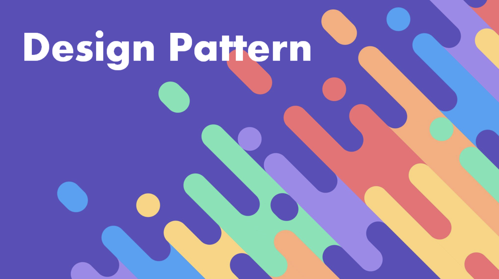

<figcaption> 디자인패턴 </figcaption>

7 ~ 8월 사이에는 이론 강의를 중점으로 교육과정이 진행되었다. 9 ~ 12월 사이에는 대면.오프라인을 중점으로 판교 교육장 오피스에서 현장 중심의 프로젝트 경험을 쌓을 수 있도록 교육 과정이 진행되었다. 이론 수업을 진행할 때 기억에 남는것은 디자인패턴과 웹개발, CS 기초, 인프라의 전반 오버뷰에 대해 학습했다는 점이다.

다만, 교육과정 중에 조금 아쉬웠던 부분도 존재한다. 사실 이론 수업을 들을 때 들은 내용들이 실무에서 정확히 어떻게 쓰인다는 것인지 연결고리를 잘 맺게 도와주셔야 한다고 생각하지만, 그리 순탄히 진행되지는 않았던 것 같다. [프로그래밍을 공부하며 능동적인 성장을 위한 학습방법](https://haon.blog/%ED%9A%8C%EA%B3%A0/growth-learning/) 에서도 다루었듯이, 모든 학습에는 이론 중심의 학습이 되어서는 안된다. 이 기술을 왜 배워야하고, 실무에서 적용해보면서 이론이 어떻게 되는것인지 깨닫는 과정을 통해 기억의 장기화가 될 수 있다.

### 자바, POJO 프로그래밍

[깃허브 아카이브 레포지토리](https://github.com/msung99/kakao-tech-archive.git) 에 교육과정동안 학습한 내용들이 모두 담겨있다. 나는 교육과정 동안 자바의 내용을 다시금 복습하고, 스프링의 근간과 Low-Level 을 집요하게 파고들며 학습했다.

프로젝트를 진행하면서 객체지향 프로그래밍에 대해 제대로 고민해보았다. 이전에 공부했던 객체지향의 사실과 오해라는 책을 다시금 읽으면서, 하나의 컴포넌트 및 기능을 구성하는 여러 객체들간에 어떻게 역할과 책임을 나누고 협력할지에 대해 많은 고민과 노력이 있었다. 객체지향 생활체조 원칙 또한 다시금 복습하면서, 우리 서비스내 백엔드 코드에 어떻게 생활원칙이 잘 적용될 수 있읋지 매순간마다 많은 고민을 기울였다.

서비스내 백엔드 코드에 디자인패턴 또한 부분적으로 적용했다. 다양한 서비스 정책이 있을텐데, 비슷한 역할을 수행하면서 구체적인 세부 구현 기능만 다른 경우에 대해서 디자인패턴을 적용했다. 예를들어, 할인정책이 있을때 1,000원 할인하는가, 10,000원 할인하는가에 따른 정책에 따라 캡슐화를 시켜놓는 방식으로 코드를 구현했다. 실제 우리 서비스에는 전략패턴, 데코레이터 패턴등이 코드내에 적용되고 있는 상태이다.

또한 스터디를 진행하며 자바 프로그래밍의 근본이라 할 수 있는 POJO 프로그래밍을 진행하며, 자바 언어에 대한 깊은 학습을 진행했다. 자바 리플렉션, JDK 다이나믹 프록시를 공부하면서 프록시 패턴의 한계점에 대해 직접 체감해보는 경험을 가져봤다. 기초적인 자바 웹 애플레케이션 개발시 자잘한 성능 이슈에 대해 고민해보기도 했다. for 문 대신에 왜 Stream API 를 자주 사용하는지, 왜 성능은 느린것인지 학습해봤으며, String, StringBuilder/Buffer 등의 성능 문제 및 Thread-Safe 특성에 대해 공부하기도 했다.

### 스프링부트

스프링부트 또한 기초적으로 대충 알고있던 내용들을 제대로 공부하기 시작했다. IoC, DI 와 같은 핵심 개념부터 제대로 근본을 이해하고자 시작했으며, 점차 JDBC 레벨로 파고들며 DataSource, JDBC Driver, HikariCP, 트랜잭션 동기화 및 추상화, TransactionManager 와 같은 스프링 생태계의 데이터베이스 Low-Level 근간을 공부하는데 주력했다. 프로젝트에선 향후 후술할 MySQL 레플리케이션 다중화 환경에서 DataSource 를 트랜잭션 readOnly 에 따라 적절히 라우팅 해줘야하는 Multi DataSource 구축 상황이 발생했는데, 이 과정에서 JDBC 단의 트랜잭션 내부 동작원리를 깊게 공부해보며 스프링의 내부 근간을 더 공부해볼 수 있었다.

프로젝트 또한 Spring JPA 로 운영되고 있기 때문에 JPA 과 관련한 여러 트러블슈팅을 마주하며 마찬가지로 심도있는 내용을 공부해볼 기회가 생겼다. JPA 의 영속성 컨텍스트, 1차 캐시와 같은 중요한 개념은 몰론이고 Multi DataSource 환경에서 JPA OSIV(Open Session In View) 설정 관련 트러블슈팅 까지 마주하며 스프링부트 내부의 동작원리를 깊게 공부했다.

개인 스터디로 Next Step 자바 웹 프로그래밍 서적을 다시금 복습해보았다.톰캣, Spring MVC, JDBC Template 등 현존하는 라이브러리, 프레임워크를 직접 바닥부터 내가 구현해봄는 경험을 해보았다. 바퀴를 재발명하는 경험을 통해 현존하는 기술들에 대한 내부 원리를 직접 체감할 수 있었다.

### TDD, 테스트 커버리지 98% 달성

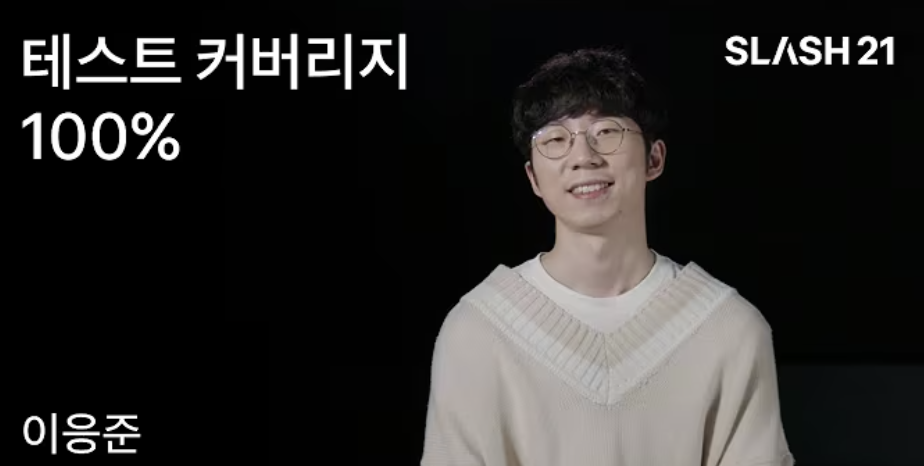

<figcaption> 토스ㅣSLASH 21 - 테스트 커버리지 100% 이응준님 발표 </figcaption>

서비스를 운영하면서 TDD 또한 제대로 공부해 볼 기회가 생겼다. 테스트 작성은 내가 가장 중요하게 생각하는 프로그래밍 관습 중 하나이다. 특히나 나는 높은 커버리지를 유지해야 한다는 강한 주장을 내세우는 사람중 한 명이다. [토스ㅣSLASH 21 - 테스트 커버리지 100%](https://www.youtube.com/watch?v=jdlBu2vFv58) 라는 토스 Slash 영상을 보면서 실무에서도 100% 라는 커버리지를 유지할 수 있으며, 100% 를 유지했을 때 얻는 장점들이 정말 많다는 점을 배울 수 있었다. 우리 팀 또한 100% 까진 달성못해도 유의미한 테스트를 작성하면서 높은 커버리지를 유지하자는 취지가 강했고, 커버리지 98% 를 달성했다. 추가적으로 90% 미만으로 떨어질 경우 빌드가 실패하여 배포 자체가 불가능하도록 만들었다.

테스트가 있어야지 리팩토링를 자신있고 과감하게 진행할 수 있다고 굳게 믿는다. 잘못된 코드 작성물이 있다면 그 즉시 테스트가 잘못되었음을 알려주어, 빠르게 피드백 받을 수 있다. 또한 테스트 자체가 일종의 문서화 역할을 하여, 협업하는 팀원들간에 해당 도메인을 빠르게 이해시키는데도 도움이 된다.

또한 테스트는 프로덕션과 비즈니스 정책에 대한 이해도를 높여주는데도 도움이 된다. 테스트를 작성하다보면 가끔 무엇을 테스트해야하는지 막히는 상황이 생길 때가 있었는데, 이떄가 바로 도메인과 정책에 대한 이해도가 낮다고 느껴질 때이다. 테스트를 통해 내가 잘못 알고있는 부분이 무엇인지 자연스레 깨닫게 되고, 실수없는 견고한 프로덕션을 만들 수 있게된다.

### MySQL, 분산 DBMS 환경 구축

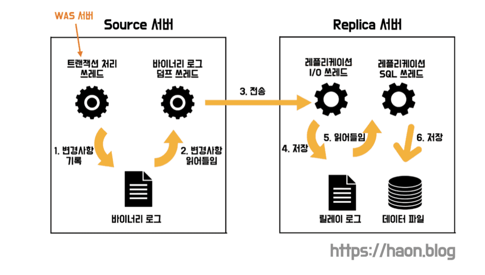

MySQL 또한 정말 집요하게 공부했다. 내가 면접을 볼 때마다 다른 지원자들과 다르게 갖고있는 강점이자 경쟁력을 무엇으로 내세울지 전략을 짜고, 많은 고민이 있었는데, 그 중 하나로 MySQL 및 데이터베이스 관련 고가용성 인프라 아키텍처 설계 역량을 내세웠다.

우리 서비스는 MySQL 레플리케이션 아키텍처 구조를 취하고 있다. 레플리케이션과 관련해서도 정말 많은 포스팅을 발행하며 내부 동작원리와 근본을 깊게 공부하는데 시간을 가장 많이 투자하지 않았나 싶다. 바이너리 로그, 릴레이 로그, 어플라이어 등등 MySQL 복제 내부 아키텍처 및 동작원리를 공부하면서 사용하는 기술에 대해 높은 이해도를 갖출 수 있었다. 이 외에도 FailOver 를 할때 필요한 개념인 바이너리 로그 위치 복제 방식, GTID 복제 방식등을 깊게 공부해보았다. 이렇게 평소에 깊게 공부한 습관들은 향후 면접 대비에서 아주 큰 도움이 되었다 🙂

또한 단순히 분산 데이터베이스 환경을 구축 하는것에 그치지 않았다. **부하 분산, 지리적 분산.재해 대응, FailOver, 백업 및 복구** 등 모두 고려한 고가용성 분산 DBMS 환경을 구축하고자 많은 노력을 기울었다. 또한 레플리케이션 아키텍처 그 자체에서 아키텍처를 취할 수 있는 구조가 정말 다양하다. 우리 서비스의 경우는 많은 고민을 기울인 경과 Multi Replica 아키텍처 구조라는 토폴로지 전략을 취했다.

레플리케이션 외에도 클러스터링, 파티셔닝, 샤딩 전략을 취한다면 우리 서비스에 어떻게 취할것인지, 1,000만건 이상의 대규모 데이터가 적재되었다면 어떻게 대응하고 아키텍처를 취할 것인지 고민이 많았다.

### 10분 카카오 Tech Talk 기술 발표 세미나

<iframe width="100%" height="350" src="https://www.youtube.com/embed/tJEbhINVPA8?si=3nVocPhH-UyiHDnx" title="YouTube video player" frameborder="0" allow="accelerometer; autoplay; clipboard-write; encrypted-media; gyroscope; picture-in-picture; web-share" referrerpolicy="strict-origin-when-cross-origin" allowfullscreen></iframe>

<figcaption> Tech Talk 기술 밢표 세미나 참여 영상 </figcaption>

카카오테크 부트캠프는 소프트 스킬 증진을 위해 10분 기술 발표 세미나를 진행한다. 매주 지정된 요일에 중앙 타운홀에 모여서 각 파트별(FE, BE, Cloud, AI 등) 로 발표를 진행했는데, FE+BE 는 매주 수요일에 발표를 하게 되었다. 나는 데이터베이스 인덱스의 기초 내용을 간단히 발표 내용으로 다루었다.

발표를 하기 전까지는 그닥 긴장될 이유가 없어서 딱히 별 생각을 안하고 있었는데, 막상 중앙 타운홀에서 발표를 진행하니 떨리고 긴장되는 마음이 커졌다. 그래도 서로가 아는 얼굴들이고, 우리 하모니 팀 팀원들이 격려와 응원을 해주어서 잘 마무리 할 수 있었다.

### 하모니 팀 기술 블로그 운영

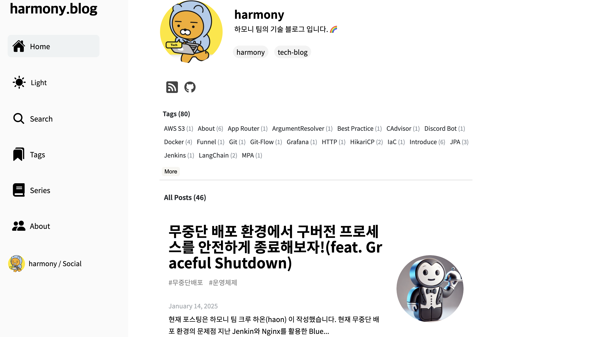

<figcaption> 하모니 팀 기술 블로그 </figcaption>

나는 기술 공유 문화를 중요시 생각하는 사람이며, 나의 최강점으로 내세울 수 있는 소프트스킬은 글쓰기.문서화 능력이다. 하모니 팀이 서비스를 운영하면서도 서로가 함께 성장할 수 있는 글쓰기 공유 문화를 만들고자 팀 기술 블로그를 만들고 운영했다.

맨 처음에는 글쓰기와 필력에 자신있고 여러 내공이 있는 나랑 도로시가 주도적으로 팀 기술 블로그 운영을 적극 추진했다. 우리 팀은 서로가 역할을 분배했는데, 나는 팀 기술 블로그 운영 및 문서화 문화 활성화에 포커싱했다. 다른 하모니 팀원들에게도 계속 글쓰기 및 포스팅 발행을 독려하면서, 프로젝트 기간동안 45여개의 포스팅을 팀 기술 블로그에 발행할 수 있었다.

### 교육과정 수료, 취준기 시작

크리스마스 시즌 무렵, 12월 27일을 마무리로 카카오의 교육 과정은 끝이나게 되었다. 막바지 무렵 쯤에는 이력서를 작성하고, 수정하고, 다듬고, 면접에 참여하느라 정신이 없었던 것 같다. 그렇게 교육과정이 끝나자마자 대학교 마지막 학기에 복학함과 동시에 취준기에 본격적으로 뛰어들었다.

## LINE 개발자가 되다

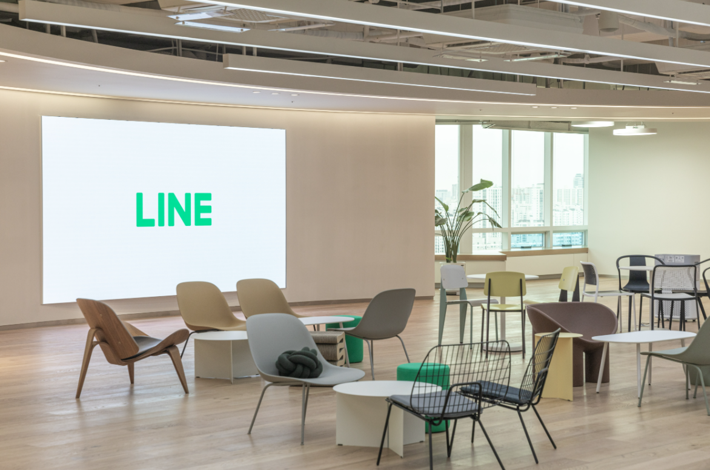

<figcaption> LINE Plus 분당 오피스 - 공용 오피스 및 라운지 </figcaption>

그렇게 대학교 막학기 재학과 동시에 취준을 병행하며 LINE Plus 서버 개발자 경력직 수시채용 공고에 이력서를 넣었고, 최종 합격을 하게 되었다. 다음달인 8월 초부터 분당 오피스로 출근 예정에 있다.

취준기는 정말 지옥 같았고, 고통스러웠다. 앞으로도 살면서 이때보다 더 힘들고, 우울했던 시기가 있을까 싶을 정도로 정말 싫었다. 하지만 힘들고 어려운 시기를 묵묵히 버티고, 이겨냈기 때문에 LINER 가 된 것이 아니겠는가 😁

### 지금까지 지원하고, 면접까지 치룬 회사

<figcaption> 네카라쿠배당토 - 대한민국 IT 최고의 기업들 </figcaption>

나는 IT 서비스 대기업에 취업하기를 몇년간 바라왔으며, 내 직무 역량을 스스로 믿고 굳게 IT 서비스 기업을 중점으로 이력서를 넣었다.

네카라쿠배당토는 이미 신입 채용이 동결된지 오래이다. 2022년을 가장 마지막으로 신입.경력 모두 취업의 문을 모두 닫았으며, 2023년부터 나를 비롯한 모든 개발자들이 심각한 채용 한파를 직격으로 맞았다는 생각이다. 나 또한 심각한 채용 한파를 피해갈 수 없었으며, 23년도, 24년도를 지나서 25년이 되었을 때는 채용 한파가 더욱 심각해져만 갔다.

IT 대기업의 3대장 네카라(네이버, 카카오, 라인) 또한 23년도 쯤부터 이미 신입 채용을 아예 동결시켜 버렸다. 나 또한 그래서 LINE 에 경력직 채용 공고로 지원하게 된 것이며, 공개채용 공고에는 단 한번도 이력서를 넣어보지 못했다. 그만큼 가혹하고도, 힘든 시기를 이겨내는데 정말 많은 노력이 있었던 것 같다.

수시 채용의 특성상 경쟁률은 매우 치열할 수 밖에 없었으며, 채용 또한 언제 마감될지 전혀 모르기 때문에 하루하루가 매우 피말려갔다. 대부분의 채용 공고가 한 자리수 이내로 채용 인원을 선별했으며, 심한 경우는 1명 정도 뽑는 자리에 8,000명 이상의 인원이 지원하여 경쟁률이 1 : 8000 을 넘어가는 수준이었다. 요즘은 작은 스타트업만 해도 1명 뽑는 자리에 1,300명이 넘게 지원한다고 하니깐 정말 심각하다. 또한 합격자가 발생하는 그 즉시 채용 전형 진행중인 모든 지원자를 불합격 처리해버리니, 아무리 능력이 뛰어나도 채용 지원 시기를 잘못타면 불합격 소식을 들을 수 밖에 없었다. (나 또한 LINE 에서 최종합격 소식을 듣자마자 채용 공고가 2시간 뒤에 바로 내려간 것을 봤다.)

서류 탈락을 제외했을 때, 즉 서류 합격 이후의 채용 절차를 밟았던 회사는 다음과 같다. 이 중에서 면접 및 코딩테스트 전형에서 불합격 소식을 들은 것도 정말 많고, 최종 면접 기회를 얻은 회사도 있지만 LINE 최종합격 소식을 듣자마자 면접 포기 메일을 보냈다.

> 💡 **서류 전형 합격 이후의 전형까지 채용 절차를 밟았던 회사 리스트**
>
> - 네이버 본사 (경력 3년 이상)
> - 네이버웹툰 (경력 3년 이하)
> - 카카오 본사 (경력 1년 이상)
> - 카카오페이 서버 개발자 (경력 3년 이상)
> - 카카오엔터프라이즈 스토리지 플랫폼 (경력 3년 이상)
> - 카카오모빌리티 서버 개발자
> - LINE Plus - 서버 개발자 (경력 3년 이상)
> - LINE Music (경력 8년 이하)
> - LINE Plus - DBA
> - 당근마켓 - 추천 시스템 서버 개발자
> - 당근마켓 - 서버 개발자 인턴 포지션
> - 토스뱅크 - 수신 플랫폼 서버 개발자
> - 토스페이먼츠 - 서버 개발자 (경력 3년 이하)

뭐 이렇게 많은 회사의 채용 절차를 밟얐냐는 생각이 들 수도 있겠지만, 지금 우리가 알아야 할 점은 채용 시장에 심각한 한파가 찾아왔다는 점이다. 또한 나는 애당초 신입 개발자임에도 경력직 채용 공고 다수에 서류 합격을 했다는 점에 감사하고 있다. 그리고 면접 전형까지 가기전에 코딩테스트 전형이 대부분 존재했는데, 나는 코딩테스트가 잘 준비되지 않은 상태라 코테 전형에서 떨어진 것도 많다. 또한 LINE 최종 합격을 하자마자 면접 포기 메일을 바로 전송한 회사도 많다.

## LINE 채용 절차

### 서류 전형 & 코딩테스트

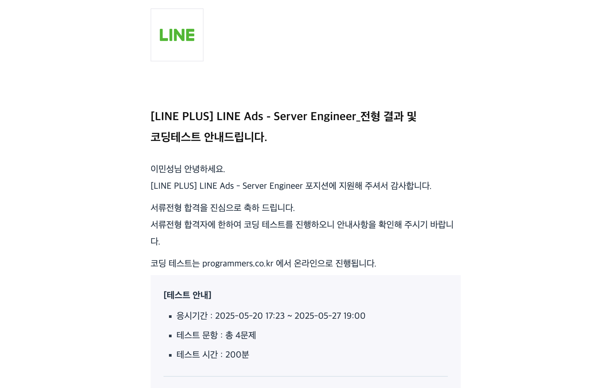

서류 전형은 그 누구보다도 자신있었다. 내 소프트스킬 상의 강점은 글쓰기, 필력, 문서화 역량이다. 내 이력서와 자기소개서를 회사 측에서 읽었을 때, 꼭 나를 만나서 얘기해보고 싶게끔 매력적인 이력서를 담아내는 것에 자신감이 넘쳤다. 또한 나만을 위한 글을 쓰는 것이 아니라, 다른 사람들에게 공유하는 목적도 동시에 갖는 글쓰기를 평소에 습관처럼 이어왔다. 이 습관은 이력서와 포트폴리오를 만드는데도 아주 큰 도움이 되었다. 내 이력서를 읽을 때 내가 어떤 사람인지를 빠르게 파악할 수 있도록 하고, 내가 읽고 작성하기 편한 이력서가 아니라 다른 사람이 읽기 편해보이는 이력서를 작성했다.

사실 이번 LINE 서버 개발자 자기소개서를 작성하고, 인적사항 기입 및 이력서를 최종 제출하는데만 30분이 걸리지 않았다. 사실 이 당시 다른 회사 서탈을 너무 많이 했던 시기라, 정신이 반쯤 나간 상태로 전혀 기대 안하고 자기소개서를 30분만에 작성하고 빠르게 제출했다. (근데 작성한 자소서 내용을 지금 다시보니 꽤나 잘 작성했다.) 그래서 서류 합격 소식을 들었을 때 깜짝 놀랐다.

코딩테스트 전형은 매우 난이도가 쉬웠다. 간단한 기초 알고리즘 유형만이 등장했으며, 구현 위주의 문제가 나왔던 것으로 아마 기억한다. 코딩테스트 제한시간이 200분인데, 나는 30분만에 모든 문제를 푼뒤 빠르게 제출하고 코딩테스트를 종료했다. 모든 문제를 빠르게 문제없이 풀고 제출했기 때문에, 코딩테스트 전형은 문제 없기 통과하곘다는 기대를 하게 되었다.

### 기술 인터뷰

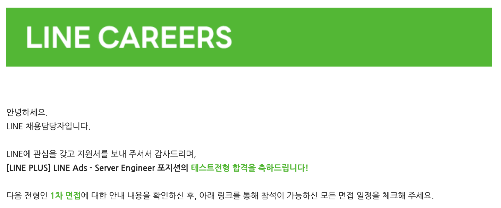

코딩테스트 종료 2일만에 합격 소식을 듣게 되었고, 직무 인터뷰를 일정을 조율하게 되었다. 직무 인터뷰는 약 1시간 정도로 진행되었으며, 꼬리에 꼬리를 정말 깊게, 집요하게 파고들며 물어보는 질문들이 이어졌다. LINE 경력직 기술 인터뷰 후기를 찾아보면 지구 내핵까지 파고들며 영혼이 나갈 정도의 어려운 질문들을 DFS 형태로 진행한다는 후기가 많았는데, 나 또한 예외없이 정말 어렵고, 난해한 기술 질문들을 받았다.

면접 진행중에 내 등 뒤에는 식은땀이 정말 많이 흘렀다. 다만, 어쩜 이렇게 전혀 생각치도 못한, 고민해보지 못한 질문들을 받을 수 있을까.. 속마음으로는 정말 훌륭하고 질 좋은 질문들이 가득하다는 느낌을 받았다. 개인적으로는 정말 어렵고 압박감있는 기술 면접 형태일지라도, 이런 유형의 기술 면접을 좋아한다.

교과서에 잘 나와있는 정형화된 질문들을 달달 외워서 답변할 수 있는가를 검증하는 것이 아니라, 개발자에게 정말 중요한 본질이라 할 수 있는 `문제 해결력` 을 검증하겠다는 느낌이 강했다. 어려운 서비스 장애 및 문제 상황을 하나 주어지고, 주어진 문제를 스스로 해결해나가고, 논리적인 추론을 슬기롭게 해내가는지를 깊게 검증하려는 느낌이었다.

모든 질문들이 하나같이 예상 질문밖에서만 등장했으며, 정말정말 어렵고 난처한 기술 질문들을 많이 받았다. 하지만 어려운 질문과 상황이 들어와도 끝까지 포기하지 않고, 합격한다면 함께 일하게 될 동료라는 입장으로 최대한 아는 지식들을 모조리 끌어모아서 답변을 드리고자 노력했던 것 같다. 함께 일할 수 있는 동료라는 느낌을 받을 수 있도록, 어려운 질문들에 절대 포기하지 않고 어떻게든 머리를 쥐어짜서 답변드렸다. 버벅 거린것도 많았지만 대부분의 답변에 어떻게든 답변을 드렸고, 다행히 직무 역량을 좋게 봐주시어 기술 인터뷰 합격 소식을 듣게 되었다.

무엇보다, 내가 사용하는 기술들에 대해 매우 깊은 Low-Level 단의 내부 동작원리, 근간을 잘 설명드렸던 것 같다. 코드 레벨단까지 내려가면서 사례.예시와, 내부 동작원리를 잘 설명드렸다. 하도 깊은 내부 동작원리에 대한 설명을 드리다보니 JDBC 수준까지 내려가면서 DataSourceUtils, TransactionSynchornizationManager 등 과 같이 매우 깊은 내용까지도 설명드렸던 것이 기억난다. Nginx 또한 Graceful Shutdown 과 관련하여 Worker Process, Master Process 의 내부 동작 과정까지 설명 드렸기도 했다. 또한 HTTP/1.1 스팩의 Half-Closed Connection 동작 과정까지도 설명드리기도 했다. 이 점에서 기술 인터뷰 전형의 고득점을 얻지 않았을까 싶다.

기술 인터뷰 결과가 나오는데 까지는 시간이 다소 오래걸렸다.. 😓 이 시간동안 정말 피말렸고, 인터넷에 라인 면접 결과가 보통 언제 나왔는지 후기를 수시로 찾아봤던 것 같다. 메일도 하루에만 수십번 열어봤던 것 같다.

### 컬처핏 & 임원 인터뷰

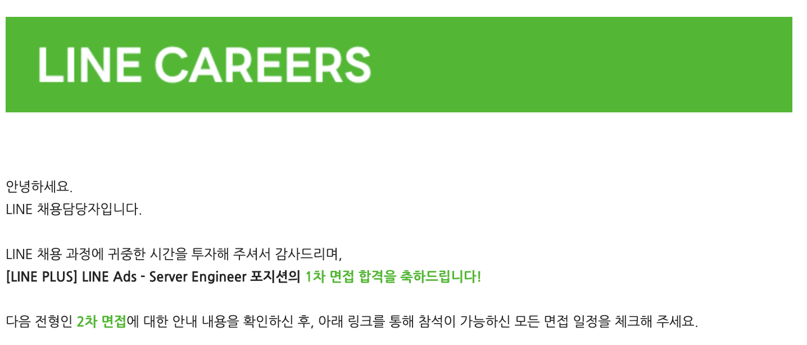

그렇게 직무 인터뷰 합격 소식을 듣고, 마지막 관문인 컬쳐핏 & 임원 면접 전형만 남게 되었다. 마지막 관문 하나만 통과하면 나도 진짜 LINE 개발자가 되는건가? 절대 도달할 수 없을 것 같았던 LINE 기업에 재직하게 되는건가? 라는 상상만 머릿속에 가득했다. 하지만 마지막 관문에서 실수해서 떨어진다면 그 만큼 상실감과 아픔이 클 것이라고 생각이 드니, 마음이 뒤숭생숭했다.

마지막 최종 인터뷰 전형 후기를 찾아보면, 대부분의 LINE 면접 후기가 2차 면접이 훨씬 어려웠으며, 더 깊고 심층적인 내용을 다루는 기술 면접이라는 후기가 대부분이었다. 특히나 직무 인터뷰에서 고득점을 얻지 못했더나 추가 검증이 필요한 지원자라면 높은 확률로 더욱 심화된 기술 면접을 보게 된다는 후기가 많았다.

그래서 나 또한 직무 관련 질문이 주를 이루며, 더 심화된 기술 질문이 들어오겠다는 추측으로 면접 시나리오를 생각해보았다. 게다가 경력직 채용인데 나는 신입 개발자이다보니, 임원들이 나를 볼때 추가적인 검증을 꼭 하지 않을까라는 생각으로 면접에 임했다. 하지만, 그렇다고 해서 직무 면접을 더 준비하지는 않았고, 컬쳐핏 대비를 철저하게 준비했다. 만약 더 심층적인 질문이 들어온다면 내가 전혀 예측하지 못하고, 미리 준비하지 못하는 질문들이 올 것이 뻔하기에, 뭘 어떻게 미리 준비 할 수 없는 상황일 것이 분명했다.

컬쳐핏 면접 대비를 위해 LINE 의 인재상은 몰론, 내가 지원한 팀의 코어벨류까지 모두 꼼꼼히 찾아봤다. 또한 지원한 팀의 기술 발표 및 관련 영상들 또한 모조리 찾아보았으며, 어떤 특성을 갖고 어떤 팀원을 뽑고 싶을지 계속 고민해보았다. 아울러, 내가 핏이 잘 맞는 부분들을 개인 사례와 함께 정리해보았다. 또한 인터넷에 나와있는 정형화된 인성 질문(ex. 본인의 장단점, 지원동기, 왜 개발자가 되고 싶은지, LINE 에서 이루고 싶은 목표 등) 들 또한 꼼꼼하게, 체계적으로 모두 준비했다.

다행히도 왠걸? 🙂 내가 받은 질문들은 대부분 인성 질문이 주를 이루었다. 기술 질문이 조금 들어왔긴 하지만, 인성+기술을 섞은듯한 느낌의 쉬운 질문을 주셨다. 정리하자면 다음과 같다.

- `인성 질문` : 80%
- `기술+인성 질문` : 20%

LINE 의 대부분의 면접 후기는 2차 면접이 훨씬 어려운 기술 면접이라고 했으나, 나는 직무 인터뷰에서 이미 좋은 점수를 얻었다는 확신이 들었다. 내가 실수만 하지않고, 나의 강점과 매력점을 잘 어필할 수만 있다면 충분히 합격하겠다는 생각이 들었다.

3명의 임원 분둘이 참여했으며, 나의 매력과 강점, 경쟁력을 모두 어필하고 보여주겠다는 각오로 면접에 임했다. 면접 분위기는 정말 편한하게 진행되었고, 내가 왜 LINE 에 채용되어야 하는지, 어떤 강점과 특별한 경험들을 가지고 있는지를 한 없이 보여주었다. 내가 가지고 있는 LINE 에 대한 애정 또한 과감하게, 진심을 다해 말씀드리며, 면접이 끝나고도 아쉬움과 후회가 없도록 최선을 다해 답변드렸다.

### LINE 최종합격

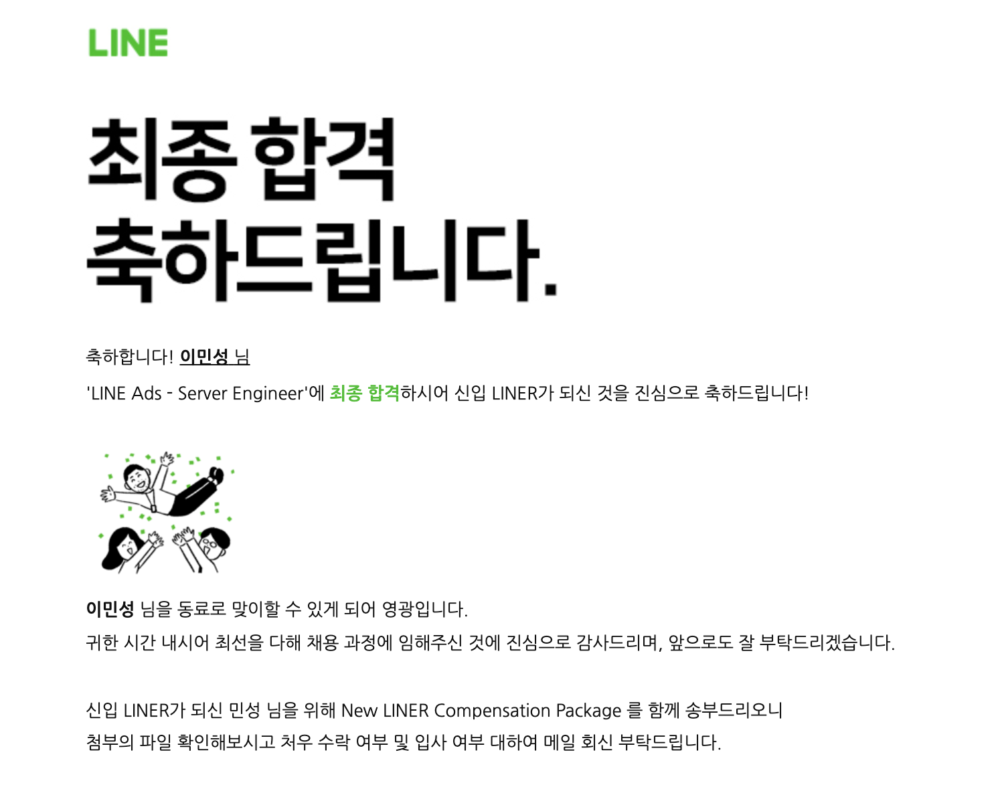

최종 면접이 끝나고 4일 뒤쯤, 모르는 번호로 유선 연락이 왔다. 누군가 했지만 혹여나 해서 받았는데, LINE 채용 담당자님의 연락이었고, 최종 합격했다는 전화를 받게 되었다 😆 채용 담당자님도 같이 기뻐하시고, 진심으로 축하해주셨다. 최종 합격 소식을 듣자마자 몇년동안 한번도 쉬지않고 노력했던 과정들이 헛되지 않았구나, 잘 살고 있었구나 라는 생각이 들면서 안도의 한숨을 내쉬었다. 최종합격 소식들을 듣자마자 우리 가족들이 옆에 있어서 함께 기쁨을 나누었다.

LINE 개발자라는 것은 나에겐 정말 이상적인 꿈의 직장처럼 보였다. 2년 전만 하더라도 대학교 동아리 친구들한테 나는 네카라쿠배 갈거야!! 라고 장난스럽게 말했는데, 진짜 현실이 될줄은 몰랐다. 절대 안될거라 생각했던 일이, 꿈같던 것이 내가 쉬지않고 몇년동안 노력하니 되는구나... 라는 생각만 가득했다.

## LINE 개발자로써의 목표, 향후 목표

### 교육자의 길

학부 시절부터 "나는 언젠간 꼭 교육자의 길을 걷고 말거야!" 라는 목표가 있었다. 지금도 그 목표는 변함없다. 난 앞으로 교육자의 길을 걸어볼까 한다. LINE 개발자로써 실제 현업에서의 경험을 쌓은뒤, 여유가 된다면 부업으로 교육의 길로 빠져볼까 한다. 최근에 카카오테크 부트캠프에서도 취업 소식을 듣고 인터뷰/특강 초청 연락이 왔는데, 이를 시작으로 조금씩 취미로 하여 교육의 재미를 느껴볼까 한다.

카카오테크 부트캠프, 우아한테크코스, 네이버 부스트캠프 등 교육 사업으로 뻗을 수 있는 길은 어디든지 열려있다고 생각한다. 어서 빠르게 현업에서 경력을 쌓은뒤에, 소프트웨어 교육자가 되어야 겠다 🙂

혹 현업의 일정이 벅차서 여유가 안될경우라면, 교육자가 되는 것이 힘들 수 있다는 생각도 든다. 꼭 오프라인 교육장에서의 교육자가 아니더라도, 인프런.유데미와 같은 교육 플랫폼에서 내 지식을 전파하면서 교육자가 되는 방법도 있을 것이다. 내가 알고있는 지식을 영상으로 공유하면서, 간단히 수익을 창출해보는 것이다.

### 의도적으로 일에서 멀어지기, 취미 활동 즐기기

지금까지 몇년동안 쉬지 않고 달려왔다. 그래서 나는, 의식적으로 일에서 멀어지는 연습을 할 것이다. 이미 "열정" 은 내 몸안에 가득하기 때문에, 이 열정을 LINE 에서 너무 빠르게 태워버려서 번아웃이 오지 않도록 적절히 휴식하는 방법을 탐구해볼까 한다. 쉴때는 쉬어야하고, 휴식 기간 동안에는 업무 생각을 전혀 하지 않는 환경에 놓여있어야지 꾸준한 페이스로 나아갈 수 있을 것이다.

제대로 휴식하기 위한 가장 좋은 방법은 바로 나만의 취미 생활을 갖는 것이다. 취미 생활이 있다면 정신적으로 건강하게 스트래스도 풀리며, 자연스럽게 업무 생각도 전혀 하지 않게될 것이다. 제대로 휴식을 해여지 업무 시간에 활력을 넣어줄 것이며, 내 성장을 부스트시킬 수 있을 것이다. 지금까지 생각해 놓은 취미생활은 복싱, 수영, 마라톤 달리기, 밴드부에 들어가 보컬 활동등이 있다. 앞으로 내 인생에 꽃길만 가득하기를.

### 운동 및 다이어트 시작

취준기 동안 살이 너무 쪘다. 그래서 최근부터 다이어트를 시작하고 있는데, 효과는 은근히 잘 나오는 것 같다. 땀을 열심히 흘려면서 다이어트도 하고, 예전의 멋진 상태의 나로 되돌아오기를 🙂

### LINE 에서 사용하는 기술스택 빠르게 배우기

LINE 에서는 지금까지 사용하고, 경험해보지 못한 기술 스택과 경험들이 정말 가득하다. 지금까지는 Java, Spring, MySQL 에만 주력을 해왔다면, LINE 플랫폼은 이보다 훨씬 광범위한 기술 스택을 다룬다.

기본적으로 LINE 서버 개발자로 적응하려면 MSA 이벤트 드리븐, Spring Cloud, Redis, Kafka, Hadoop, Apache Kylin, ELK Stack, Kotlin, ... 등등을 다양하게 사용한다고 한다. 이 외에도 정말 많지만, 전부 나열하기에는 끝도 없어보인다. (MySQL 은 안쓴다. 그 대신 하둡을 쓴다.) 아직까지는 무엇을 우선순위로 삼고 공부해야 하는지 감이 잡히지 않으니, 현재로써는 회사에 합류하여 도메인을 파악하고 내가 어떤 것을 우선순위로 삼고 공부해야하는지 목표로 해두자! 정도만 생각해 두고있다.

그럼에도 서버 개발자 1년차동안에는 개인적으로 공부해보고 싶은 것을 간략히 나열해보면 다음과 같다.

> - **MSA 이벤트 드리븐** : [마이크로서비스 아키텍처 구축](https://product.kyobobook.co.kr/detail/S000202596905) 발췌독
> - **Hadoop 및 데이터 파이프라인** : [데이터 중심 애플리케이션 설계](https://search.daum.net/search?w=bookpage&bookId=1583723&tab=introduction&DA=LB2&q=%EB%8D%B0%EC%9D%B4%ED%84%B0%20%EC%A4%91%EC%8B%AC%20%EC%95%A0%ED%94%8C%EB%A6%AC%EC%BC%80%EC%9D%B4%EC%85%98%20%EC%84%A4%EA%B3%84)
> - **Redis** : [개발자를 위한 레디스](https://www.yes24.com/product/goods/123182350)
> - **네트워크** : [컴퓨터네트워크 - 한양대학교 이석복 교수님](http://www.kocw.net/home/cview.do?cid=6166c077e545b736)

## 마치며

그 누구보다 열심히, 피땀흘리며 살았다고 자부할 수 있을만큼 LINE 이라는 좋은 기업에 취업하게 되었다. 신입임에도 불구하고 LINE 서버 개발자 경력 3년차 포지션으로 합류하게 되었다. 채용 한파를 뚫고, 다른 경력직 지원자를 모두 제치고, 치열한 경쟁률을 모두 이겨내며 LINER 가 되었다.

앞으로는 현직자로써 어떤 개발자가 되고 싶은지, 어떤 커리어를 쌓아나가며 어떤 꿈을 중.장기적으로 이루고 싶은지 고민하면서 살 것이다. 훌륭한 개발자가 될 수 있도록 꾸준한 페이스로, 멋진 사람이 되도록 살아나가야 겠다.
