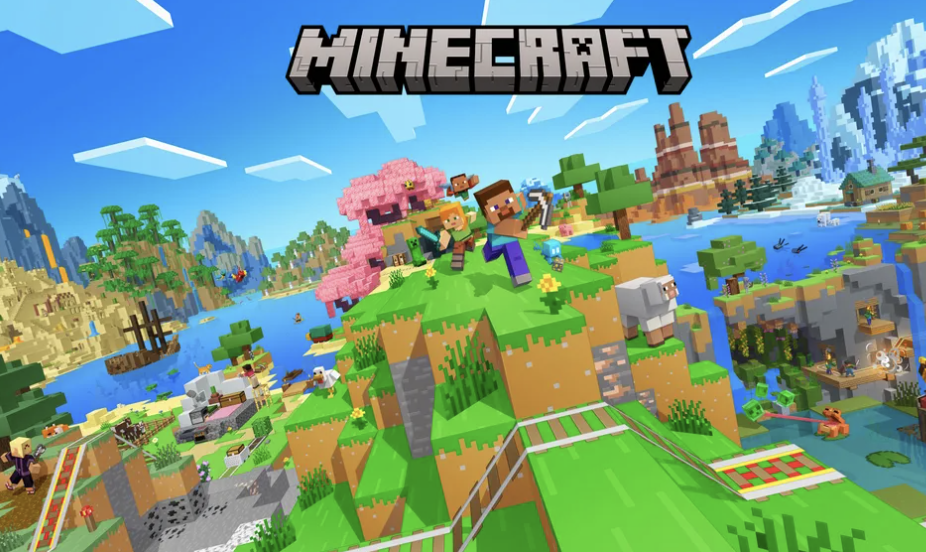
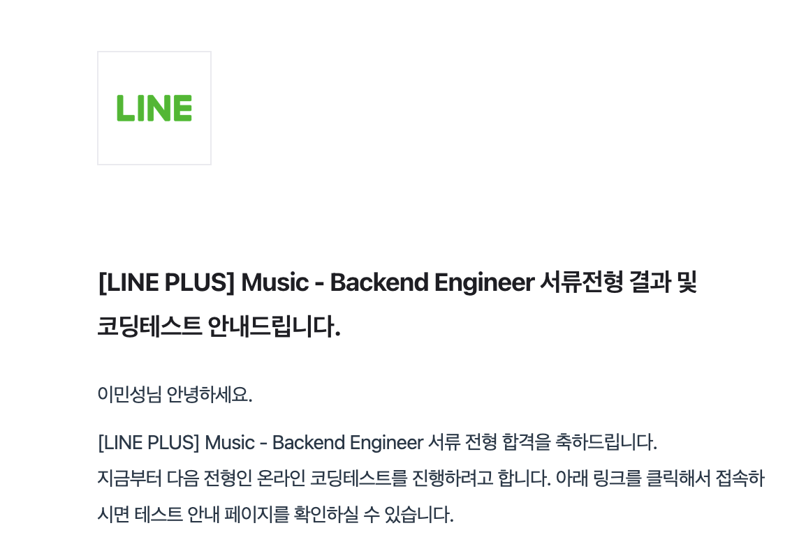

카카오에서 주관하는 개발자 양성 과정에 참여한지 많은 시간이 지났다. 나는 훌륭한 카카오 코치님들, 최고의 동료들과 함께 성장하고 있다. 이 몰입 과정이 정말 끝나지 않았으면 하는 바람이지만, 수료까지 많은 시간이 남지 않았다. 수료까지, 아니 취업까지 난 어떻게 성장해야할까? 평소처럼 기술적인 내용을 다루지 않고, 정말 마음 편하게 짧은 회고를 해볼까 한다. 주말이기도 하고 😉

## 불안함과 초조함 걷어내기

내 스스로 느끼기에, 타인도 느끼기에 가장 안좋은 단점은 쉽게 불안함과 초조함을 느낀다는 점이다. 안좋은 습관도 생겼다. 자꾸 불안함을 느낄 때 마다 머리를 꼬는 버릇도 생겼다. 예전에 회고했기를, 의식적인 노력이 필요하다고 했지만 이 노력을 하지 않은것도 정말 오랜 시간이 지났다. [개발자로 살아가면서 불안과 가면 증후군, 메타인지 학습법을 가꾸는 방법](https://haon.blog/%ED%9A%8C%EA%B3%A0/unrest-behavior/) 에서 회고했듯이, DMN 은 의식을 의도적으로 잠시 다른 곳으로 분산키기거나, 잠시 일상 생활에서 벗어나는 행위를 통해 극복해야 없어질 수 있다. DMN 이 켜지는 것은 성장통으로 받아들이되, 활성 빈도가 높아질수록 일상에 큰 악영향을 끼친다는 점을 다시 꼭 알아두자.

자주 생기는 불안함은 일상생활과 취업에 큰 영향을 끼치고 있었다. 불안함을 이겨내지 못한체 평일은 몰론 주말에 새벽 2시가 넘어서까지 노트북을 내려놓지 못한다. 충분한 휴식이 있어야만 평소 일상생활에 일에 집중할 수 있고, 더 빠르게 성장할 수 있다. 이를 작업하면서도 생각하고 있지만, 마음처럼 그는 쉽게 되지 않는다.

또한 불안함이 만땅인 상태에서 충동적으로 지금 문제를 급히 해결하려 시도할 때가 많다. 이는 이력서를 제출하면서 많이 느꼈던 점이다. 불합격 통보를 받고, 충분한 생각과 고민, 그리고 휴식을 거치지 않은체 곧바로 입사 지원을 하고있다. 제 3자의 입장에서 봤을때도 이 불안함은 좋지 못할 것이다. 내가 다시 한번 인지해야 할 내용은 다음과 같다.

- 불안함에 가득차있을 때는 의식적인 노력이 필요하는 점을 다시 꼭 기억하자. 일정한 극복 패턴이 필요하다.
- 불안함에 가득차 있을때 결정을 내렸던 행동 중 단 한번도 좋은 결과물이 나온적이 없다.
- 불안함으로 인해 충분한 휴식을 취하지 않았을 때 항상 일주일동안의 작업량은 매우 극명하게 낮다.
- 강제로 휴식을 취해야는 날을 주 1회이상 만든다. 이 또한 의식적인 노력이다.
- 불안함이 높은 상태이고, 판단력이 흐려졌다고 생각이 드는 그 즉시 결정을 뒤로 미룬다. 가장 이상적인 것은 오늘 몇 시간 뒤가 아닌, 다음날 아침이다. 아침에 기상한 나는 가장 현명한 선택을 내릴 수 있는 사람이 된다.
- 비슷한 맥락으로, 곧 바로 일을 절대 저지르지 말자. 최소 하루 이상의 고민 시간을 가진뒤에 결단을 내린다. 하루가 안된다면, 몇 시간이라도 시간을 가진다.
- 실패는 다음의 성공을 위한 소중한 자산이 된다. 끊임없이 실패하고, 성공을 위한 소중한 경험을 쌓자. 앞으로 만들어질 성공이라는 성취감을 만끽하자.
- 심리적인 마인드 셋 또한 성장통임을 잊지 말자. 내 감정과 심리적 압박을 유연하게 다룰 줄 아는 것 또한 성장이다.
- 주변에 성공하는 사람들 모두가 내가 생각한 것 보다 훨씬 많은 실패를 겪었다. 서강대 출신 30만 구독 유튜버도 58번의 서류 탈을 통보받았다. 
- 가면 증후군을 의식적인 노력을 통해 벗겨내자. 나는 주변 사람들에게 자주 인정받았을 만큼 멋진 사람이다. 내 노력을 인정하고 사랑할 줄 알자.
- 스트래스를 풀 수 있는 나만의 취미가 필요하다. 확실한 취미를 찾아서 불안함을 깔끔히 제거할 수 있다.
- 실패는 실패한대로 둔다. 단, 그 실패가 다음 성공을 위한 도약점이 되어야한다.

### 훌륭한 퀄리티를 보장하는 휴식은 무엇일까?

나에게 더 일에 몰입하기 위한 휴식 방법에 대한 고민이 많았다. 취미를 만들기 위해 여러 고민이 많았다. 일과 시간이 끝나면 저녁을 먹고 밖에나가 몇 시간동안 뛰어보기도 했고, 어릴 때 즐겨했던 마인크래프트 게임을 다운로드 받아서 잠시 추억을 회상해보기도 했다. 하지만, 게임을 즐겨했던 것도 잠시일 뿐, 옛날처럼 그다지 내게 큰 재미를 가져다주지는 못했다. 운동을 나가서 열심히 조깅하는 것은 도움이 된 것은 분명하지만, 완전히 심신의 안정감을 가져다주는 것에는 도달하지 못했다. ~(마인크래프트 8,900원에 유료 구매한거 매우 후회중이다!)~

좋은 휴식에 대한 조건은 보통 아래 3가지와 같다고 한다.

-  **편안**: 휴식이 끝났을 때 심신의 안정을 얻을 수 있어야 한다. 휴식을 했는데도 긴장이 풀리지 않거나 되려 더 자극 받게 되는 방법들(뉴스, 공포 영화, 리그오브레전드 등의 자극적인 게임) 은 편안하지 않다.

- **도파민 분출과 몰입**: 나 또한 이에 매우 공감되는 내용인데, 우리 뇌는 무언가에 몰입할 떄 도파민이 분출된다. 반면 인스타, 쇼츠등의 의식적이지 않고 행복하지 않은 것은 좋은 휴식이 아니다.

- **거리두기**: 앞서 회고한 내용과 동일하다. 강제로 일에서 벗어나는 것이다. 진정한 휴식은 "일과 얼마나 거리를 두었는가" 이다. 업무 외적인 시간에도 업무를 생각해야 업무 능률이 더 향상될 것 같지만, 사실 뇌는 충분한 휴식을 가진 뇌가 더 효율적으로 일한다고 한다. 나 또한 매우 공감하는 내용이다.

앞서 회고한 내용들이 대다수 위 내용에 포함된 내용들이다. **진정한 휴식이라면 편안해야 하고, 내가 몰입할 수 있여야하며, 업무와 전혀 관련없는 것이어야 한다.** 앞으로 나는 최소 주 1회이상 업무와 전혀 연관없는 취미를 가져볼까 한다. 또한 내가 재밌게 몰입할 수 있는 취미를 해보면서, 실제로 충분한 휴식이 내 성장을 얼마나 부스트 할 수 있을지 실험해볼까 한다. 글을 적다보니, 앞으로 어떤 것을 취미로 가질지 고민이 생긴다. 막연하게 당장 떠오르는 취미는 아래와 같다.

- 글쓰기 (현실적으로 가장 좋아하는 것. 지금도 글을 너무 재밌게 쓰고 있다. 😂)
- 레고 아이쇼핑 및 간단한 조립 (정말 내가 좋아했던 레고를 다시 해볼까 생각한다. 다만 너무 비싸서, 비싼건 아이쇼핑만 하고 가격이 그나마 괜찮은 건 조립해보기로.) 
- 맛집과 좋은 카페 찾아다니기 (안그래도, 내일 판교 주변에 있는 백현동 카페거리에 가볼까 한다.)
- 요리 만들기 (요즘 좋은 취미가 생긴 것 같다. ~백종원님 레시피 보면서 요리 만드는게 생각보다 너무 재밌다!~)
- 복싱 (현실적으로 판교에서는 하기 힘들지만, 김포로 다시 돌아다면 시작할지도?)

유튜브만 보지 말고, 주 1회 더 생산적으로 도파민이 분출될만한 취미를 찾아 나서보자. 

### 블로그와 코딩테스트

#### 블로그

최근 10월 말~11월 초중순 사이, 괜히 바쁘다는 핑게로 글을 거의 발생하지 못했다. 1차 데모데이 마감기한이 얼마 남지 않았기 떄문에, 사실 그 당시 글을 발생하지 못했던 것은 어쩌면 당연하다. 핑계가 아닐 수 있다. 하지만, 글쓰기를 통해 내 성장을 이끌어내지 못했던 것은 객관적으로 자명한 사실이다.

나는 블로깅을 위해 아래 재밌는 실험을 해볼까 한다.

블로그 작성 루틴에 대한 실험이다. 나는 글을 한번 작성할 떄 제대로 이해했는지 알기 위해서 쓰지만, 간혹 남에게 더 잘보여주고 싶은 괜한 욕심도 생겨서 장문의 글을 작성할 떄도 있다. 글의 길이로 인해 포스팅 작성이 간혹 부담스럽게 느껴져서 시작을 안할떄도 있다. 그래서 나는, 한가지 실험을 해볼까한다. **글의 퀄리티, 길이를 신경쓰지 않고 주 3회 이상의 포스팅을 강제로 발행하는 것이다.** 블로그를 남에게 보여주는 것에 포커싱을 맞춰야 하는 것이 아니라, 내 학습 수단을 위한 것임을 잊지 말도록 해야한다. 우선 위 방식대로 몇주간 강제로 글을 발행해본 뒤, 기존 방식과 강제적인 글 발행 방식 중에 어떤 것이 더 내 성장을 부스팅하는지 실험해보고자 한다.

#### 코딩테스트

코딩 테스트가 가장 심각한 내 단점이다. 사실 지난번에 **여러 차례 회사에서 경력직 채용 서류 합격 통보를 받았음에도 불구하고, 결국 코딩테스트에서 탈락**이 되버렸다. 내가 현실적으로 가장 몰입해야 할 것은 코딩테스트이다. 

코딩테스트 또한 강제성을 부여해볼까 한다. **하루 2문제, 주 12문제 이상의 알고리즘 문제를 강제로 푸는 것이다.** 또한 여기에 조건을 붙여보고자 한다. 그 당일 문제가 (내 주관적인 기준하에) 쉽다고 판단되면, 2문제 이상이 아닌 여러 문제를 풀어야 그 날의 할당량이 인정되는 방식이다. 다시 좋은 기회를 잃고싶지 않다면, 정신차리고 코딩테스트에 집중하자. 현실적으로 이제 내년 상반기 취업을 위해 준비할 수 있는 마지막 기회임을 절대 잊지말자. 내가 하고싶은 주제만 하면 안된다. 현실을 바라보자

#### 내가 쌓아온 정량적 지표들 정리하기, 모범 케이스 찾아보기

다시 한번 이력서를 점검하는 시간도 가져볼까 한다. 모범 사례들을 다시 한번 참고하여, 내 활동을 더 응집하여 표현해볼까 한다. 우선 당장에는, 다음주 카카오 Tech Talk 발표를 준비하고, 교육과정에서 활동한 내용들을 별도 깃허브 레포지토리를 생성하여 아카이브 해볼까 한다.

## 마치며

글을 적으니 역시 생각이 정리된다. 더 빠르게 성장을 부스트하기 위해, 내 생각을 잠시 정리해보는 시간을 가져보았다. 앞으로도 더 빠르게 성장할 수 있는 내가 되기위해, 꾸준히 노력해보자. 불안함의 안개를 걷어내기 위해 의식적인 노력을 하고, 충분한 휴식을 가져보자. 블로그와 코딩테스트, 이력서를 계획한대로 발전시켜보자.