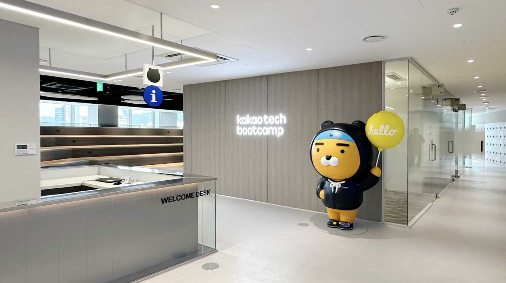
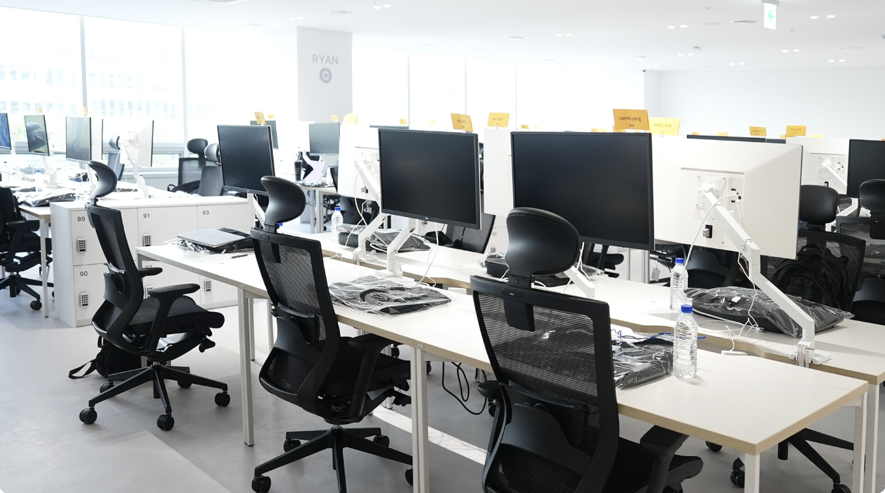
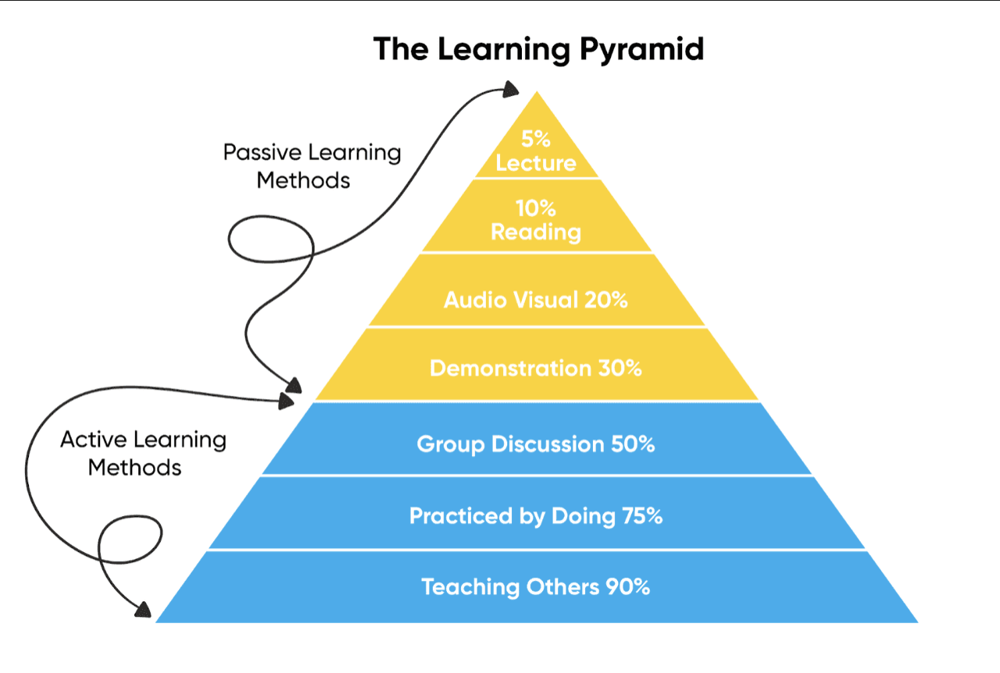
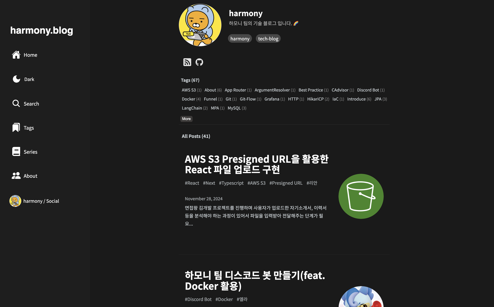

> 💡 카카오테크 부트캠프는 자율 주제 글쓰기 & 소정의 이벤트가 주어진다. 이 포스팅은 "카카오테크 부트캠프에서 찾아낸 나만의 효과적인 프로그래밍 학습법" 주제로 작성한 글이다.

## 최고의 소프트웨어 개발자 양성 과정, 카카오테크 부트캠프

벌써 첫 눈이 내린 11월 말이네요. 저희 카카오테크 부트캠프 크루들과 어제 라이언 눈사람도 만들고, 교육장에 들어와 따뜻한 커피도 한 잔 했답니다. 최고의 동료, 훌륭한 멘토들과 함께 성장하는 이곳이 정말 행복하기만 한데, 벌써 수료를 앞두고 있네요. 아직 카카오테크 부트캠프에서 동료들과 하고 싶은 것들이 넘쳐나는데, 시간은 무정하게 흘러갔습니다. 곧 12월부터 카카오테크 부트캠프 2기 모집이 시작된다고 합니다.

문득, 수료를 앞두고 있으니 작년 이맘때 혼자서 프로그래밍을 공부할 때가 생각나네요. 혼자서 공부하니 무엇을 공부해야하는지 조차 스스로 찾아야 했고, 혼자 긴 시간을 방황해야 했습니다.  곁에서 올바른 방향으로 바로 잡아줄 멘토가 없다보니, 정말 많이 방황하게 되더라고요.. 스스로가 제대로 공부하고 있는 게 맞는지 끊임없이 의심하면서 감정 소모도 많이 했습니다. 그런 저에게 카카오테크 부트캠프는 큰 길잡이가 되었어요. **무엇을 시작해야하는지 조차 몰랐던 저에게 현장 중심의 교육 기회를 제공해주었고, 평생동안 자기 주도적으로 학습할 수 있는 역량을 가진 인재로 만들어주었거든요.** 

지금부터, 카카오테크 부트캠프만의 소프트웨어 교육 철학을 소개해볼까 해요. 최고의 몰입 환경 속에서 그간 어떻게 성장했는지를 돌이켜보고자 합니다. 그리고 6개월의 과정 속에서 제가 만들어낸 나만의 자기주도 학습법에 대해 공유해볼까 합니다 😎

## 전통적인 교육, 그리고 카카오테크 부트캠프

<figcaption> 카카오테크 부트캠프 오프라인 교육장 </figcaption>

저희는 초, 중, 고등학교와 대학교를 거치며 책상에 가만히 앉은 상태로 지식이 주입되는 교육 방식에 익숙합니다. 하지만, 그런 교육에는 주관과 비판적 사고가 결여되어있죠. 이런 전통적인 교육과정을 거쳐 간 저희 대부분은 스스로 생각하고, 고민하는 방법을 잊은 지 오래 일 것입니다. 자신이 진정 무엇을 하고 싶은지도 모른 채 높은 점수를 위한, 평가를 잘 받기위한 학습만을 해온 저희는 학습의 본질을 잊은 채 살아왔던 것은 아닐까요? 🤔

일방적으로 답을 알려주는 교육은, 교육받는 이로부터 스스로 답을 찾기 위한 고민의 기회를 박탈하는 것입니다. 타인이 정의해준 문제를 남이 정해놓은 방법으로 해결하는 것을 의미있는 학습이라고 부를 수 있을까요? **"Why?"** 라는 질문을 던지는 학생을 찾아볼 수 없는 교육에서 저희는 정말로 본질을 이해하고, 깨달을 수 있을까요?

### PBL(Problem Based Learning)

카카오테크 부트캠프는 일방적인 강의를 진행하면서 정답을 제공하는 교육이 아닙니다. 카테부는 강의 위주의 교육 보다는 잘 설계된 미션, 그리고 관련된 최소한의 지식이나 키워드만을 크루들에게 던져줍니다. 그리고 크루들은 주어진 개인 & 팀 미션을 해결하기 위해 정해진 해결 방법이 아닌 자신만의 해결 방법을 만들기 위해 끊임없이 고민하고, 스스로 찾아야합니다. **즉, 학습자는 지식보다 문제을 먼저 접하고, 문제를 해결하는 과정에서 자연스럽게 필요한 지식을 습득합니다.** 그렇게 크루들은 자신이 직접 학습한 지식의 필요성에 대해 깊은 공감을 할 수 있습니다. 카카오테크 부트캠프는 이 교육 철학을 **PBL(Problem Based Learning)** 이라고 부르고 있어요.

> - **Project Based Learning** : 프로젝트 기반 학습
> - **Problem Based Learning** : 문제 해결 기반 학습
> - **(Sequential) Progress Based Learning** : (순차적) 진행 기반 학습

카테부(일명, 카카오테크 부트캠프) 는 **PBL(Problem Based Learning)** 를 위와같이 정의하고 있어요. 전통적인 수동적 수업 방식을 벗어나 학습자가 학습의 주체가 되어 능동적인 학습 활동을 할 수 있도록 설계된 수업을 말하는 것으로, 주체적이고 협동적인 학습 활동을 통해 문제해결 능력, 자기주도학습 능력, 협동학습 능력을 향상시킬 수 있는 효과적인 학습 방법을 뜻합니다. 

주어진 개인 & 팀 미션을 열심히 마치고 멘토님에게 피드백을 요청하면, 그에 대한 상세 피드백이 미션이 끝난 시점에야 비로소 진행됩니다. 문제를 해결하기 위해 많은 고민을 끝마치고, 이미 자신만의 해결 방법을 만들어낸 상황에서 듣는 강의는 우리에게 '정답'이 아닌 문제에 대한 '새로운 관점' 이죠. 이 과정에서 잘못 알고 있던 내용을 교정할 수 있고, 모호하게 알고 있던 부분이 좀 더 선명해지게 됩니다. 

미션 수행 과정에서 만들어진 각자의 문제 해결 방법은 **평가되거나, 채점되는 방식이 아닙니다.** 생각이 다르고 더 경험이 풍부한 멘토님들을 통해 피드백과 자유로운 의견을 주고받는 과정만이 존재할 뿐이죠. 🙂

## 카카오테크 부트캠프에서 발견한 나만의 평생 자기주도 학습법

**맹목적으로, 자신의 생각과 깊은 고민이 담겨있지 못한 학습 태도는 학습자 본인에게 절대 유의미한 성장을 끌어낼 수 없습니다.** 학습 방법도 마찬가지입니다. 모두에게 적용되는 절대적인 최적의 학습법이 있을까요? 한 사람에게 매우 효과적으로 작용한 학습 방법이 다른 사람에게는 무용지물일 수 있습니다. 사람 모두는 각기 다른 성향을 갖고 있기 때문이죠.

 저 또한 카카오테크 부트캠프에서 나만의 효과적인 학습법을 찾아내는데 이것저것 많은 방법을 시도했습니다. 맹목적으로 귄위있는, 일방적인 누군가의 의견을 따르는 것 보다, 평생 저만의 학습법을 찾는 것이 좋겠다는 생각이었습니다. 카테부 교육 철학 또한 일방적인 주입식 교육이 아닌, 본인과 크루별로 자율적인 문화, 학습법을 찾아내길 강조하죠. 저는 이 교육 철학 속에서 아래와 같은 학습법을 찾아낸 것 같습니다. 몰론 아직 다듬어야 할 부분은 많지만, 어느정도 학습법이 정교화된 것 같습니다.

## 기록하고, 공유하고, 설명하기

> 💡 제 프로그래밍 학습법에 대한 자세한 내용이 궁금하다면 [프로그래밍을 공부하며 능동적인 성장을 위한 학습방법](https://haon.blog/about/) 을 참고해주세요! 😎

저는 한 주제에 대한 학습을 제대로 마쳤다! 의 기준을 **남에게 명확히 설명할 수 있는가?** 로 판단합니다. 즉, 주어진 학습 키워드를 나만의 언어로 타인에게 제대로 설명할 수 있어야지 자신만의 지식으로 체화한 것이라고 생각해요. 이를 확인하기 위한 좋은 방법은, 주변 크루들에게 내가 학습한 내용을 설명해보는 것입니다. 학습한 내용을 타인에게 설명하다보면 내가 어떤 부분을 잘 모르고, 잘 이해했는지 금방 알아차릴 수 있거든요. **즉, 학습한 지식을 머리 밖으로 인출(Output)하는 과정속에서 생각이 정교화(elaboration) 되고, 메타인지가 활성화됩니다.** 

<figcaption> 실시간 오프라인 오피스 작업 공간 </figcaption>

이 믿음을 갖고 카테부에서 제 학습법을 정교화시키기 위해 크루들과 정말 다양한 방법을 시도해봤어요. 한 뜻을 가진 크루들과 스터디를 하며 회의실에서 발표도 해보고, 교육장 내의 오피스에서 일과시간에 끝나고 다같이 남아서 뜨겁게 토론도 해봤습니다. 

카테부 오프라인 교육장은 **자신만의 효과적인 학습법을 찾아낼 수 있도록 장기간 몰입하기에 최고의 환경**이에요. 자율적인 몰입 환경에서 성장에 열망 넘치는 크루들이 가득하고, 함께 성장하며 여러 학습법을 시도해볼 수 있고, **정해진 규정없이 자신만의 정답을 찾아갈 수 있도록 지원합니다.** 즉, 나만의 색깔과 개성을 찾아갈 수 있도록해요. 이를 위해 중앙 타운홀 무대에서 짧게 강연을 해도 좋고, 각 팀 마다 제공되는 오피스에서 프로젝트 회의를 해도 좋고, 회의실을 예약하고 스터디와 소규모 발표 세미나를 열여도 되거든요. (카테부 멘토님들, 운영진, 크루들 모두에게 항상 땡큐 😉)

그런데, 문제점이 하나 있었습니다. 저 또한 교육장에서 여러 학습법을 시도해보던 중 한 가지 아쉬운 점을 발견했어요. 그건 바로 24시간 내내 저를 따라다니며 설명을 들어줄 크루는 그 어디에도 없었다는 점이에요. 밤새 공부하고 싶어도 사람마다 공부하는 시간대, 주제 모든 것이 똑같을 순 없죠.

### 블로깅을 통해 학습한 지식을 설명하기

그렇다면 현실적으로 가장 좋은 방법은 무엇일까요? 저는 바로 **블로깅**이라고 생각해요. **내가 그날 공부한 개념에 대해 잘 모르는 다른 사람들도 쉽게 이해할 수 있도록 글을 쓰는 그 과정에서 메타인지가 향상**되는 경험을 많이 할 수 있었습니다. 누군가에게 가르치듯이 설명하고, 시끄럽게 떠드는 학습 방식은 이미 뇌과학적으로 높은 학습효과를 보인다는 것이 이미 증명된 사실이죠. 반면 조용하게 인강과 책을 읽고, 문제를 대충 풀어보는 수동적인 방식은 매우 낮은 학습효과를 보인다는 것 또한 이미 증명된 사실이에요.

블로깅은 자신의 상황에 알맞게 언제든지 글쓰기를 시작할 수 있습니다. 글을 작성하면서 본인 스스로 남을 위해 설명하듯 글을 작성하다보면, 생각이 `정교화(elaboration)` 되고, 이곳저곳 흩어진 생각을 한 곳으로 모으며 지식을 글로 `설명(explain)` 할 수 있어요. **타인에게 설명을 하듯 글쓰기를 시작하면, 자연스레 지식과 생각들이 정리됩니다.** 또한 글을 적다가 내가 잘 모르는 부분이 있다면 반드시 설명을 하는데에 막힐 수 밖에 없습니다. 이 과정에서 메타인지가 활성화됩니다. 내가 부족한 부분을 글을 작성하며 정확히 알 수 있게되죠. 그를 보충하기 위한 추가 학습 키워드가 생기며, 필요에 의해 능동적으로 학습하고, 배우고, 고민하고, 보충할 수 있는 기회가 주어집니다.

또한 블로깅은 **기억의 장기화**에 매우 큰 효과를 보이기도 해요. 인간은 망각의 동물입니다. 모든것을 기억할 수 없으며, 설령 높은 이해도를 갖고 있던 지식들도 오랜 시간이 지났을 때 잊기 마련이죠. 이때 블로깅은 장점을 보입니다. 그 당시 내가 갖고 있던 정교화된 생각들을 빠르게 상기할 수 있으며, 휘발된 기억을 빠르게 되찾을 수 있거든요. 이렇게 정교화된 생각들을 내가 필요할 때 마다 계속 꺼내볼 수 있다는 점도 매우 큰 장점입니다.

글을 쓰고 있는 지금 기준으로, 카카오테크 부트캠프 시작 이후에 작성한 블로그 포스트가 110개가 쌓였어요. 약 2일에 한 번꼴로 글을 쓴 것 같아요. 이렇게 글쓰기 습관을 들이면, 나중에 성장이 지체되는 것 같은 불안감이 오더라도 그간 작성한 블로그 포스트를 돌아보며 **'맞아. 그래도 나 이런 것들을 공부했었어. 힘내보자!'** 라는 생각도 할 수 있습니다. 이렇듯 블로그 포스팅은 학습의 **정량적인 지표** 가 되기도 합니다. 

### 함께 글쓰기를 통해 성장하기

<figcaption> 하모니 팀 기술 블로그 </figcaption>

몇 달 전부터, 블로깅을 저 혼자가 아닌 카테부 크루들과 함께 작성하며 성장할 수 있는 방법도 떠올려봤어요. 팀원 서로가 태스크를 진행하며 학습하거나 경험한 내용을 글로 공유하며 이해도를 높이는 고유 문화를 만들기 위해, [하모니 팀 기술 블로그](https://kakaotech-harmony.netlify.app/) 주도적으로 운영하고 있어요. 팀 기술 블로그 플랫폼은 제가 직접 개발한 [Gatsby 블로그 오픈소스 프로젝트](https://github.com/msung99/Gatsby-Starter-Haon)를 사용해서 개설했답니다. 팀 기술 블로그내에 작성한 글을 토대로 자체 세미나를 열고, 다른 크루들에게 설명하는 시간을 매주 가지니 더 효과적인 학습이 되는 것 같습니다. **이렇듯 저는, 글쓰기를 기반으로 카테부 오프라인 교육장에서 저만의 색깔과 학습법을 찾아가고 있어요.** 😁

카테부에서 찾아낸 학습법이 더 궁금하다면 [프로그래밍을 공부하며 능동적인 성장을 위한 학습방법](https://haon.blog/about/) 을 참고해주세요. 블로깅을 통한 프로그래밍 학습 방법, 이 좋은걸 저만 할 수는 없죠! 훗. 😄

## 뜨겁게 토론하고, 잡담하고, 발표하기

카테부에 참여하기 전에는, 제가 가지고 있는 생각에 대한 자신감이 많이 없는 편이었습니다. **옛날에는 제가 무지하다는 것을 남에게 들키는게 정말 무서웠고, 타인의 의견과 갈등이 생기는게 정말 싫어서 항상 토론을 회피했거든요.** 하지만, 카테부에서의 저는 확연히 달라졌습니다. 카테부는 뜨거운 토론, 잡담을 중요시하는데요, **갈등 해결 경험 또한 중요한 소프트 스킬** 중 하나라고 생각하는 문화가 녹아있습니다. 

<figcaption> 카카오테크 부트캠프, 매주 오후 2시에 진행되는 Tech Talk 기술 발표 세미나 참여 </figcaption>

동일한 학습 주제, 미션, 프로젝트 기능 구현을 해결하는데에 뜨거운 잡담을 통해 다양한 시야가 확장되는 것을 자주 경험했습니다. 혼자서 공부하고, 프로그래밍 하다 보면 자신만의 틀에 박힌 생각에 갇히게 되는 경우가 많거든요. 하지만 **서로 다른 의견을 가지고 있는 사람과 뜨겁게 의견을 주고받다보면 전혀 생각치 못한 획기적인 방법을 깨닫고, 다양한 시야가 확장된다**는 것을 알 수 있었습니다. 더 빠르게 성장하는 학습 방법은 **더 능동적으로 최대한 많이 토론하고, 잡담하는 것입니다.** 저희 크루들은 서로가 다른 의견을 가지고 있을 때 그 자리를 회피하기보다는 오히려 의견 교환에 적극 참여하는 경우가 대부분입니다. **저 또한 갈등이 싫어 토론과 잡담을 항상 회피하는 사람이었으나, 지금은 오히려 다양한 의견 교환을 위해 여러 스터디, 기술 발표 세미나에 적극 참여중입니다.**

한 예로, 이번주에 **10분 카카오 Tech Talk 기술 발표 세미나** 에 참여해 열심히 발표를 했던 기억이 남네요. 일명, 카부톡 발표 세미나는 매주 월~수요일 오후 2시에 각 과정별로 크루들이 기술적 경험을 공유하는 발표 세미나입니다. 제가 알고있는 지식을 발표 세미나에서 공유하고, 생각치 못했던 질문들과 토론을 주고받으면서 함께 성장할 수 있는 세미나입니다. 

이번 주차 발표자로 참여하면서, 이 당시 또한 하지만 서로 다른 의견을 가지고 있는 사람과 의견을 주고받으며 자연스럽게 시야가 확장되는 것을 경험했습니다. 책 **'함께 자라기'** 에서 강조하는 함께 성장하기가 이제는 무엇인지 조금은 알 것 같아요. 맥락은 조금 다르겠지만, 카테부에서 오프라인으로 다른 사람들과 물리적으로 모여있는 공간에서 얻을 수 있는 가장 좋은 점이 이렇게 뜨겁게 토론하고, 잡담하며 함께 성장할 수 있는 것이 아닐까 싶습니다. (카테부 다시 한 번 땡큐 😉)

## 마치며

카카오테브 부트캠프 교육과정은 타인의 생각을 수동적으로 받아들이던 과거의 나로부터 탈피하여, 나만의 생각을 만들어가는 과정이라는 생각이 많이 듭니다. 제일 중요한 것은 타인의 생각을 맹목적으로 따르지 않기인 것 같습니다. 나만의 색깔과 개성, 학습법을 찾아가게 해준 카테부 모든 분들에게 항상 감사할 따름입니다. 다른 모든 분들도 동의되지 않은 권위에 굴복하지 않기를 바라며, 글을 마치겠습니다 😁

