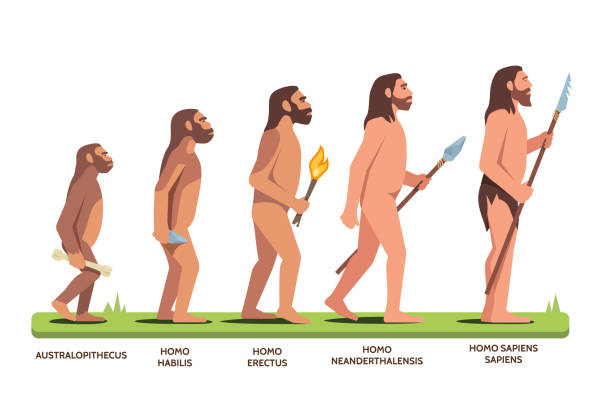
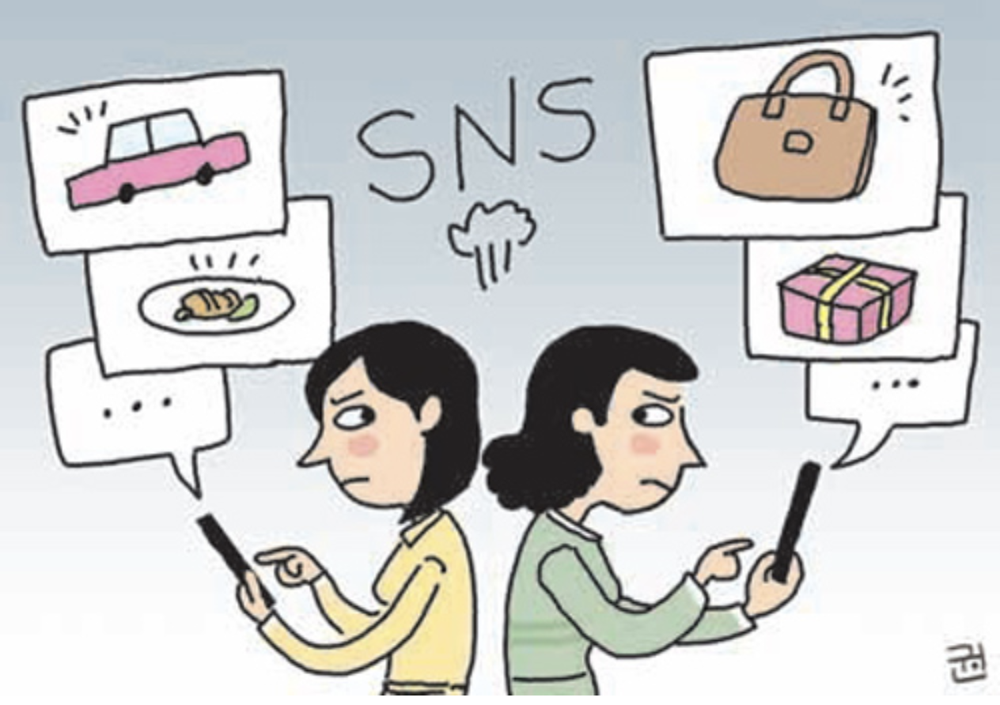
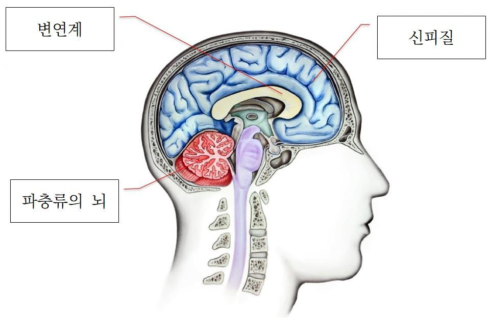

오늘 할 일도 다 끝났고, 꼭 적어보고 싶었던 내용을 적어본다.

항상 개발자로써 성장하고 싶은 마음은 한가득이다. 분명 열심히 살고 난 이렇게나 많이 성장했어! 라는 객관적인 지표가 여럿 있음에도 불구하고 불안, 걱정은 내 머릿속을 지배하고 있다. 그럼에도 평소 `"불안"` 을 자주 느껴서 내 평소 할 일에 집중하지 못할떄가 많다. **나는 왜 못할까. 왜 이것밖에 성장하지 못했을까. 다른 동료들은 저렇게 잘 하는데..** 라는 악순환이 돈다. 타인과 나를 비교하기 시작하는 습관도 생겼다.

난 개발자로써 커리어, 성장에 정말 욕심이 많고, 정말 최선을 다해 살아가고있다. (프로그래밍을 너무 좋아하기도 하고) 단순히 맹목적인 취업 목표로 주구장창 알고리즘만 올인하여 푼다거나, 서비스에 이것저것 기능을 급급하게 추가하려고 애먹는 사람이 아니다. 항상 느끼는 것이지만 프로그래밍을 좋아하고 노력하기 더해진 사람과, 단순 취업을 목표로 애타게 억지로 공부하는 사람과의 성장 속도는 정말 확연하게 다르다.

### 그럼에도 불구하고

그럼에도 나는 괜한 불안함에 휩싸여 평소 내 할일에 집중하지 못하고 있다. 불확실성, 두려움, 불안에 대한 생각이 한 번 시작되면 악순환에 빠져서 계속 빠져나오지 못한다. 최근에도 느꼈지만, 학교 전공 수업을 듣다가도 한 번 다른 생각으로 빠지면 다시 교수님의 말씀에 집중하기가 정말 힘들었다. 당장 오늘만 해도 OS 수업을 들으면서 절반은 집중하지 못했다.

또한 최선을 다해, 남들보다 쉬지않고 노력했음에도 불구하고 **"운이 좋아서", 난 밑천이 드러나면 진짜 보잘것 없는 사람인데"** 라는 생각이 자주 든다. 분명 노력을 통해 가꾸어낸 정량적 지표를 만들었음에도 내가 한 것이 아닌 기분이 들떄가 많다.

인터넷에서 좋은 영상들을 여럿 발견했다. [나는 왜 쓸데없는 생각을 많이 해서 삶을 피곤하게 하는 걸까? ⵏ 뇌과학](https://www.youtube.com/watch?v=hJ7w2FqPfBI) 를 비롯한 좋은 영상들을 시청했다. 내 나쁜 버릇을 고치고자, 좋은 생활 습관을 실천하기 위해, **글쓰기의 인출(Output) 을 통한 기억의 장기화를 위해 글을 적어본다.**

---

## DMN: 우리가 멍 때릴때, 사실 뇌는 일을 한다.

<iframe width="100%" height="400" src="https://www.youtube.com/embed/hJ7w2FqPfBI" title="나는 왜 쓸데없는 생각을 많이 해서 삶을 피곤하게 하는 걸까? ⵏ 뇌과학" frameborder="0" allow="accelerometer; autoplay; clipboard-write; encrypted-media; gyroscope; picture-in-picture; web-share" allowfullscreen></iframe>

우리가 멍 때릴 때, 사실 뇌는 일을 한다. 그때 `DMN`, 즉 디폴트 모드 네트워크라는 것이 활성화된다. 컴퓨터로 따지자면 화면 보호기, 절전모드라고 보면 된다. DMN 이 활성화되면 우리의 마음은 내부에서 방황하기 시작한다.

DMN 은 여러 정보들을 이리저리 조합해서 자아성찰도 하고, 미래에 대한 계획도 세운다. 걱정거리, 쓸 데 없는 상상에, 잊고만 있었던 흑역사까지도 모조리 꺼내서 **"어떄? 이게 너의 나쁜 모습이야~"** 하면서 방해거리를 만들어낸다. (마치 "넌 실패작이야" 왜 같은 나쁜 생각을 만들어낸다.) 편히 쉬고 싶은 그 순간 조차도 DMN 이 말을 계속해서 걸어온다. 쉬는시간에도 우리의 자아랑 의식이 "연속적" 인 느낌을 갖게해서 자아 정체성을 유지한다. 그럼 DMN은 자아 정체성만 유지하게 할 것이지, 왜 이렇게 부정적인 생각을 자꾸 떠올리게 할까?

### 인간은 원초적으로 "불안해야지" 생존이 가능했다.

우리의 조상님인 호모 사피엔스는 약 20 ~ 30만년 전쯤 등장했으며, 약 300 ~ 400만년 전쯤에는 오스트랄로 피테쿠스와 같은 모습이였다. 지금의 우리가 태어나서 존재할 수 있었던 것은, 몇 억년전 원시 조상님들이 생존에 성공했기 때문이다.

단순히 생각해봐도 우리 조상님들이 지능이 낮은 생물이었다면 당연히 지금까지 인류란 존재는 생존하지 못했을 것이다. 뒤에서 위화감이 느껴지는데 아무런 신경을 쓰지 않았던 조상님들이라면 사자, 하이에나등 야생동물에게 수차례 위협을 당하고, 생존하지 못했을 것이다. **우리 인간은 원초적으로 지능을 높지만 생태계에서 나약한 존재였다. 따라서 부정적 생각, 즉 `불안모드` 가 기본적으로 장착되어 있어야 생존이 가능했다.**

불안하고 불편해야지 생존이 가능했다. 그래야 불을 피우고, 발명하고, 무기를 만들고, 동물을 잡고를 반복하여 생태계의 최강 생물이 된 것이다. DMN이 인간의 생존을 가능하게 만들었다.

---

## DMN는 선천적으로 존재하는 것

이 DMN 는 그대로 현재 시대까지 이어져 와서 나쁜 기억만 떠올리게 하고, 흑역사를 생각나게 하는것이다. DMN 는 제 역할을 충실히 수행하고 있었고, 떄문에 우리를 우울하고 불안하게 만드는것이다.

따라서 우리는 **당연하게도 DMN가 인간에게 선척적으로 존재함을 인정해야한다. 단, 당연하게도 나쁘고 우울한 기억들을 그만 떠오르게 노력해야하고, 현재에 집중해야만 비로소 행복해질 수 있다.**

하버드 대학의 연구에 따르면, 50%는 일을 할 때 잡 생각을 한다고 한다. DMN가 자주 켜지는 것이다. 또한 그 잡 생각 50%는 나머지 50%보다 덜 행복하다고 한다. 이미 불안이나 우울감으로 고생하는 사람은 DMN 모드가 지나치게 자주 켜지는 상태이다.
이런 상태에서는 부정적 생각이 나도 모르게 떠오르고, 그 생각 떄문에 감정이 다운되고, 그래서 다시 부정적 생각이 떠오르는 악순환 구조가 생기는 것이다.

---

## 현재에 집중해야한다

이런 DMN의 기능을 끌 (OFF 시킬) 유일한 방법은 지금의 눈 앞에 일에 `집중` 하는 것이다. 책을 읽을 때 종이의 질감, 책을 넘기는 느낌이나 내가 쉬는 숨의 느낌, 폐의 느낌, 이런 것들에 집중하는 것이다.

우리의 뇌는 2가지 부분으로 나뉜다고 한다. 하나는 수동모드 뇌, 다른 하나는 메크로 뇌이다. 사람은 자기 행동을 거의 90% 정도는 자동화 모드로 돌리고 있는 것인데, "지식은 날리지" 님은 그것을 자동으로 DMN 모드가 발생한다면 의식적으로 OFF 하기 위해 노력해 볼 것을 권장한다. 그래야지 DMN 모드가 OFF 될 수 있다고 한다. 몰론 노력하는 그 와중에도 DMN이 자동을 켜저서 나쁜 기억이 다시 떠올를 수 있지만, 최대한 무시하기 위해 노력해야한다. 떠오른 그 나쁜 생각에 대해 또 생각의 늪에 빠져서 이런저런 생각을 하면 안된다. "응 왔니?" 정도의 인사 정도는 괜찮다.

### 무시하고, 현재에 집중하고, 뇌를 변화시키기

무시하기, 그리고 현재에 집중하기를 의식적으로 훈련하고, 노력하다보면 뇌는 변화하기 시작한다. DMN 모드를 점점 약화하는 쪽으로 변화하기 시작한다.

---

## 현대 사회는 부정적 정보가 넘쳐난다

또한 우리는 부정정 정보의 홍수 속에서 살고있다. 그런데 `부정적 정보` 가 너무나도 많다. 그래서 정보를 차라리 적으면 적을수록 좋다. 뉴스만 인터넷만 봐도 절대로 세상이 좋아졌다는 긍정적인 이야기는 찾아볼 수 없다. 이들은 아래와 같은 2가지 원인들로 인해 사회에는 부정적인 정보가 가득한 것이다.

> - 생존자 편향 (Survivor Bias)
> - 부정성 편향 (Negativity Bias)

가령 뉴스에 대한민국에 거주하는 평범한 고등학교 학생이 인하대학교 컴퓨터공학과에 합격했다! 라는 소식이 등장한다면 시청자들을 그를 흥미롭게 시청하지 않는다. 아무도 관심이 없을 것이다. 사람들이 관심을 갖는 부정적이고 충격적인 스토리만이 뉴스에 보도되는 것이고, 그를 보곤 사람들은 **"아, 세상은 오늘도 부정적인 일들만 가득하구나. 이런 헬 조선."** 라고 하는 것이다.

SNS 도 똑같다. 사람들은 집에서 잠옷을 입고, 나사빠진 모습으로 라면을 먹는 모습을 인스타그램에 올리지 않는다. 반대로 **SNS 에 자신이 가장 행복할 찰나의 모습, 성공한 모습만을 보여주고 싶어한다. 자랑할것을 올린다.** 실제 인스타그램을 보면 무슨 행복 한가득이고, 친구들 많은 엄청난 인싸이고, 부자인 사람들만 넘쳐나보인다. **SNS를 보면 "나 빼고 다들 행복하네. 잘 살고있네."** 가 되어 나 자신이 초라해진다. 결국 SNS 도 부정적 정보가 된다.

> SNS, 뉴스등의 부정적 정보를 줄여야 행복해진다.

---

## 현실에 집중하는 방법

현실에 집중하는 방법으로 이런 방법들을 권장하고 있다. 다이어트 도중에 식욕이 넘쳐날 떄 이마를 30초 정도 떄린다면 그 욕구가 줄어든다는 얘기가 있다.

### 악순환의 근본적인 발생 원인

우리 뇌는 감정을 담당하는 `변연계`, 이성적 사고를 담당하는 `신피질`이 서로 경쟁을 한다. 변연계와 신피질 중에서 우리 뇌에게 먼저 말을 거는 쪽이 승리하는 것이다. 그런데 보통은 변연계가 이긴다. 그래서 충동적으로 행동하게 되는 경우가 많다. 재수없는 신피질은 뒤 늦게와서 비난질이나 해 대니, 그렇게 부정적 생각이 늘고, 악순환이 반복되는 것이다.

### 의식을 의도적으로 잠깐 다른곳으로 분산시킨다

그런데 이마를 30초 떄리는 행동은 의식을 잠깐 다른곳으로 돌려서 시간을 버는 사이, 신피질이 활동할 수 있게한다. 꼭 이미가 아니더라도 벽이나 책상을 두드려도 무려 60% 는 감소한다고 한다.

또한 의식을 의도적으로 잠깐 다른곳으로 분산시켜서 집중력을 유지시킬 수도 있다. **중요한 일에 집중해야만 할 떄는 간단한 낙서나 다른 일을 해보는 것이다.** 우리 뇌는 멀티테스킹도 못하지만, 그렇다고 한가지 일에 집중을 잘하는 것도 아니다. 아주 모순덩어리다. **딱 한가지 일에 집중하면 뇌에 과부하가 와서 금방 지치는데, 낙서와 같은 무의식적으로 할 수 있는 행동은 오히려 집중력을 살짝 분산시켜서 뇌가 금방 지치지 않게 도와주고, 잡생각이 일어나는 것을 방지할 수 있다.**

스트래스, 불안은 인간이라면 누구가 당연히 가지고 있는 것이다. 왜냐면 그게 없었던 사람은 생존이 불가능했기 떄문이다.
따라서 남들이 모두 겪고있는 그 감정을 어떻게 처리하는 것이냐에 따라 인생이 달라진다. 억지 웃음으로 스트래스를 풀어서 행복해지는 방법, "그렇군" 병먹금으로 멘탈 강화하는 방법등 **나만의 효과적인 방법을 찾아내어 머릿속 생각 스위치를 끄고 불안감에서 벗어나야한다.**

---

## 가면 증후군 (Impostor syndrome)

<iframe width="100%" height="400" src="https://www.youtube.com/embed/_h4zWa7B6f8?si=TmnLR2-lWY-uX1Rz" title="YouTube video player" frameborder="0" allow="accelerometer; autoplay; clipboard-write; encrypted-media; gyroscope; picture-in-picture; web-share" allowfullscreen></iframe>

한편 걱정과 불안의 근본적인 원인 중 하나로 임포스터 증후군(Imposter Syndrome), 즉 가면 증후군을 의심해볼 수 있다.
가면 증후군은 생각보다 정말 많은 사람들이 겪고 있는, 심지어 전세계에서 유명한 연예인과 AWS, Google 과 같은 유명 대기업을 다니는 다년차 개발자들도 흔히 겪는 증상이다.

**성공이 언제 끝날지 몰라서 두렵고, 진짜 내 모습을 들킬까봐 무서움에 빠진 현상이다.**
특히 완벽주의의 성향에서 자주 드러나며, 주변에 뛰어난 동료들과 함께 있을 때 자신의 부끄러운 모습을 숨키고자 가면을 쓰는 것이다. 모든 분야에서 부족함 없이 잘 해내야 한다는 압박감에 가면으로 자신을 포장하며 본 모습을 숨겨버린다. 가령 자신이 프로그래밍 분야에서 많은 사람들에게 인정받는 실력가라면 집안일을 잘 못할 수도 있음에도 불구하고, 그 부족한 모습을 내 스스로가 용납하지 못하는 것이다.

**하나 쯤은 부족하고 모자른 부분이 당연히 있어도 괜찮은데도, 모든 걸 자신이 완벽하게 잘 해내야 한다는 가면속으로 숨겨버린다.** 심한 경우 작은 실수 하나라도 못하거나, 남에게 부끄러운 모습을 보인다면 "나는 모든 걸 실패했어. 난 능력이 없는 사람인가봐." 라는 생각과 함께 우울감, 번아웃이 찾아올 수 있다.

### 전문직, 학자일수록 가면 증후군에 훨씬 취약하다.

박서희 의사님은 **특히 자신의 특정 분야의 전문 지식과 기술이 있는 전문직, 또는 학자라면 가면 증후군에 취약해짐**을 언급했다. 자신의 전문 지식에 대해서는 당연히 정확하게 알고 있어야하하는 것은 맞다. 그렇지만 그 정도가 지나쳐서 개미 콧구멍만 한 것들, 모래 한 알 같은 사소한 것까지 전부 다 알 순 없을 것임에도 불구하고 모른다는 사실을 들켰을 때에 대한 두려움에 빠져 불안함에 빠지게 된다. 그 아주 작은 하나라도 자신이 모르고 있음을 인지할 때 **"내가 모르는걸 들키면 사람들이 무능력하다고 생각할거야"** 라는 생각으로 불안감, 초조함을 가지게 된다.

실제로 가면 증후군의 대가라고 알려지신 유명한 심리학자 교수님 "리사 손" 님도 임포스터 증후군이 찾아왔다고 한다. "내가 교수가 될 자격이 없는데도 된 것 같아. 내가 학생들에게 배움을 가르칠 자격이 있는걸까?" 와 같은 현상이 나타났다고 한다. 다른 사람이 봤을때는 매우 저명학 학자분들이 "도대체 왜 그러실까? 라는 생각이 들 정도로 불안함, 두려움을 안겨준다. **가면 증후군은 앓고 있다면 내 스스로 내 능력을 믿지 못하게 된다. 아무리 내가 노력하고 학식이 가득 차 있는데도 불구하고 두려움에 휩사여 능력을 발휘할 수 없게된다.** 좋은 기회가 찾아와도 괜한 두려움 떄문에 소중한 시간을 잃게된다.

나 또한 프로그래밍을 열심히 하면 할 수록, 성장하면 성장해 있을수록 불안감에 휩싸일 때가 너무 많다. 간혹 되려 부족한 모습을 매꾸기 위해 공부하고, 뒤돌이켜보면 정말 많이 성장해 있음에도 기분은 항상 우울해진다. 더 열심히 살면 살수록 행복 지수는 많이 낮아지고 있다. 오늘까지만 해도 **"난 아직도 정말 못한다. 많이 부족한 사람이다."** 를 생각했다.

---

## 개발자를 망하게 하는 사고방식 😱

<iframe width="100%" height="400" src="https://www.youtube.com/embed/hU4kULhOdNE?si=y-aO6l5hCT5SSqOq" title="YouTube video player" frameborder="0" allow="accelerometer; autoplay; clipboard-write; encrypted-media; gyroscope; picture-in-picture; web-share" allowfullscreen></iframe>

드림코딩 님의 개발자 마인드셋에서도 임포스터 증후군은 모든 개발자 70% 이상이 흔하게 겪는 증상임을 말씀하신다. 또한 **성장의 길을 택하자! (Growth MindSet)** 을 강조하신다. 정말 특출난, 처음부터 타고난 개발자는 어딘가엔 분명 존재할 수 있겠지만, 그렇지 못한 사람들이 대부분이다. 모두가 공부하고, 노력하고, 계속해서 실력을 향상 하려 했기에 성장할 수 있었던 것이다.

"저 사람은 타고날때부터 저런거야" 라는 마인드가 아닌, **"나는 이 순간 저 사람의 하이라이트 순간을 바라보고 있다. 저 사람은 하이라이트가 오기 전까지 얼마나 많은 연습과 노력을 했을까? 어떻게 지금의 하이라이트를 만들어 냈는지 내가 한 번 알아봐야지. 나도 저렇게 열심히해보자!"** 라는 생각을 해보자. 또한 잘하는 곳에만 머무는 `컴포트 존(Comfort Zone)` 에서 벗어나자. 내가 지금 임포터스 증후군을 겪는것도 성장하고 있는 삶을 살아가고 있는 것이다. 새로운 것에 대한 두려움과 불안이 있어야만 내가 성장할 수 있음을 인지하자.

임포터스 증후군이 찾아올 떄 마다 "아, 난 왜 이렇게 부족하지?" 가 아니라 "내가 지금 겪고 있는 불안은 성장통이구나. 성장하고 있기 떄문에 이런 생각이 찾아온거구나." 라고 생각해보자.

---

## 포장된 가면을 벗어내기 위해

### 그래, 나 못한다. 그래서 어쩌라고? 🤔

박서희 의사님은 가면 증후군을 해결하기 위해 본인의 당당한, 자신감 있는 모습을 드러내기를 권장한다. 다른 사람들이 가면 벗은 내 모습이 마음에 안 들고 실망할 수 있다. **"그런데 그게 뭐 어쩌라고, 이게 내 모습이다! 저는 이런 제 모습이 좋습니다. 어쩌라고요, 이게 난데."** 라는 솔루션을 제안했다. 가면을 벗은 내 솔직한 모습을 인정하고, 진솔한 모습에 사랑할 수 있어야함이 느껴진다.

나는 모든걸 다 아는 완벽한 전문가가 될 수 없음을 인정하자. 나는 정말 당연하게도 수많은 프레임워크, 라이브러리, 아키텍처, 코드, 문서 내용을 파악하고 이해할 수 없다.

### 나 스스로를 단정짓지 않는다.

나 스스로를 어떤 존재라고 단정짓지 않아야한다. 내 스스로를 어떤 사람이라고 정의내리지 말자. 우리의 모습은 스냅샷과 같은 한 장의 모습만이 존재하는 것이 아닌, 변화 무쌍한 동영상과 같은 다양한 모습을 지니고 있다. 나 스스로가 내 모습을 고정시켜버리면 그때부터 불안이 시작된다.

**상대방에 기대에 맞추기 위해서 내 스스로의 진솔한 모습을 일지말자. 포장된 가면속에 살다간 결국엔 나 조차도 내가 어떤 사람인지를 잃어버리게 된다.** 절대로 그 틀에 나를 가두지 말자.

우리 모두는 부족함이 없는, 정말 멋져보이는 모습이 있을 것이고, 한편으론 덜렁거리는 모습이 있다. 우리에겐 다양한 모습이 있고, 그 모습 자체가 정말 아름답다. 여러가지 모습, 가면을 쓰고 있는 것이 당연하며, 그게 절대 나쁜것이 아니다. 다만 한 가지 가면에만 자신을 고집하고, 정의하고, 그 가면 뒤에 숨어서 불안해하고, 그 가면이 벗겨질까 전전긍긍하지 말자. 또한 타인의 기대에 맞춰 가면을 쓰지말자.
내가 자유롭게 다양한 모습, 가면들을 쓰고 벗었다 하면된다.

### 내 스스로의 노력, 성과를 인정해주자 🙂

우리가 노력한 시간이 분명있다. **단순히 운이 좋았다? 몰론 운도 따라줬겠다. 하지만 그 운을 잡는것도, 기회를 잡기 위해 노력한 나의 시간이 있었기 때문에 가능한 것이다.** 또한 운을 통해 기회를 잡아도 그걸 유지하기 위한 노력이 분명히 있었기 때문에 가능한것이다. 그 노력한 시간들을 절대 그냥 흘려보내지 말고, 내 스스로에게 칭찬하는 습관을 길들이자.

### 다른 사람들의 하이라이트를 인정하고, 배워보자!

앞서 말했듯이 "저 사람은 타고날때부터 저런거야" 라는 마인드가 아닌, **"나는 이 순간 저 사람의 하이라이트 순간을 바라보고 있다. 저 사람은 하이라이트가 오기 전까지 얼마나 많은 연습과 노력을 했을까? 어떻게 지금의 하이라이트를 만들어 냈는지 내가 한 번 알아봐야지. 나도 저렇게 열심히해보자!**" 라는 생각을 해보자.

> 자기 자신을 속이는게 가장 슬픈 일이다. 진솔한 내 자신을 직면하는 용기와 불안을 떨칠 수 있어야한다. 완벽하지 않는것이 불안을 극복하지는 가장 현명한 방법이다. 또한 메타인지는 사실 자기 삶의 주인이 되고 행복하게 알아가는 도구임을 잊지 말아야겠다 😆

---

## 마치며

"난 아직도 못한다." 라는 마인드 셋을 버리자. 또한 내가 노력해서 만들어낸 정량적 결과물들을 인정해주자. 나 자신을 칭찬하고, 좋은 습관을 만들기위해 계속 고민해야겠다. 더 이상 포장하는 습관을 버리자.
